# 工作手順書（図つき）— 右手のスティックと左手のエンコーダ

2026-10-10 版。上から順にやる。□ は終わったら印を付ける欄。
理由や、動かなかったときのログの読み方は [../BUILD.md](../BUILD.md) にある（こちらは「何をするか」だけ）。

**まだ実機では一度も組んでいない手順。**詰まったら、その場所の番号を知らせてください。

## 全体のつながり

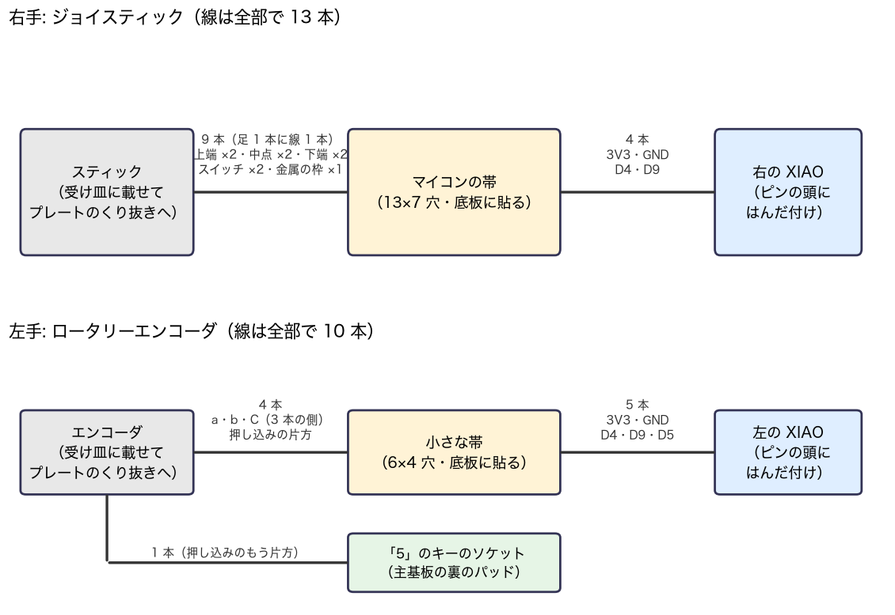

| 章 | やること | 目安 |
|---|---|---|
| 0 | テスターで部品を確かめる（はんだ付けの前） | 30 分 |
| 1 | 刷る（受け皿・キャップ → プレート） | 受け皿とキャップ 15 分・プレートは左 47 分・右 56 分（3MF は `../print/joystick_*.3mf`。git の外 `build/joystick/print/`） |
| 2 | 右手: 書き込み → 帯 → スティック → 机で動かす → 筐体へ | 半日 |
| 3 | 左手: 帯 → エンコーダ → 机で動かす → 筐体へ | 2〜3 時間 |

右手と左手は別々に進められる。**どちらも「机の上で動かしてから筐体に入れる」。**

---

## 0. テスターで確かめる（はんだ付けの前）

テスターの使い方はこの 2 つだけ:
- **抵抗を測る**: ダイヤルを Ω の `20K` に。赤と黒の棒を 2 本の足に当てる（向きはどちらでもよい）。左端に `1` だけ出たら「レンジより大きい＝つながっていない」
- **つながっているか見る**: ダイヤルを Ω の `200` に。`0` に近い数字なら「つながっている」、`1` だけなら「つながっていない」

- [x] **0-1 キットのシルクの並び** — 済み（図と同じ）
- [x] **0-2 キットの VDD–GND 間** — 済み（レンジで値が変わる＝抵抗ではなく IC の性質。問題なし）

### 0-3 スティックの足 — 済み（2026-10-10 に実測。下の表）

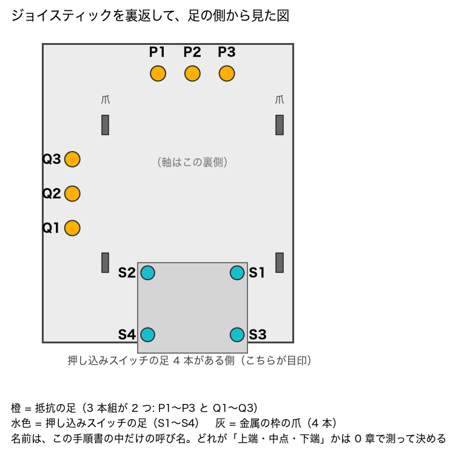

1. スティックを裏返し、図と同じ向きに置く（スイッチの足 4 本がある側を手前に）
2. `20K` で **P1–P3** を測る → 約 10（kΩ）。軸を倒しても変わらないこと
3. `20K` で **P1–P2** を測りながら軸を倒す → 値が動くこと（動けば P2 が中点）
4. **Q1–Q3**・**Q1–Q2** も同じに
5. `200` で **S1〜S4 の 2 本ずつ**を当て、軸を押し込む。**押したときだけ `0` 付近になる組**を探す
6. `200` で、**爪**と P1 / Q1 / S1 の間 → どれも `1`（つながっていない）こと

書き留める（あとの配線はこの表が元）:

| 何を | 結果 |
|---|---|
| P1–P3 の抵抗 | **9.96 kΩ** |
| P 組の中点（倒すと動く足） | **P2** |
| Q1–Q3 の抵抗 | **9.64 kΩ** |
| Q 組の中点 | **Q2** |
| 押すとつながる組 | **S1 と S3**（S2 と S4 も同じ。S1–S2・S3–S4 は中でいつもつながっている） |
| 爪はどの足ともつながっていない | **はい**（爪–P1 で確認） |

**決まり**: P 組を「X」、Q 組を「Y」と呼ぶ。両端はどちらを「上端」にしてもよい（向きや X・Y の入れ替わりは、あとで設定で直せる）。
図と違う結果（3 本のうち 2 本だけがつながる、など）が出たら、はんだ付けの前に知らせてください。

### 0-4 エンコーダの足 — 済み（2026-10-10 に 1 個を実測。下の表）

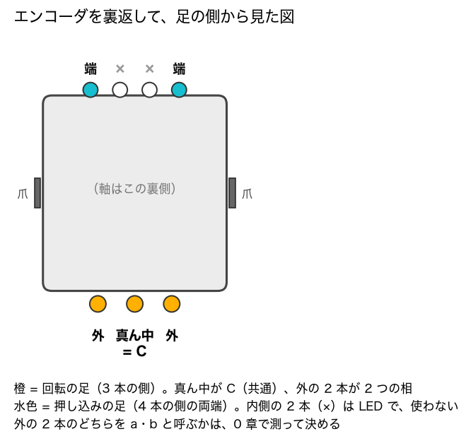

1. `200` で、3 本の側の **「外」の片方と真ん中（C）** に当てる。つまみをカチッと止まる所まで 1 刻みずつ回し、**止まった所で** 数字を見る。10 刻みほど
2. もう片方の「外」と C でも同じに
3. **止まった所で、いつも `1`（つながっていない）の方が「a」**、もう片方が「b」。a の足に印を付ける（マスキングテープなど）
4. `200` で、4 本の側の**両端**に当てて、軸を押す → 押したときだけ `0` 付近

| 何を | 結果 |
|---|---|
| 止まった所でいつも開いている方（= a） | **両方とも開いている**（10 刻みで確認。刻みの間では両方とも一瞬閉じる）→ **図の右の「外」を a、左を b と呼ぶ**（規格書の図の A 相が、足の側から見て右。逆でも回す向きが反対になるだけで、設定で直せる） |
| もう片方（= b）は、止まった所で | **いつも開いている** → 止めている間は、抵抗に電流が流れない（A 案でも） |
| 押し込み（両端）は押すとつながる | **はい** |

両方とも閉じていることがある個体だった場合は、知らせてください（左手の読み方を変える）。

### 0-5 USB シリアル変換器の電圧 — 済み（2026-10-10 に実測）

| 何を | 結果 |
|---|---|
| TX–GND | **3.3 V**（信号は 3.3V） |
| VCC–GND | **5 V**（電源のピンは USB の 5V がそのまま出る） |

変換器に 3V3 のピンは無い。
- **キット単体に書く（2-1）**: キットの電源は**単 3 × 2 本（約 3V）**から取る。**変換器の VCC（5V）はつながない**（GND は共通にする）。
  5V で動かすと、マイコンの書き込みピンが High と認める電圧（0.8 × VDD = 4.0V）に、3.3V の信号が届かない（データシート DS40002204A 表 36-11）
- **帯に載せた後に書き直す**: 信号が 3.3V なので、そのままできる。**VCC（5V）の線は絶対につながない**。つなぐのは GND と RST の 2 本だけ、キーボードは USB で給電

---

## 1. 刷る

**どの部品も、広い平らな面（上面）をベッドへ向けて、裏返して置く。**

- [x] 1-1 受け皿 2 つとキャップ: [../print/](../print/) の `left_tray.stl`・`right_tray.stl`・`right_stick_cap.stl`
- [x] 1-2 届いた部品を受け皿に挿してみる（爪が穴に入り、床に座ること）。キャップは軸にきつめに入ること
- [ ] 1-3 プレート 2 枚: `left_plate.stl`・`right_plate.stl`（右は幅 175mm。いまのプレートと同じに斜めに置く）

**1-2 が通ってから 1-3 を刷る。**きつい・ゆるいは 0.05mm ずつ直せる。

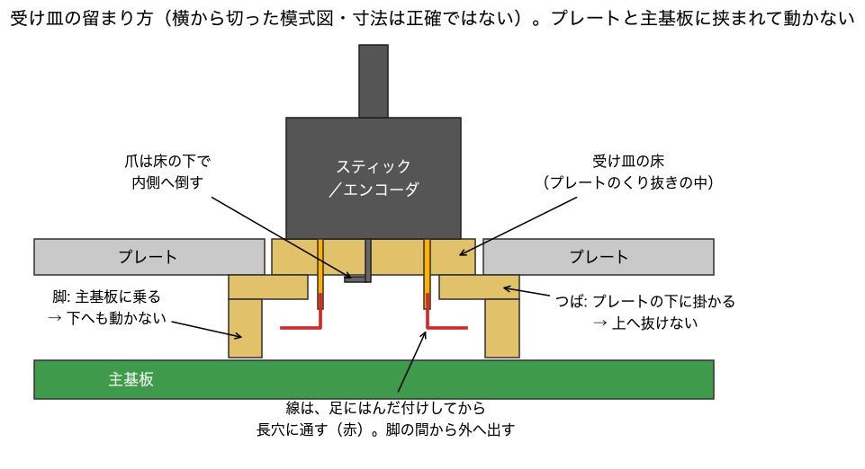

---

## 2. 右手（スティック）

### 2-1 マイコンに書く — 済み（2026-10-10）

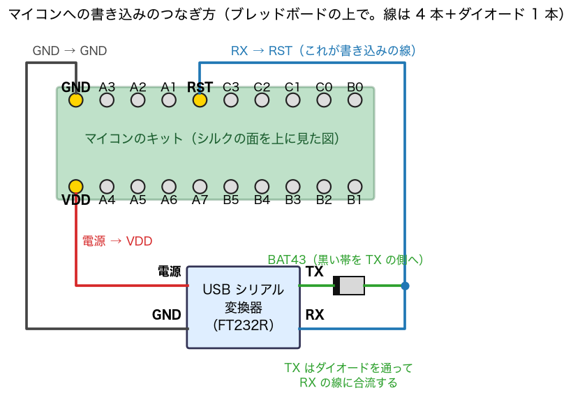

**⚠ 図の「電源 → VDD」は、変換器の VCC ではなく、単 3 × 2 本の ＋ につなぐ**（電池の − は GND へ。理由は 0-5）。

- [x] 1. キットに付属のピンヘッダをはんだ付けした
- [x] 2. 図のとおりにつないだ（電源は単 3 × 2 本）
- [x] 3. `../pod_layout/pod_incase.hex` を書いた。ID 1E9421（ATtiny1616）・照合 OK・ヒューズ 3 つ（読み戻し `0B 08 02`）

書き直すときのコマンドは [../pod_layout/README.md](../pod_layout/README.md) の「マイコンへの書き込み」。⚠️ ヒューズは 3 つだけ書く（SYSCFG0 は書かない）。
`pod_incase_pa4.hex` は、上端の電圧が読めなかったときの逃げ道の版。

### 2-2 帯を作る（線はまだ付けない）— 済み（2026-10-10）

実際には、板は 14×8 穴のまま使い（余りの 1 列は列 12 の外、取付穴の行は行 0 の外）、キットをブリッジより先に付けた。
**線を挿す 13 か所の穴へつながる最後の 1 区間は、まだつないでいない。線を挿すときに一緒にはんだ付けする**（2-4）。

**部品面から見た図は、列 0 が左。はんだ面の図は、裏返すので列 0 が右。**穴は「行・列」で数える。

- [x] 1. ユニバーサル基板を 13×7 穴に切り、**被覆のジャンパ線**を行 2 の列 1 → 列 11 に付ける（部品面を通す）

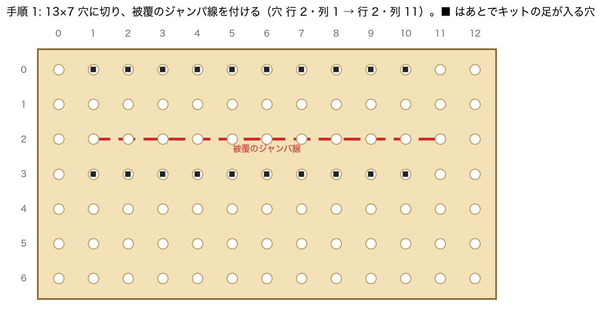

- [x] 2. 抵抗 8 本とコンデンサ 4 個を挿す。**33Ω は小型の品**。10µF は足を内側へ曲げて挿す

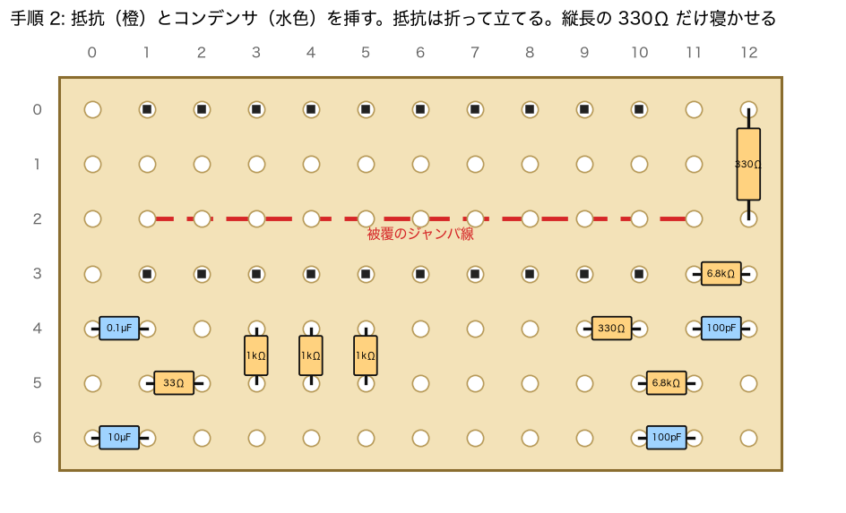

- [x] 3. 裏返して、色の帯のとおりに隣の穴どうしをはんだでつなぐ

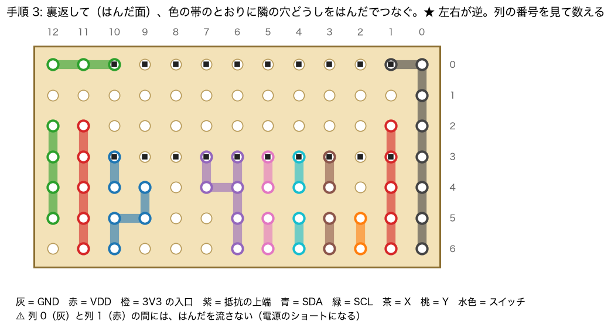

- [x] 4. **テスター（`200`）で、列 0 のどれかと列 1 の行 3 に当てる → `1`（つながっていない）であること。**
      `0` 付近なら、列 0 と列 1 の間にはんだが流れている。キットを載せると見えなくなるので、必ずここで
- [x] 5. （2-1 で書き込みが済んでから）キットを列 1〜10・行 0 と行 3 に載せて、はんだ付けする。**GND が列 1・行 0、VDD が列 1・行 3**

### 2-3 スティックに線を付けて、受け皿に組む

- [ ] 1. 足 1 本に線 1 本（各 15cm）をはんだ付けする。**9 本**: P 組 3・Q 組 3・押すとつながる 2 本（0-3 の表）・爪 1
      - こては 350℃・3 秒以内・やり直さない
      - 爪の線は、**受け皿の縁まで切り欠いてある側の爪**に付ける（ほかの爪の穴は線が通らない）
- [ ] 2. 線の色を書く:

| 足 | 役 | 線の色 |
|---|---|---|
| P1 | X の上端 | |
| P2 | X の中点 | |
| P3 | X の下端 | |
| Q1 | Y の上端 | |
| Q2 | Y の中点 | |
| Q3 | Y の下端 | |
| S1（S2 でもよい） | スイッチ | |
| S3（S4 でもよい） | スイッチの片側 | |
| 爪 | 金属の枠 | |

- [ ] 3. 線を受け皿の長穴に通し、スティックを床に座らせる
- [ ] 4. 爪 4 本を、マイナスドライバーの先で内側へ押し倒す
- [ ] 5. 線を、受け皿の脚の間から平らに並べて出す

### 2-4 線を帯と XIAO につなぐ

- [ ] 1. スティックの 9 本を、帯の緑の穴へ（右の表のとおり）。**挿した穴と、隣の色の帯のはんだを、ここでつなぐ**（2-2 で残した最後の 1 区間）
- [ ] 2. 帯の黄の穴 4 つに線（各 8cm）を付ける

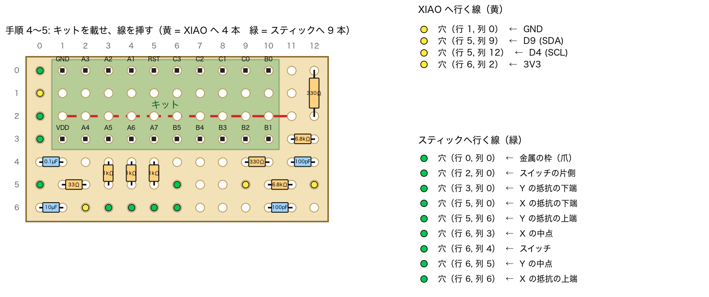

- [ ] 3. 筐体を開け、底板・子基板・主基板を FFC でつないだまま机に広げる。右の XIAO をソケットから抜く
- [ ] 4. **XIAO の裏のシルク（D0〜D10）で、下の図と左右の列が合っていることを確かめる**
- [ ] 5. 帯からの 4 本を、XIAO の**ピンの頭（はんだの山）**に付ける: 3V3・GND・D4・D9

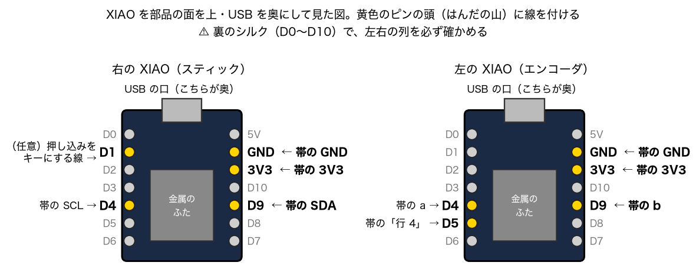

### 2-5 机の上で動かす

- [ ] 1. XIAO をソケットへ戻す（線は上へ逃がす）
- [ ] 2. 右に `hhkb_split_right-pod`、左に `hhkb_split_left-podR-encB` を焼く（GitHub の Actions → `Build ZMK firmware` → ブランチ `stick-pod-trial` の成果物）
- [ ] 3. 右を USB でつなぐ。**2 分ほどで止まるようなら**、電池を入れて電源 ON のままつなぎ、知らせてください
- [ ] 4. 見る: 倒すとポインタが動く／押し込みで中ボタン／触っていないのに流れない／打鍵しながら使ってキーが抜けない

Bluetooth でポインタが動かないときは、ホスト側で一度削除して登録し直す。
動かないときは [../BUILD.md](../BUILD.md) の 2-5b（ログの見方）へ。

### 2-6 筐体に入れる（⚠️ 実物で確かめた手順ではない）

- [ ] 1. プレート＋スイッチ＋主基板のかたまりを抜き、主基板を外し、スイッチを全部、新しいプレートへ移す
- [ ] 2. 受け皿を、新しいプレートのくり抜きに**下から**当てる
- [ ] 3. 線を、主基板の上（スイッチの胴の間）を**奥へ**走らせる。3 本 × 3 段に束ねる
- [ ] 4. 主基板をスイッチの足へ戻す。線を挟んでいないこと
- [ ] 5. **線を、下の図の赤い所にテープで仮留めする。ここだけ縦 1 列に並べる**（横に 2 本は並ばない）

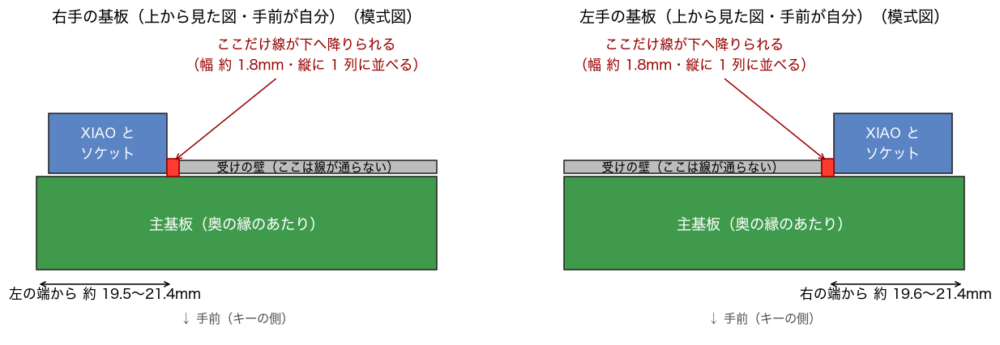

実形状で描いた絵（**奥から見ているので左右が逆**）。赤が線、青が XIAO、黄が受け皿:

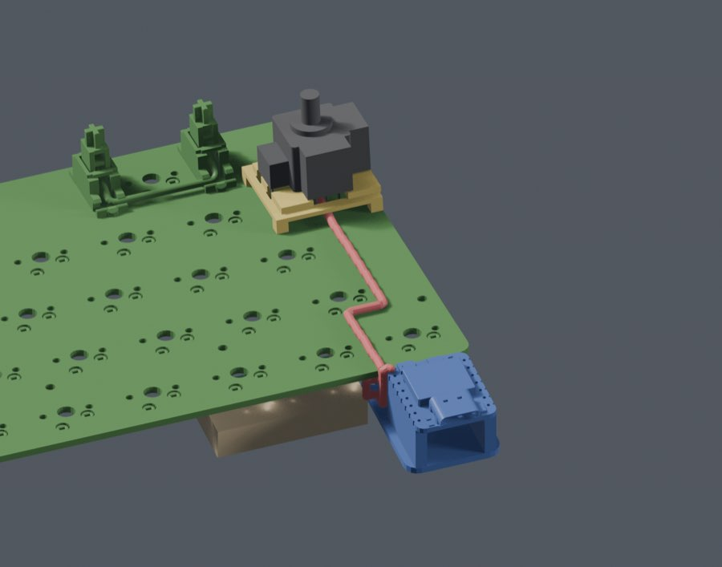

- [ ] 6. 帯を、スポンジ入りの両面テープで底板に貼る（場所は [../images/right_r_inside.jpg](../images/right_r_inside.jpg)）。受け皿 → 帯の線に 3cm のたるみ
- [ ] 7. かたまりを上の器へ戻し、底板を閉じる。キャップを挿す

---

## 3. 左手（エンコーダ）

### 3-1 帯を作る

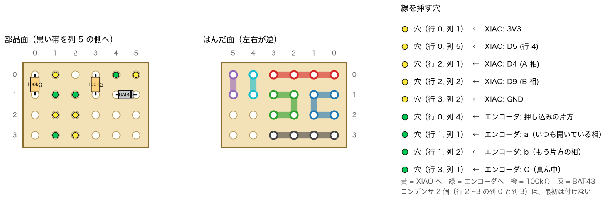

- [ ] 1. 6×4 穴に切り、100kΩ 2 本と BAT43 を挿す。**ダイオードの黒い帯は列 5 の側**
- [ ] 2. 裏返して、色の帯のとおりにつなぐ
- [ ] 3. 黄の穴 5 つに線（各 8cm）を付ける

### 3-2 エンコーダに線を付けて、受け皿に組む

- [ ] 1. 足 1 本に線 1 本。**5 本**: a・b・C（各 8cm）、押し込みの両端（片方 8cm・**もう片方は 12cm**）
- [ ] 2. 線を受け皿の長穴に通し、エンコーダを座らせ、爪 2 本を**内側へ**押し倒す

### 3-3 つないで、机の上で動かす

- [ ] 1. a・b・C・押し込みの 8cm の方を、帯の緑の穴へ
- [ ] 2. 左の XIAO を抜き、帯からの 5 本をピンの頭へ: 3V3・GND・D4・D9・D5（2-4 の図の右側）
- [ ] 3. 押し込みの 12cm の線を、主基板の裏の**「5」のキーのソケットのパッドのうち、「T」のソケットとつながっている方**へ（テスターの `200` で探す）
- [ ] 4. 左に `hhkb_split_left-podR` を焼く
- [ ] 5. 見る: 回すとホイール（1 刻みで 1 段）／Fn＋回すと拡大縮小／押すと左クリック／Fn＋押すと右クリック
- [ ] 6. 回す向きが好みと逆なら、帯の a と b の線を入れ替える

### 3-4 待機電流ゼロの読み方（B 案）に替える — 机で動けばこちらを本命に

- [ ] 1. 左に `hhkb_split_left-podR-encB` を焼く
- [ ] 2. **b の側の 100kΩ（帯の列 3）の片足を浮かせる**（残すと約 29µA 流れ続ける）
- [ ] 3. 3-3 の 5 と同じに動くこと
- [ ] 4. USB を抜き、電池で 35 分置く → キーを押しても数秒つながらなければ、スリープに入れている

### 3-5 筐体に入れる（⚠️ 実物で確かめた手順ではない）

- [ ] 1. 右（2-6 の 1〜4）と同じに、スイッチを新しいプレートへ移し、受け皿を挟む
- [ ] 2. 線を、2-6 の図の赤い所（左手は**右の端から約 19.6〜21.4mm**）で、縦 1 列に並べて降ろす

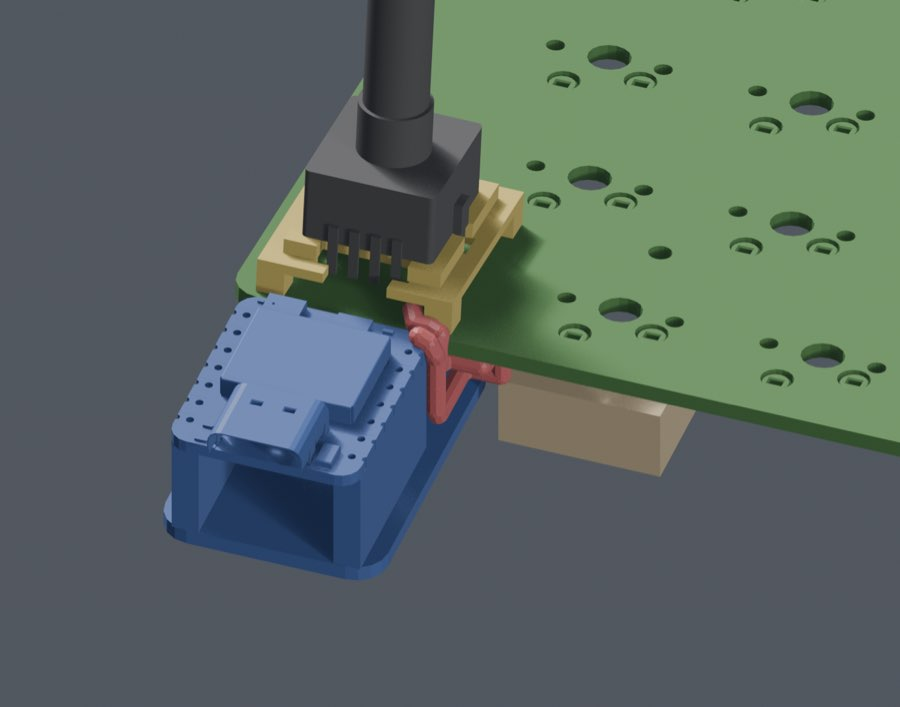

- [ ] 3. 帯を両面テープで底板に貼る（場所は [../images/left_r_inside.jpg](../images/left_r_inside.jpg)）
- [ ] 4. かたまりを戻し、底板を閉じる
- [ ] 5. **つまみは最後。一度挿すと外れない**

---

## 図について

図は [guide_figs.py](guide_figs.py) が描く。帯の図（05〜09）は配置データ（回路と機械で突き合わせた物）から、足の図（02・03）は部品の図面の座標から描いている。
11・12 は説明のための模式図で、寸法は正確ではない（正確な形は `../images/` の絵）。
