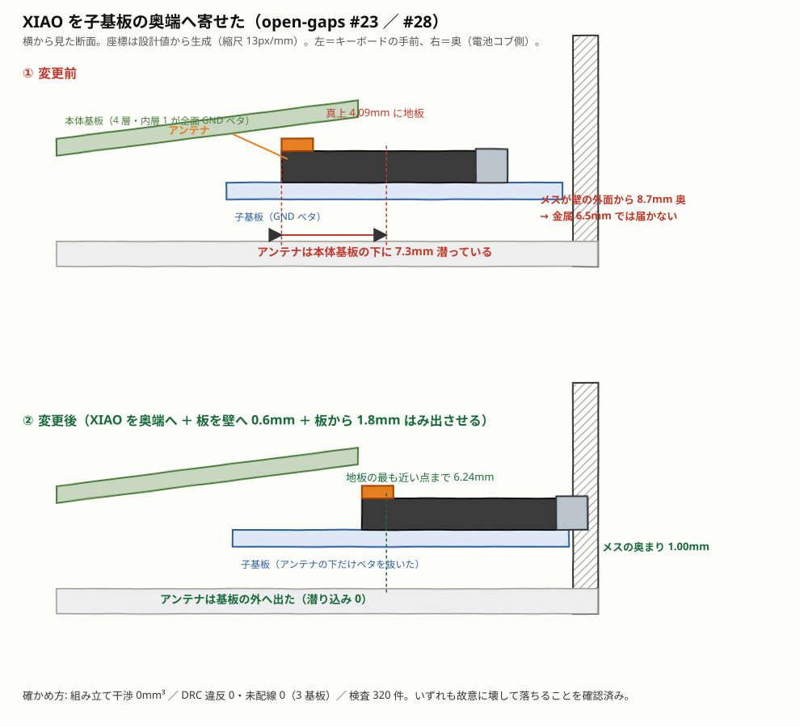
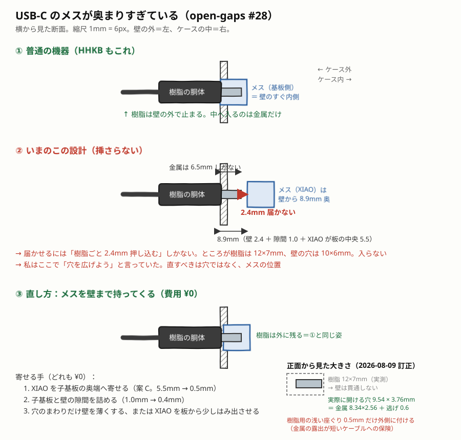

# 実機とまだ違うところ

**差があること自体は必ずしも悪くない。悪いのは、差があるのに気づけないこと。**

この案件では「要求を守っているように見えて、守っていない値」を固定した
テストが 2 つあり、どちらも利用者の問いかけで初めて分かった。

- `PLATE_TOP_FRONT == 17.5` — 実機の**ベゼル**高さをプレート面と取り違えていた。
  全段のキートップが 3.5mm 高かった
- `test_keytop_heights_match_the_real_machine` — 参照モデルを検査しており、
  **設計そのものは検査していなかった**

以後、実機と違うところはここに書く。
[tools/test_invariants.py](../../tools/test_invariants.py) が、この表と
設計値がずれたら落ちるようにしてある。差が無くなったら行を消す。

---

## いま残っているもの（2026-08-11 に棚卸し）

**この節が無かったせいで、#1・#8・#17 は解決済みなのに 4 日間
「未解決」として残っていた。**#1 に至っては、古い主張のほうを検査が
固定していた。**節を書き換える人と、一覧を見る人が別人になる。**

### ★ 発注をせき止めているもの（1 つだけ）

| # | 何 | 次の一手 |
|---|---|---|
| **[#23](#23-未解決-アンテナが地板に挟まれている発注前に必ず読む)** | アンテナが地板に挟まれている | **手 0**（アルミ箔で地板を模擬して RSSI を測る。**¥0・1 日**）。案 C のまま測定を待つと決めた（2026-08-11） |
| [#30](#-未解決-メスがケースの外へ-026mm-はみ出す23-と一体2026-08-11) | メスが 0.26mm はみ出す | #23 と一体。#23 が解ければ一緒に消える |

### 物を買う・刷るまで進まないもの

| # | 何 | 要るもの |
|---|---|---|
| [#11](#11-公差が一律-02mmクーポンは用意した刷るのが残り) | 公差 `CLEARANCE` | クーポンを 1 枚刷る |
| [#12](#12-上ケースを奥で留める方法が未解決) | 上ケースの奥の留め方 | 刷って、奥が浮くか見る |
| [#18](#18-電源スイッチの実部品が未選定調査済み購入待ち) | 電源スイッチ | 購入（候補は C&K OS102011MA1QN1） |
| [#19](#19-ffc-ケーブルの向きが未確定) | FFC の向き | 両向き 1 本ずつ買う |
| [#21](#21-キーキャップは-dsa-を暫定候補にした均一プロファイル) | 上 2 段のキャップ | **高さは決めた**（9.16 / 11.12mm）。その高さの実在品を探して買う |
| [#22](#22-本番の電池をどう保持するか未決定) | 電池ボックス | **品番は決めた**（BH-325-1A150）。買って測る |
| [#25](#25-ブレッドボードのチャタリング本番基板では未確認) | チャタリング | 本番基板で再現するか |
| [#27](#27-子基板と本体基板の隙間は-013mm-しかなくソケットが入らない) | ソケットか直付けか | #23 と同時に決める |
| [#28 残](#まだ残っていること) | 公差・片持ち・組み立ての順番 | 刷って組む |
| — | [provisional-values.md](provisional-values.md) の暫定値 | 上の全部の合流点 |

### 受け入れた差（塞がない。忘れないために残す）

| # | 何 | なぜ |
|---|---|---|
| [#2](#2-奥行コブが実機より深い) | 奥行 +5.1mm | ホットスワップをやめれば戻るが、交渉可能事項を捨てることになる |
| [#20](#20-電源スイッチが実機と違う形式機能位置) | 電源スイッチの形式・位置 | 機能が違う（機械的に切る vs ソフト電源） |
| [#24](#24-押した瞬間の-1-回だけ列が全部-high-のまま走査されるzmk-の実装) | ISR で 1 回だけ全 High | 実測で実害なしを確認済み。記録のみ |
| [#26](#26-片方が居ないともう片方が探し続けて電池を食う) | 片側不在時 3.7mA | **安く直せる方法が無い**ことを確かめた（ZMK 本体の 1 行で、Kconfig が無い） |

### ファーム（基板に影響しない。**ビルドは通ったが実機未確認**）

| # | 何 | 状態 |
|---|---|---|
| [#13](#13-一部未解決-電池残量の が乾電池に合っていない) | 乾電池の残量% | 差し替えた。ただし入っているのは**線形の写像で、放電曲線ではない**（C4/C5 待ち） |
| [#25b](#25b-電池が尽きるときの止まり方ファームで直せる基板は関係ない) | 打ち止めでの安全な停止 | 実装した（`zmk_pm_soft_off`） |

---

## 1. ✅ 2026-08-07 解決（手前端の高さ）— **閉じたのに 4 日間「未解決」として残っていた**

| 項目 | 設計 | 実機 | 差 |
|---|---|---|---|
| 手前端の高さ | **17.50mm**（組み上げた上ケースの前縁を実測） | 17mm と約 18mm の 2 件 | **その間。差なし** |

上ケース（ベゼル）を足し、プレートを 6.62mm 沈めることで閉じた。
経緯は [decisions/2026-08-07-top-case.md](decisions/2026-08-07-top-case.md)、
断面は `gen_case.build_topcase` の図。

**設計基準が 17.5 なのは、実機の一次資料が割れているから。**
Tom's Hardware の逐語が 17mm、別レビュー（blue-de）が約 18mm で、
その中間を採っている（[dimensions.md](dimensions.md)）。

### ⚠️ この節が 4 日間「未解決」のまま残っていたこと自体が、この案件の失敗の型

2026-08-07 に**この節が書いたとおりの手（ベゼルを立ててプレートを 6.62mm
沈める）で解決された**のに、節は「ベゼルが無い」と言い続けていた。
そして `test_front_edge_height` が

```
設計 PLATE_TOP_FRONT(10.88) < 実機 17.0 → 差が残っている
```

を**毎回緑で確認していた**。プレート面はもう手前端ではないのに、
検査は定数どうしを突き合わせていたので気づけない。
**「要求を守っているように見えて、守っていない値を固定したテスト」の
裏返し——「既に守っているのに、守っていないことを固定したテスト」。**

→ 検査は**組み上げた上ケースの実形状から前縁を測る**ように直した
（2026-08-11）。`BEZEL_TOP_FRONT` を 20 にすると落ちることを確認済み。

---

## 2. 奥行（コブが実機より深い）

| 項目 | 設計 | 実機 | 差 |
|---|---|---|---|
| 本体＋コブ | 125.1mm | 120.0mm | +5.1mm |

**原因**: MX ＋ ホットスワップソケットは、プレート上面からソケット下端まで
9.8mm ある。Topre は基板の下に出っ張りが無く、ここが 5mm 以上薄い。
単3×2 を収めるのに、実機の 12mm より深いコブが要る。

**影響**: 机の占有面積。分割なので左右それぞれ 5mm 深くなる。

**塞ぐには**: ホットスワップをやめて直付けにすれば 3.2mm 戻る。
ただし打鍵感の調整という交渉可能事項を捨てることになる。**現状維持を推奨。**

---

# 領域を分けて見直して出たもの（2026-08-07）

「同じ失敗の型」だけを探していては見つからないものを、領域ごとに開いて探した。
**探しやすいところを探すのは検証ではない。**

## 3. 基板の設計規則が JLCPCB の能力に合わせてない ✅ 2026-08-07 解決

`.kicad_pcb` の `(setup)` に設計規則（クリアランス・線幅・アニュラリング・
最小穴）が**一つも設定されていない**。KiCad の既定値で DRC を通しているだけ。

**「DRC 違反 0 件」は「JLCPCB で製造できる」を意味していない。**

JLCPCB の 2 層/4 層の標準能力（最小線幅 0.127mm、最小クリアランス 0.127mm、
最小アニュラリング 0.13mm、最小ドリル 0.2mm、外形までの距離 0.2mm など）を
設計規則として書き込み、その規則で DRC を通す必要がある。

## 4. 子基板が電池から 1.0mm しか離れていない ✅ 2026-08-07 解決（12.2mm へ）

| | 電池の内側端 | 子基板の外側端 | 隙間 |
|---|---|---|---|
| 左 | +38.4mm | +39.5mm | **1.0mm** |
| 右 | −21.7mm | −38.9mm | 17.1mm |

XIAO のアンテナは USB と反対の端にある。**単3 電池は金属の塊で、2.4GHz の
アンテナを至近距離で大きく狂わせる。** 左右間の BLE 接続が本要件なのに、
その通信距離を自分で潰していた。

電池を寄せて場所を作った副作用。アンテナ側にどれだけ空けるべきかを
定数として持ち、検査すること。

## 5. 電池残量がファームウェアで読まれていない ✅ 2026-08-08 解決済みと確認

**この項目は古かった。**実装は入っている。

| | 場所 |
|---|---|
| `zmk,battery-voltage-divider` | `hhkb_split.dtsi`（`output-ohms` / `full-ohms`） |
| `chosen { zmk,battery = &vbatt; }` | 同上 |
| 左右間の残量取得 | `hhkb_split_left.conf`（FETCHING / PROXY） |
| ADC の取得時間 40µs | **ZMK の driver が設定**（500kΩ の分圧に必要な値） |

**残っているのは残量%の曲線だけ**で、それは #13 に分けてある
（ZMK の%はリチウムイオンの放電曲線。乾電池では正しい%にならない）。

## 6. デバウンスが未設定 ✅ 2026-08-08 解決済みと確認

**この項目も古かった。**左右とも設定されている。

```
CONFIG_ZMK_KSCAN_DEBOUNCE_PRESS_MS=3
CONFIG_ZMK_KSCAN_DEBOUNCE_RELEASE_MS=5
```

「数珠つなぎが速い打鍵を取りこぼす」懸念も **Task C2-b で実測して合格**
（SPI 4MHz。シフトレジスタは 74HC595 → **74LVC595** に変更済みで、
1.8V でも fclock 104MHz 保証なので余裕はさらに広い）。

## 7. 基板に左右の識別が無い ✅ 2026-08-07 解決

シルクに Left/Right の表示がゼロ。JLCPCB から 2 種類が届き、
見分けがつかない。組み立ても修理も取り違える。

---

# 未着手だった領域を一巡して出たもの（2026-08-07 その2）

幾何・電気・製造は見たが、**組立・保守・強度・公差は一度も見ていなかった。**

## 8. ✅ 2026-08-07 解決（取付ネジがキーキャップの下にある）— **#1 と同じく、閉じたのに残っていた**

当初: ネジ 14 本中 9 本がキーキャップ（18mm 角・隙間 1.05mm）の下にあり、
**ドライバーが入らなかった。**ボスの位置探索がプレートの開口（14mm 角）
しか避けておらず、キャップの 4mm 大きい外形を考えていなかった。

**#1 と同じ手（上ケースを足す）で同時に解けた。**ネジは
`MOUNT_Y = ±51.5` のベゼルの中へ移り、本数も 14 → **5 本**（本体 3・
子基板 2）になった。キャップの縁は ±47.1 なので、下に 1 本も無い。

守っている検査（[tools/test_topcase_geometry.py](../../tools/test_topcase_geometry.py)）:

| | |
|---|---|
| `test_a_screwdriver_reaches_the_screw` | キャップからネジ頭まで 2mm 以上 |
| `test_the_screw_head_fits_inside_the_bezel` | 頭が開口に掛からず、ケースの外にも出ない |
| `test_no_screw_sits_on_the_left_or_right_edge` | 左右の辺には置けないという前提を明示 |

## 9. RESET ボタンに手が届かない ✅ 2026-08-07 解決（キー操作で復旧）

ケースに RESET 用の穴が無い（`grep -c RESET tools/gen_case.py` → 0）。

XIAO はブートローダに入るのに **RESET を素早く 2 回**押す必要がある。
今日の Task C1 でも実際に使った。ファームウェアを壊したとき、
**ケースを開けないと復旧できない。**しかも開けるにはキーキャップを
外す必要がある（#8）。

**塞ぐには**: 子基板の脇に細穴（φ2、クリップが入る）を開けるか、
子基板に押しボタンを載せて底面から押せるようにする。

## 10. ネジボスが PLA 直ねじ込みで肉厚 1.65mm ✅ 2026-08-07 解決（熱圧入インサート φ5.6）

ボス φ5.0 / 下穴 φ1.7 → 肉厚 1.65mm。M2 をタッピングで直接ねじ込む前提。
**PLA は繰り返しの開け閉めで舐める。** 熱圧入インサート（外径 3.2mm）を
使うならボスは φ5.6 以上が要る。

## 11. 公差が一律 0.2mm（クーポンは用意した。刷るのが残り）

`CLEARANCE = 0.2` を蓋のレール・脚のピン・ナット・子基板・電源スイッチの
ポケットの全部に使っている。3Dプリントは穴が縮み、XY と Z で収縮量も違う。
**K1 Max ＋ PLA での実測が無い。**

**2026-08-08: クーポンを作った。**`tools/gen_testpieces.py` が
`build/clearance_coupon.stl`（76 × 34 × 4mm）を出す。

| | |
|---|---|
| 丸穴 | φ4.0（脚のピン相当） |
| 角穴 | 8.6 × 4.4mm（電源スイッチ相当） |
| 逃げ | 0.0 / 0.1 / 0.2 / 0.3 / 0.4mm を左から並べた |

**丸と角の両方を見る。**角は隅に材料が寄るので、同じ逃げでもきつくなる。
片方だけ見て決めると、もう片方で外す。

1 枚刷って「入るが緩くない」逃げを選び、`gen_case.CLEARANCE` に入れる。

---

# 根本原因: 「プレートが天板」という構造

**#1（ベゼルが無い）と #8（ネジがキャップの下）は同じ原因から出ている。**

いまの構造はプレートがそのままケースの天板。そのため

- 天板がキー面と同じ高さになり、実機のベゼル 5.2mm が再現できない（#1）
- 上から留めるしかなく、ネジがキー領域に入る（#8）

**上ケース（ベゼル）を足すと、両方同時に解ける。**

```
   いま                        上ケースを足すと
 ┌──────────┐              ┌─┐        ┌─┐
 │ プレート  │←ネジ(上から)  │ │プレート│ │ ←ベゼルが押さえる
 ├──────────┤              ├─┴────────┴─┤
 │ 基板      │              │ 基板        │
 │ ケース    │              │ ケース      │
 └──────────┘              └──────△─────┘
                                   ネジ(下から)
```

- ネジは**底から**上ケースへ通す。キー領域にネジが無くなる
- 手前端がベゼルの高さ 17mm になり、実機と一致する
- ネジ頭が底面に隠れ、見た目も実機に近づく

**ただし凍結境界（プレート寸法）を動かす。** 影響は
プレート・基板・取付穴・ケースの全部に及ぶ。判断が要る。

---

## 12. 上ケースを奥で留める方法が未解決

手前 3 本のネジは決まったが、**奥をどう留めるかが決まっていない。**

舌と溝で引っ掛ける案を実装したが、**噛まなかった。**
ケースは上が開いたトレイなので、コブの上に材料が無く、溝を空中に
切っていた。干渉検査は「当たらない」ことしか見ないので通ってしまい、
**噛み合いを直接見る検査**（舌の上下に材料があるか）が検出した。

**候補**

| 案 | 問題 |
|---|---|
| 側壁の内面にリブを出して引っ掛ける | 上ケースの外面に凹みが要る。抜き方向と噛み合わせの検討が要る |
| 奥にもネジ（底から） | 奥は電池と子基板で埋まっている |
| 磁石 | 部品が増えるが確実。ケースが樹脂なので相性は良い |
| 手前 3 本だけで留める | ベゼルの剛性次第。奥が浮くかは実物を刷らないと分からない |

**いまは手前 3 本だけ。** 実物を刷って奥が浮くかを確かめてから決める。
[task-b3](task-b3-print-and-compare.md) の確認項目に加えること。

---

## 13. ⚠️一部未解決⚠️ 電池残量の%が乾電池に合っていない

ZMK の残量%は**リチウムイオンの放電曲線**で計算される
（`app/src/battery.c` の `lithium_ion_mv_to_pct`: 3450mV 以下は 0%）。
乾電池 2 本（2.4〜3.3V）を入れると、**ほぼ常に 0%** と報告される。

### 2026-08-11: 差し替えた（**ただし曲線ではない**）

**このリポジトリ自身を ZMK のモジュールにした。**`zephyr/module.yml` が
あると、ZMK 公式の再利用ワークフローが
`-DZMK_EXTRA_MODULES=<リポジトリ直下>` を付けて拾う（確認済み）。

| | |
|---|---|
| 残量計 | [firmware/drivers/battery_alkaline.c](../../firmware/drivers/battery_alkaline.c)。compatible `hhkb,battery-alkaline` |
| 選び方 | `hhkb_split.dtsi` の `vbatt` と、左右の `.conf` の `..._FETCH_MODE_STATE_OF_CHARGE=y` |
| 0% | **2400mV**（`circuit.BATT_V_MIN`）＝ **この回路が動かなくなる電圧** |
| 100% | **3300mV**（`circuit.BATT_V_MAX`）＝ 新品アルカリの開路電圧 |

### ★ ここが残っている: 入っているのは**線形の写像**で、放電曲線ではない

**メーカーが公開しているアルカリの放電曲線はグラフだけ**で、数値表が無い
（Energizer E91 のデータシートを当たった）。**グラフを目で読んで数字にすると、
この案件で最も高くついた失敗の型そのもの**になるので、やらなかった。

いま主張しているのは 3 つだけ:

- **単調**（減り続ける。増えたように見えない）
- **0% ＝ 本当に使えなくなる電圧**（リチウム曲線のように、まだ使えるのに 0% にならない）
- **100% ＝ 新品**

**本物の曲線は Task C4/C5 の放電実測で置き換える。**軽負荷（実測 0.66mA）の
アルカリは終盤まで比較的なだらかに下がるので線形は悪い近似ではないが、
**「測っていない」ことは変わらない。**

> **⚠️ ビルドが通っただけで、実機では一度も動かしていない。**
> 手元に Zephyr SDK は無く、コンパイルの確認は CI の ZMK ビルドだけ。
> 数字の出所が 1 つであることは `tools/test_firmware.py` が見張っている
> （dtsi の値 ↔ `circuit.py`。故意にずらして落ちることを確認済み）。

---

## 14. 電池コブに天井が無かった ✅ 2026-08-07 解決

内側のくり抜きを奥まで通していたため、**コブが上に開いたままで電池が
露出していた。** 本体側はプレートと上ケースが覆うが、コブの上には
何も載らないので、ケース自身が塞ぐ必要がある。

**「メッシュが水密」は「箱として閉じている」を意味しない。**
干渉検査も水密検査もこれを見つけられなかった。電池の真上に材料が
あるかを直接見る検査を足した。

---

## 15. 子基板の配線が未完 ✅ 2026-08-08 解決（違反 0 / 未配線 0）

基板そのものは生成できている（22 × 30mm、XIAO・FFC 12P・0.1µF・取付穴 2、
裏面に GND ベタ）。**配線が通っていない。**

  pcb/hhkb_split_daughterboard.kicad_pcb   違反 93 / 未配線 1

途中で潰した問題:

| | |
|---|---|
| ケーブルのピン順が配線の順序と逆 | 6 箇所短絡 → **順序を配線しやすい並びに変更**（左群は左列を y の大きい順、右群は右列を y の小さい順）。GND はベタで受けるので順序から外せる |
| ビアの向きが基板の縁側 | 全ネットの横枝が同じ y に並んで重なっていた |
| 外形と部品が 50mm ずれていた | `_rounded_rect_outline` が `gen_pcb.ORIGIN` を参照していた。**レンダリングが真っ黒（空）になって気づいた** |

**残っているのは FFC コネクタまわりの寸法調整。**
基板の手前端に寄せすぎていて、コネクタと配線が縁に掛かっている。

**解決した。** 最後まで残ったのは 3 つ。

| | |
|---|---|
| レーンの x が相対値のまま絶対座標に混ざっていた | 145.9mm の配線ができていた。DRC の「配線の長さ」が異常値で気づいた |
| 左右の振り分けを 0 と比較していた | 絶対座標の x は常に正なので、全ネットが右の群に入っていた |
| **FFC を裏面に置くと並びが鏡像になる** | 順序が逆でファンアウトが必ず交差する。**ケーブルのピン番号を鏡像に合わせて振り直した** |

ほかに、パスコンの配線が無ネットのパッド（5V）を貫いて短絡していたのと、
GND のパッドが「ベタの上にあるだけ」で未接続だったのを直した。

---

## 16. 本体基板の電子部品 ✅ 2026-08-08 解決（違反 0 / 未配線 0）

部品も配線も載った。3 基板すべて DRC 違反 0・未配線 0 で、
`tools/test_pcb.py` の `WIP_BOARDS` は空になった。

配線は手書きのコードをやめ、Freerouting に委ねた（`tools/autoroute.py`）。
手書きルータは衝突判定を持たず、任意のネット対を短絡させていて、
経路の調整では 0 にならなかった。経緯は
[配線を自動配線器に委ねる設計](../../superpowers/specs/2026-08-08-pcb-autoroute-design.md)。

以下は経緯として残す。

### 置き場所が変わった

当初は**奥の帯**（10.3mm）に置く計画だった。しかし取付ボスを基板の外へ
出すために基板の前後を詰めた（`PCB_INSET_Y` 3.0 → 5.3）結果、
**奥の帯は 3.40mm になり、595 も FFC も入らなくなった。**

代わりに**段と段の間**を使う。

| | |
|---|---|
| 段の間隔 | 19.05mm |
| ソケットの占有 | 9.8mm |
| **空き帯** | **9.25mm × 全幅 が 4 本** |

全部品が入る（595 が 6.4mm、FFC 5.0mm、スライドスイッチ 5.0mm、
バルク 5.4mm、電池線ランド 4.0mm、0805 が 1.2mm）。
段の間に横向きに寝かせれば、長い部品も通る。

裏面はソケットとダイオードの実装面なので、**同じ面に置くのは理にかなう**
（JLCPCB の実装が片面で済み、費用も下がる）。

### 4 層は入った

  F.Cu    信号（**実際には自動配線後 0 本。空いている**）
  In1.Cu  GND ベタ（全面）。**信号は 1 本も通さない**（検査で担保）
  In2.Cu  行の引き回し・電源
  B.Cu    ソケット・ダイオード・行のバス・部品

自動配線の結果、信号は In2.Cu と B.Cu だけで足りた。**F.Cu は丸ごと
空いている。**4 層をやめられるという意味ではない（In1.Cu の GND ベタは
分割の 2.4GHz のために残す）が、今後部品が増えても入る余地がある。

### 進捗

| | |
|---|---|
| 段の間に部品を置く | ✅ 完了。`PENDING` は空になった |
| 4 層化・GND ベタ | ✅ 完了 |
| GND をベタで受ける | ✅ 各パッドの脇にビア |
| 595 の出力 → 列 | ✅ In2 経由でビアへ |
| 電源・SPI・行 | ⚠ 結線したがレーンが重なる |

  左 違反 25 / 未配線 5
  右 違反 47 / 未配線 6

**未完の基板は `tools/test_pcb.py` の `WIP_BOARDS` に明示してある。**
DRC の検査から外すなら、外していることが見えていなければならない
（偽の緑を出さないため）。`test_the_unfinished_boards_are_declared` が、
綺麗になったのにリストへ残っている状態も検出する。

### 残っている手順（内訳まで特定済み）

| # | 内容 | 件数 |
|---|---|---|
| 1 | **行 5 本が未結線** — J_DB から各行のバスへ In2 で降ろす。ここが本命 | 未配線 5〜6 |
| 2 | GND のビアが表の列バスに当たる | 短絡 9 |
| 3 | In2 の配線がスイッチの非メッキ穴を通る（穴避けが要る。表・裏では実装済みだが内層は未対応） | 穴 8 |
| 4 | ビアと配線のクリアランス | 4 |
| 5 | U1 のコートヤードが SW8 と重なる（x を数 mm ずらす） | 2 |
| 6 | In2 のレーンどうしの交差 | 2 |

**どれも原因が特定できている。**あとは順に潰すだけ。

そのあと `WIP_BOARDS` を空にし、ガーバー・BOM・CPL を出す。

---

# 発注前に決めること（2026-08-08）

## 17. 電源スイッチに手が届かない ✅ 2026-08-08 解決（背面パネルへ）

`SW_PWR`（スライドスイッチ）は**帯 0 ＝ 段と段の間・基板の裏面**にある。
上はプレートとキーキャップ、下はケースの床。**ケースを開けないと操作できない。**

| 確認したこと | 結果 |
|---|---|
| `gen_case.py` に開口があるか | **無い** |
| 組み立て干渉検査が見ているか | **見ていない** |
| `PLACE` のコメント | 「手前の帯に電源。手が届く側に置く」と書いてあるが、実際は左右とも帯 0（奥）。**コメントが実態と食い違っている** |
| 実機はどうか | `reference-sources.md` の `97_03.jpg` が「**背面**。電池ボックス・電源スイッチ・USB 端子の位置」 |

**実機は背面にある。**この案件の揺らがせない方針は実機再現なので、
背面へ出すのが筋。

| 案 | 変更範囲 | 実機再現 |
|---|---|---|
| **A. 背面へ出す** | 基板 ＋ ケース | ◎ 電池のコブが背面なので隣に並ぶ |
| B. ケース床にスリット | ケースのみ | △ 入切のたび裏返す |
| C. スイッチ廃止 | 基板から削除 | ✗ 電池を抜く運用 |

### 決めたこと（2026-08-08）

**A を採り、基板側は電池ボックスと同じ「ランド 2 個＋配線」にした。**

基板の後端からケース背面まで **23.3mm** ある。基板の上のどこに置いても
背面には出せないので、**基板に載せるという前提自体が誤り**だった。
`SW_PWR` の種類を `wire_pads` にして、基板は `SW_PWR_1` / `SW_PWR_2` の
ランド 2 個で受ける。実物はケース背面のパネルに付けて配線で繋ぐ。

**部品はプッシュロック（オルタネート）の丸ボタン。**実機の
「電源／Bluetooth ペアリング」も丸いプッシュボタンで、見た目が揃う。
機械接点なので電池を本当に切り離せる（長期保管で漏れない）。
ケース側も丸穴 1 つで済む。

再発防止に `test_no_user_operated_part_is_sealed_inside` を足した。
**故意にスイッチを基板へ戻すと落ちる**ことを確認済み。

### 残っていること

- ~~**ケース背面の丸穴と、スイッチの当たり判定。**`gen_case.py` に開口はまだ無い~~
  → **✅ 実装済み**（[gen_case.py](../../tools/gen_case.py) の「受けの箱を足してから中身を抜く」）。
  受けの箱＋操作部のスロットが背面に開き、組み立て検査にも `sw_pwr` として
  入っている（#29 の表）。**故意に彫るのをやめると落ちる**ことも確認済み
- **残るのは買う部品だけ。**`SW_PWR_W/D/H` はまだ [暫定] で、
  実物のデータシート寸法を入れるまで開口の寸法は仮（→ #18）
### 背面に使える枠（実測・2026-08-08）

| | 使える幅 | 奥行（壁の内側から） |
|---|---|---|
| **左** | **10.6mm**（電池 x −70.6..+38.4 と子基板 x +49..+70 の間） | 15.6mm |
| 右 | 43.9mm | 15.6mm |

**左が律速。**電池はケース内寸に対して左端まで 0.2mm、子基板は右端まで
0.8mm しか余っておらず、**どちらもずらせない**。

**一般的な M8 パネル取付プッシュロックは入らない**（胴径 10mm・パネル裏
20〜25mm が多い）。買う前にこの枠（**10.6 × 15.6mm**）で確かめること。

## 18. 電源スイッチの実部品が未選定（調査済み・購入待ち）

### 調査で分かったこと（2026-08-08）

**市販のパネル取付（取付耳つき）スライドスイッチと、丸型オルタネート
プッシュスイッチには、この枠に入るものが無い。**

| | 実測 | 枠 | 判定 |
|---|---|---|---|
| 耳つきパネル取付スライド | 全高 16.2〜19.0mm | 15.5mm | 高さで不可 |
| 丸型プッシュロック（M8 級） | パネル裏 18.5mm 以上 | 15.6mm | 奥行で不可 |

**→ 耳を持たない超小型の基板実装用スライドスイッチを、3Dプリントの
ポケットへ落とし込んで固定する。**

候補: **C&K OS102011MA1QN1**（Digi-Key JP / RS JP・約 ¥120）。
[データシート](https://www.ckswitches.com/media/1428/os.pdf)で実測:

| | |
|---|---|
| 本体 | **8.60 × 4.40mm、奥行 約 4.70mm**（データシート I-42 の外形図）。枠 10.6 × 15.6 × 15.5mm に対し余る |
| ストローク | 2.00mm。ピン間 8.20mm |
| アクチュエータの向き | 外観図では**側面から出る右アングル型**に見える。**現物で確認する**（背面パネルへ真っ直ぐ出せるかが決まる） |
| 定格 | 0.1A @ 12VDC（負荷は 15mA。十分） |
| 接点抵抗 | 20mΩ 以下 |
| 寿命 | 10,000 回（1 日数回なら 10 年以上） |
| 端子 | PC マウント（スルーホール）。リード線を半田付けする |
| アクチュエータ | **黒** POM。ストローク 2.0mm |

### 接点は銀メッキ。金の標準品は無い（確認済み）

データシートの材質欄は「可動接点: 銅合金・**銀メッキまたは金**」
「固定接点: ブラス・**銀メッキ**」「端子: ブラス・銀メッキ（**金メッキは要問合せ**）」。

**掲載されている型番表に接点材質の選択欄は無い。**OS 系で挙がっている
型番はすべて標準品＝銀メッキで、金は特注（customer service 扱い）。
**つまり「金メッキの型番を選ぶ」という選択肢は無い。**

#### 何が心配なのか

3.0V・1mA 未満の微小電流ではアーク放電が起きない。アークは接点表面の
硫化膜を破壊して低抵抗を保つ働きがあるので、それが無いと硫化膜が
堆積し続け、数か月〜数年で接触不良になりうる。

#### なぜ受け入れるか

1. **スライドスイッチは動かすたびに接点を擦る**（セルフクリーニング）。
   定期的に入切する使い方なら膜が育ちにくい
2. **基板に載っていない。**リード線 2 本で繋がっているだけなので、
   劣化したら**基板に触らずスイッチだけ交換できる**。これが決め手

#### 実測で分かること・分からないこと

| | |
|---|---|
| 分かる | 新品の接触抵抗（20mΩ 以下のはず）。届いたらテスターで測る |
| **分からない** | **硫化膜による経年劣化。**数か月〜数年かかるので、立ち上げ試験では測れない |

（当初これを「Task C4 で実測する」と書いたが**誤り**。C4 は 1 回の
測定なので、経年劣化は原理的に測れない。上のとおり「交換できる」ことを
もって受け入れる。）

（なお外部の調査報告はこの部品を「金メッキ」と断定していたが、
データシートでは標準は銀だった。**報告は寸法の軸も取り違えており、
アクチュエータ色も誤っていた。**外部の情報も突き合わせること）

## 20. 電源スイッチが実機と違う（形式・機能・位置）

決定の経緯は
[decisions/2026-08-08-power-switch.md](decisions/2026-08-08-power-switch.md)。

| | 実機 | この設計 |
|---|---|---|
| 形式 | 丸いプッシュボタン | スライドスイッチ |
| 機能 | ソフト電源／Bluetooth ペアリング兼用 | 電池の機械的な切り離し |
| 位置 | 背面の左端 | 背面の空き（左は中央寄り、右は左寄り） |

**機能が違う以上、同じ部品にはできない。**こちらは電池を物理的に切るので
長期保管で減らない。実機はソフト電源なので待機電流が残る。

位置が違うのは、コブの中を電池（幅 109mm）と子基板が占めていて、
空きが左 10.6mm・右 43.9mm の場所にしか無いため。

**塞ぐには**: ペアリングを別のキー操作に割り当てたうえで、丸型の
オルタネートスイッチが入るよう電池か子基板を動かす。どちらも余裕が
1mm 未満なので、コブの寸法から見直すことになる。**現状維持を推奨。**

## 21. キーキャップは DSA を暫定候補にした（均一プロファイル）

### 背の高いプロファイルは物理的に入らない（実測）

`CAP_H_HOME` を変えて組み立て検査を回した結果。

| プロファイル | `CAP_H_HOME` | `PLATE_TOP_FRONT` | 判定 |
|---|---|---|---|
| 実機（Topre） | 6.7 | 11.78 | OK |
| **DSA** | **7.6** | **10.88** | **OK** |
| XDA | 9.1 | 9.38 | **NG 基板と 230mm^3 食い込み** |
| Cherry | 9.4 | 9.08 | **NG 基板と 368mm^3 食い込み** |

背の高いキャップほどプレートが下がり、ケースが基板を噛む。
**Cherry と XDA は選べない。**

### DSA を選ぶ理由

| | |
|---|---|
| 収まる | 上表のとおり、入るのは DSA だけ |
| 実機に近い | ホーム段 7.6mm vs 実機 6.7mm。差 0.9mm で候補中いちばん近い |
| 入手性 | TALP が **3U スペースバーを 1 個単位で在庫**（黒/灰/白）。遊舎工房も DSA ブランクを 1 個単位で扱う |
| 費用 | **1 個単位で買える**ので、必要な数だけ。セット買いの余りが出ない |

**3.0u × 2（分割したスペースバー）が最大の調達リスク**だった。標準の
60% セットには入っていない。DSA なら 1 個単位で買える。

### 上 2 段だけ背の高いキャップを混ぜる（**2026-08-11・利用者の決定**）

DSA は**均一プロファイル**（全段 7.6mm）なので、下 3 段は実機とぴたり
合うが、上 2 段が **QWERTY −1.6mm / 数字段 −3.5mm** 低かった。
CLAUDE.md は「キートップの高さは実機に合わせる」としているので、
**上 2 段だけ背の高いキャップを混ぜる**ことにした。

| 段 | 実機 | 設計 | 差 |
|---|---|---|---|
| bottom | 26.7mm | 26.7mm | **+0.0mm** |
| ZXCV | 29.2mm | 29.2mm | **+0.0mm** |
| home | 31.6mm | 31.6mm | **+0.0mm** |
| QWERTY | 35.6mm | 35.6mm | **+0.0mm** |
| number | 40.0mm | 40.0mm | **+0.0mm** |

**この表は `test_our_design_actually_reaches_the_real_keytop_heights` が
設計値と突き合わせている。**ずれたら落ちる。

**ケースは変わらない。**ケースの高さを決めるのはホーム段だけ
（`PLATE_TOP_FRONT` は `OUR_CAPS["home"]` しか読まない）なので、
DSA 単一で作ったケースのまま、あとからキャップだけ足せる。

#### 検査が高さを見ていなかった（この変更で発覚・2026-08-11）

`gen_assembly` は 61 個のキャップを**すべて `OUR_CAPS["home"]` で
建てていた**。上 2 段を高くしても、**検査の中では高くならない**。
検証の作法 4 そのもの。`gen_case.cap_height(key)` を唯一の出所にし、
`key_stack_envelopes` がキーごとの高さを受け取るよう直した。

#### ★残っていること: 実在の品番が決まっていない

| | |
|---|---|
| いま入っている値 | QWERTY **9.16mm** / 数字段 **11.12mm** |
| その正体 | **実機のキートップ高さに一致させるのに要る高さ**を逆算した要求値。**製品の実測値ではない** |
| だから | 両方とも **[暫定]**。買う品を決めて実測したら差し替える（→ provisional-values.md） |

**買うときに効く条件（これを満たす品を探す）:**

1. **高さ**: 数字段 11.12mm ／ QWERTY 9.16mm（±0.3mm 程度なら差は表に出る）
2. **MX 十字ステム**・1u 中心。数字段は 1u ×13、QWERTY 段は 1u ×13＋1.5u
3. **1 個〜段単位で買える**こと（60% セットは段ごとに売られていない）
4. **天面の形が DSA と喧嘩しないこと**（DSA は球面天面。混ぜると見た目が
   ちぐはぐになる。これは受容すると決めた差）

**判断の材料**: `tools/gen_testpieces.py` が出す `height_gauge.stl` を
刷って実機の横に立てれば、段の高さの違いを手に取って比べられる。
**数値で悩まず、現物で決める。**

### 他の道はあるか（検討済み）

| 案 | なぜ駄目か |
|---|---|
| Cherry / XDA / OEM / SA | 背が高すぎてケースが基板を噛む（上表） |
| ホーム段を 31.6mm より高くする | 実機再現の根幹を捨てることになる |
| ケースを作り直して背の高いキャップを許容 | 基板・電池・ソケットの積み重ねから来る制約なので、コブの寸法から見直しになる |

**ホーム段のキャップが 6.7〜7.6mm でないと成立しない**という強い制約が
あり、MX で選べる中では DSA がほぼ唯一。

### まだ確定していないこと

- `CAP_H_HOME = 7.6` は **DSA の公称値**。実物を測っていない
- `CAP_LIFT = 6.2`（プレート上面→キャップ底面）は **MX の値として未検証**。
  規格として公表された数値を見つけられなかった
- DSA の 1.5u / 1.75u / 2.25u が 1 個単位で買えるかは未確認

**キーキャップを変えても基板とプレートは作り直しにならない。**
`PLATE_TOP_FRONT` を使うのは `gen_case.py` と `gen_assembly.py` だけで、
`gen_plate.py` も `gen_pcb.py` も参照していない（確認済み）。
**ケースを刷り直すだけ。**

## 22. 本番の電池をどう保持するか未決定

### 何が起きたか

買い物リストに「電池ボックス 単3×2」とだけ書いたため、**横並び型
（2 本が横に並ぶ。58 × 32mm）**を購入することになった。
**コブの内寸は 15.6mm しかなく、入らない。**

原因は 2 つ重なっている。

1. **設計は「箱を使わない」**（裸の電池をケースが保持する）のに、
   買い物リストが「箱」を指定した。**突き合わせていなかった**
2. `provisional-values.md` が `AA_TERMINAL`（＝**電極バネ**の余裕）を
   「**電池ボックス**が届いたら測る」と書いていた。**定義と測定対象が
   食い違っていた**（2026-08-08 に修正）

**箱がその隙間に入るかを一度も計算していなかった**のが決定的だった。

### 選択肢

| | 買うもの | ケース | 奥行（実機 120mm） |
|---|---|---|---|
| A. 電極バネ | バネ接点 2 組 + リード線 | 変更なし | 125.1mm（+5.1） |
| **B. 一直線型ボックス** | **BH-325-1A150** | 断面 +1.1/+1.3mm | 125.1mm（**変わらず**） |
| C. 買った横並び型 | — | コブ +17mm | **142mm（+22）。却下** |

- **組み立てと公差が厳しいのは A**（小さなバネをプリント面に位置決めして
  接着し、細線を半田付けする。保持がプリント精度に依存する。
  しかも `CLEARANCE` は未実測 / #11）

### ✅ 決まった: B（2026-08-11・利用者の決定）

**買う品を実在の型番で確定させた。**

| | |
|---|---|
| 型番 | **BH-325-1A150**（Comfortable Electronic 製） |
| 買う場所 | 秋月電子 販売コード **110201**・**¥60** |
| 名前 | 電池ボックス 単3×2本 リード線・**たて一列** |
| 外形 | **109 × 16.6 × 16.8mm**（商品ページの記載。ノギスは届いてから） |

**探すのに手間取った点を残す。**「単3×2・リード線付」で売られている品の
ほとんどは**横並び（58 × 33mm）**で、これは却下済みの C そのもの。
Keystone のカタログにも一直線の 2 本用は無く（1 本用と横並びだけ）、
米国系の流通品では見つからなかった。**「たて一列」という日本語の
呼び方に当たって初めて出てきた。**

#### 効いた条件は、厚みではなく**長辺**だった

事前の見立ては「箱の厚みぶんコブが +1〜2.5mm」だったが、**支配的なのは
長辺**だった。背面の壁ぎわは電池と子基板でほぼ埋まっており、
**左半分に残る窓は 10.56mm しかない**（実測。電池は左端まで 0.20mm、
子基板は右端まで 0.80mm）。ここは電源スイッチ（#18）の置き場なので、
長辺が伸びるとまずここが潰れる。

| | |
|---|---|
| BH-325-1A150 の長辺 | **109.0mm** ＝ 裸の電池 2 本＋電極の占有と同じ |
| 窓 | **10.56mm のまま。1mm も食わない** |

Keystone の 1 本用（2461）を 2 個並べる案なら 114mm 級になり、窓は
5.6mm まで縮む。**同じ「一直線」でも、そこで決着が変わっていた。**

門番は `gen_case.power_switch_x_center`。窓が
`SW_PWR_W + CLEARANCE × 2` を割ると `RuntimeError` で止まる。

#### 断面はこう変わった

| | 前（裸の電池） | 後（箱） |
|---|---|---|
| 高さ | 15.5mm | **16.8mm** |
| 奥行 | 15.5mm | **16.6mm** |
| 占有空間の形 | 円柱 2 本＋電極の箱 | **直方体**（箱を買う以上、角は樹脂で埋まっている） |

買った横並び型は **Task C4 / C5 のブレッドボード検証にはそのまま使える。**

## 23. ★未解決★ アンテナが地板に挟まれている（**発注前に必ず読む**）

**この項目が残っている間は、左右間 BLE が実測されていない。**

**この件を止めている仕組み（実在するもの・2026-08-09 に確認）:**

| 何が | 何をするか | 何をしないか |
|---|---|---|
| `test_the_antenna_record_cannot_be_silently_deleted` | **測る前にこの節が消されたら落ちる。**消してよいのは、見出しに **「アンテナの実測結果」**を含む節を残したときだけ | **未解決のまま落ち続けはしない。**節がある限り緑 |
| `test_fabrication_output_requires_an_accepted_antenna_risk` | この節がある間、**「### 承知して発注する」が無ければ**製造ファイルの出力を止める | |
| `export_fab.py` の `_gate_antenna()` | 同上（実際にガーバーを出す側の門） | |

> **⚠️ ここには一度 `test_the_antenna_risk_is_still_unresolved` と書いてあったが、
> その名前の検査は一度も存在しなかった**（履歴にも無い。別セッションの指摘で発覚）。
> **文書が「検査がある」と主張していて、実際には無かった。**この案件で
> いちばん危ない形（設定しただけで効いていない）そのもの。

### 何が起きているか（すべて実測）

| | 距離 | 何 |
|---|---|---|
| **上** | **4.09mm** | 本体基板の **In1.Cu 全面 GND ベタ**（4 層） |
| **下** | **1.6mm** | 子基板の GND ベタ |
| 横 | 0.5mm | FFC コネクタ。そこから 12 芯・50〜115mm のケーブル |
| 横 | 10.6mm | 電池（ここだけ基準を満たしている） |

**アンテナは本体基板の後端より 6.6mm 内側へ潜り込んでいる**
（アンテナ y=+42.1 / 本体基板の後端 y=+48.7）。

一般的なチップアンテナの指針は「**全層で 5〜10mm の禁止域**」。
**上 4mm・下 1.6mm では、どう対策しても満たせない。**

### なぜこうなったか

`USB を実機と同じ奥面へ出す`（decisions/2026-08-07-daughterboard.md）から
連鎖している。

```
USB を奥面へ → XIAO の USB 端が奥を向く
            → アンテナは必ず反対端＝本体の内側を向く
            → その先に本体基板（4 層・全面 GND ベタ）がある
```

**子基板をどこへ動かしても、USB が奥面である限りアンテナは内側を向く。**

### 検討して**捨てた**対策（同じ道を二度通らないため）

| 案 | なぜ捨てたか |
|---|---|
| 本体基板の後端の銅を抜く | 3 つの阻害要因のうち**いちばん遠いものだけ**。支配的でない |
| 子基板を 90° 回す | **FFC コネクタが入らない**（幅方向 1.1mm 超過／奥行方向 4.9mm 不足） |
| XIAO を子基板の奥端へ寄せる | USB の隙間 2.9mm が要り、**奥側の取付穴が入らなくなる**（帯 2.90mm、M2 は 4.4mm 必要） |
| 子基板を横広（27×24）にしてネジを左右へ＋コブ +5mm | **実機 +10mm 払ってアンテナが 1mm 出るだけ。**割に合わない |
| 外部アンテナ端子を使う | **XIAO nRF52840 に BLE 用の u.FL 端子は無い**（NFC 用は別物） |
| コブを大きく深くする | 指針を満たすには**実機 +20mm 以上**。実機再現を捨てることになる |
| 子基板の銅をアンテナの下から抜く | **アンテナの影 3mm のうち 2mm が FFC コネクタの下。**空くのは 1mm 幅だけ（2026-08-08 実測） |
| 子基板を 90° 回す（再検討） | 左は使える幅 31.4mm を使い切り、**アンテナと電池が −0.6mm**（必要 10mm）。10.6mm 足りない。右だけなら回せるが、通信は弱いほうで決まる |
| 右の子基板を空いた x へ動かす | **どこに置いても最良で 9 本掛かる。**裏面を列のバス 9 本が横断している（x を 0.5mm 刻みで全走査） |

### 2026-08-08 にやったこと: 本体基板の禁止域（**左のみ**）

上の表で一度「支配的でない」として捨てた案を、**入れ直した。**
発注を 1 回にまとめると決めた以上、**無料でできることは全部やる**ため。

| | 結果 |
|---|---|
| **左** | **30×15mm を全層で禁止域に。**配線を 1 本も動かさずに入った（DRC 0 件のまま。費用はビア +1 個・配線 +4mm） |
| 右 | **入れられなかった。**裏面を列のバス 9 本が横断している。30×15 で違反 19 件、20×8 に狭めても 10 件 |

**Freerouting 2.3.0 は DSN に書いた禁止域を守らない。**4 層とも正しく
出ていることは確認した。左が通ったのは、たまたまそこを使わなかっただけ。

### ⚠️ 「左は対策済み」ではない

**塞いでいるものは 3 つあり、左右で共通。**左で外せたのは 1 つだけで、
しかも**いちばん遠い＝影響が小さいもの**。

| | 距離 | 何 | 左 | 右 |
|---|---|---|---|---|
| 上 | 4.09mm | 本体基板の GND ベタ | ✅ 窓を開けた | ❌ 開けられない |
| **下** | **1.6mm** | **子基板の GND ベタ** | ❌ | ❌ |
| 横 | 0.5mm | FFC コネクタ | ❌ | ❌ |

**いちばん近い「下 1.6mm」は左右とも手つかず。**
正しくは「**左右とも未対策。左だけ、無料でできる分を追加でやった**」。

効き目は限定的なはず。2.4GHz の波長は 125mm で、4mm 上のベタに開けた
30×15mm の窓の外にはベタが残る。**「やらないよりまし」以上の主張はしない。**

`test_the_antenna_keepout_is_actually_empty` が、宣言どおり銅が無いことを
実基板で確かめる。`test_the_antenna_keepout_covers_the_real_antenna` が、
その位置がケース側から計算した本物のアンテナと合っていることを確かめる。

#### 代償（地板を切ることの副作用）— 確認済み

| 見たこと | 結果 |
|---|---|
| 内部に穴を作っていないか | **基板の縁から入る切り欠き。**内部の孤島は無い |
| ベタが分断されていないか | **左 86.5% / 右 89.3% を覆ったまま**（割ると 39.5% に落ちる） |
| 切り欠きの向こうに部品があるか | **何も無い。**残る地板 3.1mm の細い部分に戻り電流は流れない |
| 近くを通る配線 | 3 本だけ。`SW6_D` と `ROW0` ＝ **走査の kHz**。遠回りは効かない |
| In2.Cu は地板か | 違う。**信号層**（配線 65 本）。禁止域の中には 1 本も無い |
| 配線の増加 | ビア +1 個・総長 +4mm |

**この基板でいちばん速いのは SPI の 4MHz。**戻り経路の遠回りが効くのは
数百 MHz からで、桁が違う。

`test_the_ground_plane_still_covers_the_board` が面積で見張る。
**数で見てはいけない。**最初「塗られた多角形が 1 個であること」と書いたが、
地板を横断する帯を故意に入れても 1 個のままだった。KiCad は切り離された側を
**孤島として黙って削除する**ので、多角形は 1 個のまま面積だけ半分になる。

### 発注は 1 回にまとめる（利用者の判断・2026-08-08）

送料がかかるので、子基板だけ先に出して測る案は採らない。
**そのため発注前に測る手段が無い。**

手戻りは**子基板 1 枚に閉じ込めてある**。ケーブルの界面
（12 ピン・0.5mm ピッチ・ピン配置・B.Cu 面・回転 180°・前端から 5.0mm）を
`test_the_cable_interface_is_frozen` が凍結しているので、子基板を作り直しても
本体基板 2 枚とケーブルは無傷。ケースは 3D プリントなので作り直せる。

### なぜ「現状のまま」にしたか

**有効な対策が無かったから。**上のとおり、払える代償の範囲に解が無い。

一方でリンクバジェットの余裕は大きい（2.4GHz・送信 0dBm・受信感度 -90dBm）。

> **-90dBm は保守値。**Nordic の仕様は **-96dBm @ 1Mbps**
> （nRF52840 Module Specification）。**6dB ぶん厳しく見積もってある。**

| 距離 | 受信レベル | 余裕 |
|---|---|---|
| 0.3m（左右間） | -30dBm | **60dB** |
| 2.0m | -46dBm | **44dB** |

**20〜30dB 劣化しても 30dB 残る。**動く可能性は高い。ただし
**実際どれだけ劣化するかは、測っていないし見積もれていない。**

### 判断材料: 送信電力（2026-08-09 に調査）

**#23 の対策一覧に送信電力は入っていない。**手順書が挙げているのは
外付けアンテナを持つ別モジュールへの変更だけ。**下は新しく調べた材料**で、
まだ検討された案ではない。

| | |
|---|---|
| 現状 | **0 dBm**。Zephyr の既定で、ZMK もこの案件も上書きしていない |
| 選べる値 | nRF52840 は **+8 / +7 / +6 / +5 / +4 / +3 / +2 / 0 / −4 / −8 / −12 / −16 / −20 / −40 dBm**（`radio-tx-high-power-supported` が dts にある） |
| 変え方 | `.conf` に `CONFIG_BT_CTLR_TX_PWR_PLUS_4=y` の 1 行。**ファームなので発注後でも変えられる** |
| 動的な変更 | Zephyr に機能はある（`BT_CTLR_TX_PWR_DYNAMIC_CONTROL` ＋ VS HCI）。**ZMK は未対応。前例も見つからない** |

**電流（Nordic の実データ・DCDC 3V）**

| 送信電力 | TX 電流 | 左の寿命（推定） | 右の寿命（推定） |
|---|---|---|---|
| **0 dBm（今）** | 4.9mA | **11.6 ヶ月**（実測 0.66mA から） | **5.7 年**（実測 0.040mA から） |
| +4 dBm | 9.3mA | 約 9.5 ヶ月 | 約 5.3 年 |
| +7 dBm | 約 12mA | 約 8.4 ヶ月 | 約 5.0 年 |
| +8 dBm | 14.1mA | 約 8 ヶ月 | 約 5 年 |

**左だけが高い。**セントラルは 7.5ms ごとに送信するが、ペリフェラルは
latency 30 で 232ms に 1 回しか起きない。**右はほぼ無料。**

**⚠️ 技適（211-220207）の空中線電力は「3.0mW、6.0mW」**

| 設定 | 公称電力 | |
|---|---|---|
| +4 dBm | 2.51mW | 3.0mW の枠内 |
| +7 dBm | 5.01mW | 6.0mW の枠内 |
| **+8 dBm** | **6.31mW** | **6.0mW を超える（公称値での比較）** |

**ただし +8 dBm が範囲外だとは断定できない。**公称値と実測値は一致せず、
**認証の 6.0mW が「+8 dBm 設定で実測した値」である可能性がある**
（実際の出力は公称より低いのが普通）。**公開情報からは判別できない。
Seeed への確認が要る。**

**⚠️ そして送信電力は、この問題を解決しない。**

```
想定される劣化      20〜30 dB（この節の見積もり）
+4 dBm で戻る量          4 dB
```

**桁が足りない。**送信電力は余裕を少し足すもので、**塞がれたアンテナを
直すものではない。**片側だけ上げても、良くなるのはその向きだけ。

### やること（**この順に。飛ばさない**）

> **⚠️ この手順は 2026-08-09 に前段が 1 つ増えた。**下の 1 は「子基板が
> 届いてから測る」前提で書かれているが、**届く前に測れる**ことが分かった
> （アルミホイルで地板を模擬する。手順は
> [Task C3 §6-6b](task-c3-ble-split.md)）。**先にそちらを読むこと。**

1. **[Task C3](task-c3-ble-split.md) の §6-6 で RSSI を測る。**
   ①XIAO 単体 → ②＋子基板 → ③＋FFC ケーブル → ④＋ケース組み立て を
   **同じ日に続けて**測る。日を分けると比較にならない
2. **実使用で確かめる。****手を鍵盤に乗せて**高速に打鍵し、取りこぼしや
   切断が出ないか。

   > **⚠️ 距離を設計側で仮定しない（2026-08-09 に訂正）。**
   > ここには「左右を 20〜40cm に置き」と書いてあったが、**分割キーボードの
   > 目的に反する。**分割にするのは左右を**自分の肩幅・角度・高さに自由に
   > 置く**ためで、机上 40cm に収まる保証は無い。片方を肘掛けや別の面に
   > 置く使い方もある。**利用者が置きたい最大の距離で試す。**
3. **問題が出たら**、外付けアンテナを持つ別モジュール（技適取得済みのもの）
   への変更も含めて選択肢を洗い直す。**いまの XIAO を前提にした対策は
   出し尽くしている**

### この節を消してよいのは

**上の 1 と 2 を実測し、結果を記録したとき。**
そのときは**この節を消すだけでなく、見出しに「アンテナの実測結果」を含む節を
残すこと。**`test_the_antenna_record_cannot_be_silently_deleted` がその文字列を
探しており、**測らずに消したのか測って消したのかを、そこで区別している。**

---

## ★ 次のセッションでやること（2026-08-09 に整理）

### 目的は「解く」こと。承知して発注するのは**最終手段**

**利用者の意思（2026-08-09）:「リスクを飲んで発注」は基本的に取らない選択肢。**

`tools/export_fab.py` の `_gate_antenna()` は、この節に
**「### 承知して発注する」が無い限りガーバーを出さない。**
**その節を書くのは、解けないと結論したあと。**最初に書くものではない。

### 攻めるのはレイアウトではなく、**前提**

**「検討して捨てた対策」の 8 案は、すべて次の前提を固定したまま潰してある。**
同じ前提のまま 9 案目を出しても同じ結果になる。**前提そのものを疑う。**

| # | 前提 | 出典 | 揺らがせるか |
|---|---|---|---|
| **P1** | **USB-C を実機と同じ奥面へ出す** | [decisions/2026-08-07-daughterboard.md](decisions/2026-08-07-daughterboard.md) の採用理由 | **CLAUDE.md の「揺らがせない」5 項目に入っていない。**入っているのは配列・寸法・段のずれ・手前端の高さ・キートップの高さ |
| **P2** | 発注を 1 回にまとめる | この節（利用者の判断・送料が理由） | 利用者の判断。**測定が買えるなら再考の価値** |
| **P3** | MCU は XIAO nRF52840 | [decisions/2026-08-07-keyscan.md](decisions/2026-08-07-keyscan.md)（技適 211-220207） | **技適取得済みで外部アンテナ端子を持つモジュールは未調査** |
| **P4** | 子基板を使う | 同上（USB を奥面へ出すため） | **P1 が動けば連鎖して動く** |

**P1 が根です。**「USB を奥面へ → XIAO の USB 端が奥を向く → アンテナは必ず
内側を向く → その先に本体基板の全面 GND ベタ」と連鎖している。

### 最低限やること（**2026-08-09 に実施。結果は下の節**）

1. **P1〜P4 のそれぞれを動かしたとき、何が壊れるかを数字で出す**
2. **技適取得済みで u.FL 等の外部アンテナ端子を持つモジュールを、実在の型番で探す**
   （在庫・価格・ZMK 対応の有無まで。#23 の「やること 3」が指しているのはこれ）
3. **「子基板だけ先に発注して測る」の費用と日数を出す**（P2 の再考）
4. そのうえで**解ける案があるか**を結論する

→ [★ 2026-08-09 の調査結果](#-2026-08-09-の調査結果前提を疑った)

### 解けなかったときだけ、承知の記録を作る

門が要求するのは 3 つ。**誰が・いつ承知したか / 駄目だったとき何を作り直すか /
その根拠。**

### 決める前に読む順序

| # | 読むもの | 何が分かるか |
|---|---|---|
| 1 | この節の**冒頭〜「なぜこうなったか」** | 何が起きているか。3 つの阻害要因 |
| 2 | **「検討して捨てた対策」の表** | **8 案すべて数字で潰してある。**同じ道を二度通らないため |
| 3 | 「2026-08-08 にやったこと」＋「⚠️ 左は対策済みではない」 | 左右とも本質は未対策 |
| 4 | 「なぜ現状のままにしたか」 | 余裕 60dB / 劣化 20〜30dB の見積もり |
| 5 | 「判断材料: 送信電力」 | 送信電力では桁が足りないこと |

### 中心にある未知

**劣化量が測れていない。20〜30dB は見積もりですらなく仮置き。**
どの案を採るにせよ、**この数字を実測に変えるか、数字に依存しない解にするか**の
どちらかが要る。

### そのほかの論点

| # | 論点 | 現状 |
|---|---|---|
| C | 駄目だったときの作り直しの範囲と費用 | 手戻りは子基板 1 枚に閉じ込め済み。**金額は未算出** |
| E | 送信電力を上げる | **桁が足りない**（4dB vs 20〜30dB）。単独では解にならない |
| F | 実使用の距離をどこまで支持するか | **設計側で仮定してはいけない**（分割の目的）。試験の条件としては決める必要がある |

### この件で、以前の説明に誤りがあった（2026-08-09 に訂正）

**次のセッションで同じ誤解をしないため、残しておく。**

| 誤り | 正しくは |
|---|---|
| 「左は対策済み」 | **左右とも未対策。**左は 3 つのうち最も遠い 1 つを外しただけ |
| 「送信電力を上げれば解決できる」 | **桁が足りない。**4dB では 20〜30dB の劣化は埋まらない |
| 「+8 dBm は技適の範囲外」 | **断定できない。**公称 6.31mW と認証 6.0mW の比較で、実測値は不明。Seeed への確認が要る |
| 「実使用は左右 20〜40cm」 | **分割の目的に反する仮定。**距離は利用者が決める |

---

## ★ 2026-08-09 の調査結果（前提を疑った）

### 結論を先に

| | |
|---|---|
| 解けるか | **解ける見込みのある案が 2 つ残った**（下の A / B）。ただし**まだ「決めた」とは書かない。**CLAUDE.md の 3 条件が未了 |
| 次の一手 | **手 0（¥0・1 日・発注不要）を先にやる。**「発注前に測る手段が無い」は**誤りだった** |
| 8 案が潰れた本当の理由 | 解が無かったのではなく、**探していた集合が空だった**（下で幾何の証明にした） |

### 8 案は空集合の中を探していた（幾何。数字は tools から計算）

XIAO は 21mm の板で、**USB とアンテナは両端にある**（この案件の実測。
`gen_case.py` の DB_ANTENNA_KEEPOUT のコメント）。ここから：

```
USB を奥面へ出す        → USB 端は奥内壁 y=69.16 のそば
                        → アンテナ端は必ずその 21mm 手前（y ≦ 約 44.7）
本体基板の後端 y ≒ 48.7 → アンテナは必ず 4mm 以上、本体基板の下に入る
```

**「必ず」なので、子基板をどこへ動かしても、回しても、削っても戻ってくる。**
そしてその帯の頭上には、そもそも高さが無い：

| 奥行 y | 本体基板の下端 z | 子基板スタックの上端 z | 余裕 |
|---|---|---|---|
| 36.16（子基板の前端） | 12.63 | 12.50 | **0.13mm** |
| 41.2（アンテナのあたり） | 13.27 | 12.50 | 0.77mm |
| 53.56（本体部分の後端） | 14.86 | 12.50 | 2.36mm |
| 68.16（子基板の後端） | 16.73 | 12.50 | **4.23mm** |

**本体基板の後端より奥（y 48.7〜69.16 の 20.5mm）には、上に何も無い。**
アンテナをそこへ出せれば 3 つの阻害要因が同時に消える。**出せない理由は
ただ 1 つ、そこに XIAO の USB 端が居るから。**

### P1〜P4 を動かしたら何が壊れるか

#### P1（USB-C を奥面へ）— **根はここ。ただし 3 段階に分けられる**

| 動かし方 | アンテナはどうなるか | 壊れるもの |
|---|---|---|
| **P1 のまま＋XIAO** | 上の証明どおり **解なし** | ― |
| **P1′ 口は奥面のまま、XIAO の口ではなくする**（内部で USB-C を延長し、XIAO は 180° 反転して**アンテナを奥へ**向ける） | y 41.7 → **59.7〜62.7**。本体基板の後端から **11mm 奥**、真上は樹脂だけ、電池まで x 10.6mm。**3 要因とも消える** | 部品 +1（パネル取付 USB-C メス＋L 型プラグの短ケーブル。**実在する**・$8〜15）／ケーブルの U ターンを**高さ 5.3mm × 幅 21mm** の空間で通す必要（`DB_BOSS_H` を 4.0→2.0mm にすれば 7.3mm）／組み立て工程 +1／USB 2.0 のまま（nRF52840 は元々 FS なので損は無い） |
| **P1″ USB-C を別の面へ出す** | 同上 | **実機再現。**この構成を採った理由そのものが消える。**取らない** |

**凍結してある界面（FFC 12P・0.5mm ピッチ・前端から 5.0mm）は P1′ で動かない。**
反転するのは XIAO のフットプリントだけで、FFC コネクタは前端のまま。
`test_the_cable_interface_is_frozen` は通る。

**XIAO の USB を基板上のレセプタクルへ引き込むことはできない。**
D+/D− が外に出ていない（裏面パッドは VUSB/GND/3V3/D10〜D7・D0〜D6・BAT±・NFC のみ。
`gen_case.py` の RESET の項で実機の写真から確認済み）。**だから物理的にケーブルが要る。**

#### P2（発注を 1 回にまとめる）— **再考したが、動かす価値が無い**

| | |
|---|---|
| 子基板だけ先に出す費用 | 板 $2（最低額）＋実装基本料 $8 ＋ステンシル・送料 $15 ＝ **$25〜35（¥4,000〜5,000）**。本番でもう一度送料 $10〜25 |
| 日数 | 製造 2〜3 日 ＋ 輸送 5〜14 日 ＝ **2〜3 週間** |
| **それで何が測れるか** | **3 要因のうち 2 つだけ**（下 1.6mm・横 0.5mm）。**いちばん効くはずの「上 4.09mm の本体基板」は手元に無い** |

**払う意味が無い。**下の手 0 が、同じもの（しかも 3 要因すべて）を **¥0・1 日**で測る。

#### P3（MCU は XIAO）— 実在の型番が 1 つある

| | Raytac **MDBT50Q-U1MV2** |
|---|---|
| 技適 | **018-180280**（工事設計認証 CSRT180280-1・2018/7/30・C&S）。対象型式に **MDBT50Q-U1M** が入っている。空中線電力 5.9704mW / 5.0816mW |
| 外部端子 | **u.FL**（10.5×15.5×2.05mm） |
| **アンテナの縛り（重要）** | **認証は「モジュール＋指定アンテナ」の組み合わせに対してのみ。**TELEC を持つのは Yageo **ANTX100 ETHAB24553**（外付・≦2dBi）／**ANTX100 P011B24003**（PCB・2.2dBi）／**ANTX100 P111B24003**（PCB・3.3dBi）の 3 つだけ。Aristotle RFA-02-5 は FCC/IC/KC/NCC/SRRC のみで **TELEC 無し**。**一覧外のアンテナを挿すと未取得**（データシート Ver.G p.30 の注記。日本の代理店（フクミ）も同じ説明） |
| 価格・在庫 | DigiKey **$6.15**・在庫あり |
| **JLCPCB の在庫** | **MDBT50Q 系 10 品番すべて 0**（`jlcpcb_lookup.py` で確認）。**実装を頼めない → 61 パッドを手半田** |
| ZMK | nRF52840 なので動く。ただし **`xiao_ble` のボード定義が使えなくなり、独自ボード定義が要る** |
| ほかに壊れるもの | USB-C レセプタクル・CC 抵抗 2 本・ESD を自前で持つ／**MCU の差し替えができなくなる**（故障＝基板ごと）／技適マーク 018-180280 の表示義務 |

**この案の利点は 1 つだけ、しかし決定的: 効くかどうかが「測った数字」に依存しない。**
アンテナを同軸で好きな場所（コブの天井ぎわなど）へ出せる。

**技適付き・u.FL・ZMK 既対応の「完成ボード」は見つからなかった。**
日本で技適を持つ ZMK 用ボードとして流通しているのは XIAO nRF52840 系で、
そのアンテナは基板上のセラミックで、外部端子は無い。

#### P4（子基板を使う）— **単独では動かない**

本体基板の空きは奥の帯が裏 10.3mm / 表 5.9mm、手前の帯は基板の上に
**3.5mm**（`PLATE_TO_PCB`）しか無い。XIAO 3.0mm ＋ ソケット 2.5mm ＝ 5.5mm。
**P1 が動いても子基板は要る。**

### 手 0（先にやる）: 発注前に測る。**¥0・1 日**

**「発注をまとめる以上、発注前に測る手段が無い」は誤りだった。**
測りたいのは**絶対値ではなく、遮蔽による劣化の差**であって、
差を作っているのは**地板そのもの**であって、基板である必要は無い。

| 要素 | 代用 | なぜ等価と言えるか |
|---|---|---|
| 上 4.09mm の本体基板の GND ベタ | 銅箔テープ／捨て基板／アルミ箔を、**厚紙のスペーサで 4.09mm 上**に | 2.4GHz では表皮深さは 1.5µm 程度。**反射体・離調要因としては厚さも材質もほぼ効かない** |
| 下 1.6mm の子基板の GND ベタ | 同じものを 1.6mm 下に | 同上 |
| 横 0.5mm の FFC コネクタとケーブル | 金属片＋手持ちのフラットケーブル | 同上 |
| 電池（10.6mm 横） | 単3 2 本 | そのまま |

**わざと実物より悪く作る**（左に開けた 30×15mm の窓を作らない・板を大きめにする）。
それで許容できるなら、**実基板はそれより良い**。数字は上限として使える。

測り方は [Task C3 §6-6](task-c3-ble-split.md) の階段に 1 段足すだけ：
**① XIAO 単体 → ①′ ＋模擬地板（これが新しい段）→ ② 子基板 …**。
①と①′を**同じ日に続けて**測る。要るのは XIAO（C3 の治具にある）と
スマホの BLE スキャナだけ。

**これで「20〜30dB」という仮置きが数字になる。**
どの案を選ぶにしても、この数字が先。

### 案 C を実装した（2026-08-09・試作）→ **アンテナは基板の下から出た**

**#28（USB が挿さらない）と同じ変更で、両方が直る。**詳細は #28。



| 阻害要因 | 変更前 | 変更後 |
|---|---|---|
| **上**: 本体基板の全面 GND ベタ | **真上 4.09mm**（7.3mm 潜り込み） | **真上には無い。**最も近い点まで **6.24mm** |
| **下**: 子基板の GND ベタ | 1.6mm（抜けない） | **抜いた**（ベタのみ。配線 12 本は通す） |
| **横**: FFC コネクタ | **0.5mm** | **7.3mm** |

**3 つとも動いた。**

> **6.24mm について、私の書き方が不当に否定的だった（利用者の指摘で訂正）。**
> 指針は「全層で 5〜10mm の禁止域」。**6.24mm はその下限を満たしている。**
> 「下限にかかる程度」と書いたが、満たしているものを満たしていないかのように
> 書くのは正しくない。

**いま指針を満たしていないのは 1 つだけ**になった。

| | 距離 | 指針（5〜10mm） |
|---|---|---|
| 本体基板の地板 | 6.24mm | **満たす** |
| FFC コネクタ | 7.3mm | **満たす** |
| **子基板の配線 12 本** | **約 1.6mm** | **満たさない** |

**配線を通すのは、チップアンテナの指針に反する。**

> **⚠️ 「12 本すべてがアンテナの下を横切る」は誤りだった（2026-08-09 に訂正）。**
> **アンテナが XIAO の全幅（18.3mm）にあるという前提で書いていた。**
> 利用者の実測では **3.5 × 1.5mm の小さな部品**で、XIAO の幅の 2 割弱しかない。
> 縦のレーンは x を選べるので、**帯の外を通せば真下は 1 本も通らない**はずだった。

**実際にやってみた結果（2026-08-09）**

| 試したこと | 結果 |
|---|---|
| レーンの間隔を詰めて全部を外へ寄せる | **駄目。**ビア（φ0.6）と隣のレーンの配線が 0.11mm（規則 0.2mm） |
| 帯に入る位置を飛ばして、その先へ置く | **駄目。**飛んだ 1 本が他のレーンと交差する |
| **レーン全体を外へ寄せる（LANE0 6.0 → 6.4）** | **採用。**6.5 は D6 のパッドと 0.17mm で落ちた |

**いまの状態: アンテナの真下を通る配線は 1 本**（10 本中）。もう 1 本が
アンテナの縁から 0.5mm 以内にいる。**2 本 → 1 本には減ったが、0 ではない。**

**残りの 1 本を消すには、次のどれかが要る（未検証）:**

| 案 | 代償 |
|---|---|
| ビアを φ0.45 / ドリル 0.2mm にする | JLCPCB の能力内だが、**追加費用の可能性**（標準は 0.3mm ドリル） |
| FFC コネクタを板の奥側へ動かす | **凍結した界面（前端から 5.0mm）を動かす** |
| 子基板を広げて XIAO の脇を通す | **電池との距離が減る。採れない** |

**アンテナの位置を実測した（2026-08-09・利用者）**

「TX と印刷されている側の縁から、青い部品の中心まで **7.0mm**」。
XIAO の幅 17.8mm の中心は 8.9mm なので、**TX 側へ 1.9mm ずれている**。

> **写真からの読み（1.7mm）より 0.2mm 大きかった。**そしてその 0.2mm で、
> アンテナの下を通る配線が **1 本から 2 本に増えた**。**測ってよかった。**
>
> 測る基準は「左の縁」ではなく「**TX 側の縁**」。基板を裏返すと左右が
> 入れ替わり、結論が逆になる（一度「左の縁」と書いて確認が要った）。
> 図: [images/where-to-measure-antenna.svg](images/where-to-measure-antenna.svg)

**実測後の状態**

| | |
|---|---|
| アンテナ（XIAO の中心線基準） | **-3.65 〜 -0.15mm**（TX 側） |
| TX 側のレーン 6 本 | -6.4 / -5.7 / -5.0 / -4.3 / **-3.6** / **-2.9** → **2 本が真下** |
| RX 側のレーン 4 本 | 6.4 / 5.7 / 5.0 / 4.3 → **0 本** |

**避けるには TX 側の 6 本を x ≤ -4.15mm に収める必要がある。
使える幅は 2.25mm で、6 本には 3.0mm 要る（0.75mm 足りない）。**
0.6mm 刻みが下限なのは、ビア（φ0.6）と隣のレーンの配線が 0.2mm 離れないため。

**残る手（どれも代償がある。未実施）**

| 案 | 代償 |
|---|---|
| ビアを φ0.45 / ドリル 0.2mm にする | JLCPCB の能力内だが**追加費用の可能性**。それでも 0.45mm 刻みが要り、まだ足りない |
| 行を 1 本 D9（MISO・未使用）へ移して TX 側を 5 本にする | **ファームのピン割り当てとキースキャンの決定を動かす。**凍結したケーブルのピン配置も変わる |
| FFC コネクタを板の奥側へ動かす | **凍結した界面を動かす** |

### いま無料でできることはやった: 2 本を遠いほうの層へ逃がした

消せない以上、**せめて距離を稼ぐ。**

| | アンテナからの距離 |
|---|---|
| 表面（F.Cu）を通す＝以前 | **1.6mm** |
| **裏面（B.Cu）を通す＝いま** | **3.2mm** |

板厚 1.6mm ぶん遠ざかるだけだが、**ここは基板が届いてからでは直せない**
（配線は XIAO の本体の下に隠れ、直付けなら剥がせない）。
`test_no_copper_on_the_near_layer_under_the_antenna` が、
**アンテナに近いほうの層に銅が無いこと**を実基板で見張る。

### ⚠️ 「駄目でも予備の 3 枚がある」は誤りだった（2026-08-09 に訂正）

**この 2 本を許容する判断の根拠として「駄目でも作り直せる」と書いたが、
根拠そのものが偽だった。**利用者の指摘で気づいた。

| 私が書いたこと | 事実 |
|---|---|
| 「駄目でも予備の 3 枚がある」 | **予備には同じ配線が乗っている。**配線が原因なら 1 枚も使えない |
| （暗黙に）手直しできる | **できない。**この 2 本は XIAO の本体の下に隠れる。直付けなら剥がすところから |
| （暗黙に）素子を足して直せる | **直せない。**モジュールのアンテナの離調を外から補正する部品は無い。**ランドを用意しても使い道が無い** |

**本当の後戻り手段は「子基板だけ作り直して再発注」しかない。**
費用 $25〜35、期間 2〜3 週間（#23 の P2 の節）。本体基板 2 枚とファーム、
ケーブルの界面は無傷なので**被害は子基板に閉じる**が、**無料でも即座でもない。**

**判断への影響:**
「駄目でも安く戻せる」が消えたので、**測定は「やったほうがよい」から
「発注前にやるべき」へ変わる。**組み上げてから分かると、そこから 2〜3 週間かかる。

### 実機で無線がおかしいとき、最初に見る場所（**未来の自分へ**）

**症状**: つながらない／距離が出ない／打鍵が飛ぶ／ときどき切れる。
**疑う順**（近いものから）:

| # | 疑うもの | 確かめ方 |
|---|---|---|
| 1 | **子基板の配線 2 本**（B.Cu・アンテナの真下・3.2mm） | **共振かどうかを見る。**FFC ケーブルを外して（左右を USB 給電にして）RSSI が改善するなら、**ケーブルまで含めた導体が効いている** |
| 2 | 本体基板の地板の縁（6.24mm） | 本体基板を外して測り、差を見る |
| 3 | 電池（10.6mm） | 電池を抜いて測る |
| 4 | ケースの中の金属（インサート 14 本・スイッチ） | 上ケースを外して測る |

> **★ 私がいちばん気にしているのは 1 の「共振」。**
> この 2 本は **100mm の FFC ケーブル**につながっている。面積は小さくても、
> **2.4GHz から見れば電気的に長い導体**で、運悪く共振長に近いとアンテナを
> 引っぱる。**面積の議論（1/10 になった）はこの効き方には当てはまらない。**
> 机上では判定できない。**だからケーブルを外して比べる**のが最初の一手。
>
> もし 1 が原因だと分かったら、対策は #23 の「残る手」の 3 つ
> （ビア φ0.45 ／ 行を D9 へ移して TX 側を 5 本に ／ FFC コネクタの移動）。
> **どれも子基板の作り直しになる。**

### まとめ: 残っているもの

**0.2mm の線 2 本**（アンテナの真下・遠いほうの層・3.2mm）。面はもう無い。
**それが何 dB 効くのかは測っていない。**そして**発注後は直せない。**
→ **手 0（アルミホイルとリード線で測る・¥0）を、発注の前にやる。**
手順は **[Task C3 §6-6b](task-c3-ble-split.md)**。**子基板が無くても測れる。**
いちばん先に測るのは「100mm のリード線を GND に付けて、アンテナの脇を通す」段階
（＝上の共振の疑いを、そこだけ切り出したもの）。

**そして、劣化量はまだ測っていない。**手 0（銅箔で地板を模擬して RSSI を測る）は
依然として有効。**mm が良くなったことと、dB が足りることは別。**

### 案 C（**費用 ¥0**）: XIAO を子基板の奥端へ寄せるだけ（2026-08-09 に測った）

**部品を 1 つも足さずに、3 つの阻害要因のうち 2 つが大きく減る。**

一度この案は「得られるのは 1.1mm だけ」として捨てられていた（#23 の表）。
**理由は「奥側の取付穴が入らなくなる」だったが、ケースは 3D プリントなので
ネジをやめて印刷したツメ・レールで受ければよい。**そこを疑っていなかった。

| | いま | 案 C | |
|---|---|---|---|
| アンテナが本体基板の下に潜る量 | **4.0〜7.0mm** | **0〜2.0mm** | XIAO を 5.0mm 奥へ |
| アンテナと FFC コネクタの距離 | **0.5mm** | **5.5mm** | コネクタは前端のまま動かさない |
| 子基板の銅をアンテナの下から抜けるか | **抜けない**（影の 2/3 が FFC コネクタの上） | **抜ける**（影の下に何も無くなる） | |
| USB プラグの届き | 壁の外面から 8.9mm 奥 | **3.9mm 奥** | latent な不安が 1 つ減る |
| 干渉 | ― | **左右とも 0mm³** | `intersection_volume` で確認 |

**代償**

- **奥のネジ 1 本を、印刷したツメ／レールに置き換える**（前側 1 本は残る。
  FFC コネクタとも当たらない）
- USB の開口を少し広げる（プラグの外形が入るように）
- **完全な解決ではない。**アンテナの 2.0mm はまだ本体基板の下で、その上の
  隙間は 4.09mm のまま。**指針（5〜10mm）は満たさない**

**つまり案 C は「¥0 で大きく良くする」案であって、「解いた」ではない。**
どこまで良くなったかは、手 0（銅箔での測定）で確かめる。

### 残った案

| | A: XIAO を反転し、USB-C を内部で延長 | B: MDBT50Q-U1MV2 ＋ 指定アンテナ |
|---|---|---|
| アンテナの居場所 | コブの中の樹脂だけの空間（本体基板の後端から 11mm 奥） | 同軸で好きな場所 |
| 実機再現 | **保つ**（USB-C は奥面のまま） | 保つ |
| 追加費用 | ケーブル $8〜15 ×2 | モジュール $6.15 ×2 ＋ アンテナ ×2 ＋ 手半田 |
| 作り直す範囲 | 子基板 1 枚＋ケース（3D プリント） | 子基板 1 枚＋**ファーム（ボード定義）**＋ケース |
| 効き目が数字に依存するか | **しない**（幾何で 3 要因が消える） | **しない** |
| いちばん危ないところ | **U ターンの空間が 5.3mm しか無い。**`gen_assembly.py` で確かめるまで「入る」と言えない | **手半田と、独自ボード定義。**技適はアンテナの型番まで縛られる |

**A が本命。**壊すものが少なく、費用も期間も小さい。
**B は、A が入らなかったときと、手 0 の数字が致命的だったときの受け皿。**

### 案 A の 3D 確認（2026-08-09 実施）

**組み立て検査と同じ道具**（`verify.intersection_volume`）で、案 A の占有空間を
ケース・プレート・本体基板・電池・蓋・上ケースにぶつけた。

> **⚠️ 最初、この検査は何も見ていなかった。**`build_assembly()` は
> `(parts, (w, h))` を返すのに、戻り値を辞書として扱っていたため、
> **すべての比較が黙って飛ばされて「当たらない」と出ていた。**
> **故意に壊した版（プラグを 20mm にした）を走らせて初めて気づいた。**
> 検証の作法 2「通ったことは調べた証拠にならない」そのもの。

**測って分かったこと**

| | 結果 |
|---|---|
| **ボス高さの下限は 2.0mm ではなく 3.4mm** | 床の上に**チルト脚のボス（天面 z=5.6・8×8mm）**が立っており、子基板がそこへ食い込む（ボス 2.0mm で 120mm³）。**手で出した「2.0mm へ下げる」は誤りだった** |
| ボス 3.4mm・XIAO を板の奥端へ・直付け | **左右とも当たらない**（子基板・XIAO・USB プラグ・降りる区間・U ターン・戻りのケーブル、すべて 0） |
| U ターンの通し方 | **床ぎわに落とすこと。**USB の軸の高さのまま手前へ出すと、本体基板に 34〜71mm³ 食い込む（天井が手前ほど下がるため） |
| **ソケットは入らない（→ #27）** | 積み上げ 4.5mm（直付け）なら通る。**1.0mm のソケットでも右が 55mm³、2.5mm で 231mm³** 食い込む。**プラグの高さ 6mm を仮定した場合** |
| 奥壁のジャック | 子基板の上に **18mm 以上の空きがある**ので置ける。ただし**USB の口の高さが上がる**（いまの z≒10 → z≒18 付近） |

**買い物の仕様（2026-08-09 に測って出した）**

USB プラグの高さと、XIAO の下に入れるソケットの高さで、本体基板に当たるかを
総当たりで測った（`intersection_volume`・両半分の悪いほう）。

| ソケット | プラグ 4.0 | 4.5 | 5.0 | 5.5 | **6.0** | 6.5 | 7.0mm |
|---|---|---|---|---|---|---|---|
| **0.0mm（直付け）** | OK | OK | OK | OK | **OK** | 5mm³ | 16mm³ |
| 1.0mm | OK | 5 | 16 | 32 | 55 | 83 | 113mm³ |
| 2.0mm | 55 | 83 | 113 | 142 | 172 | 202 | 231mm³ |
| 2.5mm | 113 | 142 | 172 | 202 | 231 | 261 | 291mm³ |

**→ 直付けなら「プラグの高さ 6.0mm 以下」。これが買い物の条件。**
ソケットを入れるなら 4.0mm 以下（ほぼ選択肢が無い）。

**部品の候補（2026-08-09 に調べた）**

| | |
|---|---|
| パネル側 | **秋月 AE-USB2.0-TYPE-C-PNL・¥250。**USB2.0・L 型・パネル取付。**内側ははんだランド**（ケーブルを直に結線する方式） |
| XIAO 側 | Adafruit **6367**（スリム L 型 USB-C・23mm・$7.50）／**6372**（同 75mm・$5.95）。CC ピンまで結線済みと明記 |
| 1 部品で済む道 | 「パネルマウント メス ⇔ オス」の延長ケーブル（AliExpress・chenyang CY 等）。**ただし 20〜30cm しか無く、ケース内に収まらない** |

> **⚠️ どのメーカーもプラグ本体の厚みを公表していない。**調べた範囲では 1 件も
> 見つからなかった（Adafruit も寸法表なし）。**買って測るしかない。**
> ここで「たぶん 5mm くらい」と書いて基板を作るのが、この案件で最も高くついた
> 失敗の型（実験用に別品番を買わせた件と同じ）。

**まだ確かめていないこと（ここが残りの危険）**

1. **プラグとケーブルは実在の製品ではない。**12×12×6mm・φ3.5mm は**仮定**。
   買う製品を決めて寸法を入れ直すまで、この結果は「その寸法なら入る」でしかない
2. パネル取付ジャックの本体と留め方（ネジかポケットか）を模っていない
3. 子基板の配線のやり直し（XIAO の向きが変わる）と、子基板側の銅の禁止域

**副産物**: 案 A ならアンテナが本体基板の下から出るので、
**本体基板の禁止域（左だけ入って右は入らなかった窓）が要らなくなる。**
左右の非対称も消える。

### 「決めた」と言うには、まだ足りない

CLAUDE.md の 3 条件のうち、**A について 3 つとも未了**：

1. 効く条件の全列挙 … USB ケーブルの曲げ半径・保持・抜き差しの力の受け方が未列挙
2. 影響範囲を端から端まで … `gen_assembly.py` を通していない。ボス高さを
   下げると FFC コネクタ（裏面 1mm）と床の隙間が減る。**その先を見ていない**
3. 何で確かめたか … ケーブルは**検索で存在を見ただけ**。買う型番・寸法は未確定

**だから、この節はまだ「解けた」と書かない。**

### 副産物: いまの子基板は、そもそもソケットが入らない（→ #27）

上の表のとおり子基板スタックの余裕は **0.13mm**。`DB_STACK_H = 4.5` は
**XIAO を直付けしたときの実測**で、仕様は「ピンソケットで交換可能」。
ソケット（約 2.5mm）を入れると **2.4mm 食い込む**。
**#23 を直すとき、同じ手で直すこと。**

## 18b. 買うときに確かめること

基板に載らないので JLCPCB とは無関係。一般の通販から選ぶ。

選ぶときの制約:

| | |
|---|---|
| 取付 | ケース背面のパネルに丸穴。**壁厚 2.4mm** に留められること |
| 接点 | SPST。電池のプラス側を切る |
| 定格 | 3V / 数十 mA。何でも足りる |
| **幅** | **左半分は背面の空きが 10.6mm しかない**（電池と子基板の間）。ここに収まること |
| 検査 | `envelopes.SW_PWR_W/D/H` に実寸を入れれば `test_the_power_switch_fits_on_the_rear_panel` が判定する。**目で見て決めない** |
| 端子 | はんだラグかリード線。基板の `SW_PWR_1` / `SW_PWR_2` へ配線する |

## 19. FFC ケーブルの向きが未確定

コネクタは両端とも `Hirose FH12-12S-0.5SH`（JLCPCB 在庫あり・$0.68）で確定。
**ケーブルの端の向き（同面 / 対向）が未確定。**本体基板の `J_DB` も
子基板の `J_MAIN` も裏面にあるが、実際の引き回しで決まる。

間違えると挿さらず、買い直しでリードタイムがもう一往復する。
**両方の向きを 1 本ずつ買っておくのが安い**（1 本 ¥200 程度）。
長さは `FFC_LENGTH`（暫定 100mm。左 92.1mm / 右 78.5mm 必要）。

## 24. 押した瞬間の 1 回だけ、列が全部 High のまま走査される（ZMK の実装）

**C2-b（2026-08-08）で ZMK の実装を読んで見つけた。実害は出ていないが、
理由が分かっていないと将来ゴーストと誤診する。**

`kscan_gpio_matrix.c` の割り込みハンドラは **ISR 文脈**で
`kscan_matrix_set_all_outputs(dev, 0)` を呼ぶ。ところが `gpio_595.c` は

```c
/* Can't do SPI bus operations from an ISR */
if (k_is_in_isr()) { return -EWOULDBLOCK; }
```

で必ず失敗する。戻り値は握り潰される。結果、**キーを押した直後の 1 回目の
走査だけ、列が待機状態の全 High のまま**始まる。列 0 を読んでいる間に列 1
以降も生きているので、原理上は押していない列のキーが混じりうる。

**なぜ実害が出ないか（実測で確認した）**

- 2 回目以降の走査では `kscan_matrix_read()` が列を 1 本ずつ立てて倒すので、
  この状態は続かない
- デバウンス（既定 5ms＝数回の一致が要る）が、この 1 回だけの異常な走査を
  落とす
- **実測: `a` `b` `c` `d` を 6 巡させて、他の列の文字は 1 回も出なかった**

**将来これを疑うべき症状** — 押していない**隣の列**の文字が混じる。
同じ文字の重複はこれではなく、チャタリング（下記）。

**逃げ道** — `CONFIG_ZMK_KSCAN_MATRIX_POLLING=y` にすれば割り込みを使わなく
なるので消える。ただし待機電流が増えるので、症状が出てから考える。

## 25. ブレッドボードのチャタリング（本番基板では未確認）

C2-a では `d`、C2-b では `c` で、**1 回押して 2 文字**出ることがあった。
C2-b の実測では 6 押しで 8 文字（`abcdabccdabcdabcdabcdabccd`）。

- **キーの取り違えではない。**同じ文字の重複なので、機械的なバウンスが
  デバウンス窓（既定 5ms）を超えて見えたということ
- 同じ試験で `a` `b` を 40 回速く叩いたときは重複ゼロ。**スイッチ個体か
  接触に固有**で、系統的なものではない
- 剥き出しのタクトスイッチと長いジャンパ線によるものと考えている。
  **本番基板で再現するかは未確認**

再現するなら ZMK の `debounce-press-ms` / `debounce-release-ms` で詰められる。

---

## 25b. 電池が尽きるときの止まり方（**ファームで直せる。基板は関係ない**）

BAT46W にしたので、**マイコンがマトリクスより先に落ちる**ようになった
（レール下限 1.80V はマイコン律速）。キーが 1 つずつ反応しなくなる壊れ方は
消えた。**ただし「マイコンが落ちる」の中身はまだ荒い。**

### 何が起きるか

レールが 1.7V を割ると nRF52840 はブラウンアウトでリセットする。電池は
負荷が消えると電圧が戻るので、**リセット → 起動 → 広告 → 電圧降下 →
リセット** を繰り返しうる。

| 起きること | なぜ困るか |
|---|---|
| 起動と広告の繰り返し | **残り少ない電池を早く使い切る** |
| 接続と切断の繰り返し | 使う側からは故障に見える |
| **低電圧での flash 書き込み** | nRF52840 の NVMC は VDD ≧ 1.7V が条件。
**ペアリング情報が壊れうる** |

### ✅ 2026-08-11 実装（**実機では未確認**）

**ZMK に電池電圧での停止機能は無い**（`CONFIG_ZMK_SLEEP` は無操作時のみ）
ので、自前モジュールに書いた。

[firmware/src/low_battery_off.c](../../firmware/src/low_battery_off.c)

| | |
|---|---|
| きっかけ | ZMK が電池を測るたびに出す `zmk_battery_state_changed` |
| 読む値 | **その場で driver がキャッシュしている電圧**。ADC を余分に回さない |
| しきい値 | devicetree の `empty-millivolts` = **2400mV**。#13 の 0% と**同じ 1 つの数字** |
| 何回で止めるか | 既定 2 回連続（`CONFIG_HHKB_LOW_BATTERY_SOFT_OFF_SAMPLES`）。1 回で止めないのは、BLE 送信中に電池の内部抵抗ぶん一時的に下がるため |
| 止め方 | `zmk_pm_soft_off()` |
| 戻し方 | 電池を替えて背面の電源スイッチを入れ直す。**soft off の wake ピンには依存しない**（この設計は電池を機械的に切り離す） |

POFCON（nRF52840 の電源断コンパレータ）も検討したが、**採らなかった**。
分圧で電池電圧はもう読めており、ZMK の測定周期に相乗りすれば
新しい割り込み経路を持たずに済む。POFWARN が要るのは「落ちる直前に
数百 µs で片付ける」場合で、こちらは 60 秒周期で余裕をもって止める。

> **⚠️ ビルドが通っただけで、実機では一度も動かしていない。**
> 確かめるのは Task C4/C5（電池を実際に使い切る試験）。
> 「設定しただけでは効いていない」を踏まないよう、
> `tools/test_firmware.py` が **`CONFIG_ZMK_PM_SOFT_OFF=y` が左右とも
> 残っていること**を見張る（これが消えると機能ごと静かに消える）。

---

## 26. 片方が居ないと、もう片方が探し続けて電池を食う

**実測 3.7mA（2026-08-09・左半分だけで起動）。**
**右がつながっているときは 0.66mA なので、5.6 倍。**

**これはセントラル（左）だけの話。**ペリフェラル（右）は相手が居なくても
**0.11mA**（同日実測）。走査しないため。2000mAh で 2 年相当で、実質無害。
**気にするのは左だけ。**

ZMK のセントラル（左）は、ペリフェラル（右）が全部つながるまで
スキャンを止めない（[central.c](https://github.com/zmkfirmware/zmk/blob/main/app/src/split/bluetooth/central.c) の `start_scanning` / `stop_scanning`）。
Zephyr の既定は **30ms 受信 / 60ms 周期＝デューティ 50%** で、
nRF52840 の RX 4.6mA から**スキャンだけで 2.3mA 級**になる。

### いつ起きるか

- 右の電池が切れた／右のスイッチを切ったまま左を使う
- 右をまだペアリングしていない

このとき左は 2000mAh ÷ 3.7mA ≒ **22 日**で尽きる。
両方そろっていれば同じ条件で 126 日（4.1 ヶ月）なので、**寿命が 1/5.6 になる。**

### どこまで悪いか（**被害は限定される**）

**無操作 30 分で左も deep sleep に入り、スキャンごと止まる**
（`CONFIG_ZMK_SLEEP` / `CONFIG_ZMK_IDLE_SLEEP_TIMEOUT`）。
放置している間は食わない。**食うのは「使っているのに右が居ない」間だけ**で、
そのときは右が反応しないので使う側も気づく。

### 対応（**2026-08-11 に調べた: 私たちの側からは手が届かない**）

ZMK に「一定時間見つからなければスキャンを緩める」機能は無い。
必要なら `bt_le_scan_start` のパラメータを遅い側
（`BT_GAP_SCAN_SLOW_INTERVAL_1` = 1.28s 周期 / 11.25ms 窓＝デューティ 0.9%）
へ落とす改造になる。**発見が遅くなる代わりに 50 倍省エネ。**

**それが「改造」で済まないことを確かめた。**ZMK の該当箇所は

```c
/* app/src/split/bluetooth/central.c  start_scanning() */
int err = bt_le_scan_start(BT_LE_SCAN_PASSIVE, split_central_device_found);
```

で、`BT_LE_SCAN_PASSIVE` は Zephyr のマクロ（`BT_GAP_SCAN_FAST_INTERVAL` /
`BT_GAP_SCAN_FAST_WINDOW` を埋め込んだ静的な構造体）。
**Kconfig も devicetree の入口も無い**（`app/src/split/bluetooth/Kconfig` に
scan の項目は `select BT_SCAN_WITH_IDENTITY` だけ）。

つまり **[firmware/](../../firmware/) の自前モジュールからは変えられない。**
モジュールで足せるのは新しいコードであって、ZMK 本体の 1 行ではない。

| 道 | 代償 |
|---|---|
| ZMK を fork して `config/west.yml` の revision を自分の枝へ向ける | **上流に追従し続ける負担。**この案件はいま `revision: main` で追いかけている。分割・電池・シフトレジスタの全部が上流の更新に乗っている |
| 上流へ PR（スキャン間隔を Kconfig にする） | 取り込まれるかは相手次第。時間の見積もりが立たない |
| **やらない** | 左だけ・右が居ないときだけ 3.7mA。無操作 30 分で deep sleep に入るので、食うのは「使っているのに右が居ない」間だけ |

**いまは「やらない」。**#26 はもともと「急がない。実機ができてから、実際に
どれくらい起きるかを見て決める」項目で、**新しく分かったのは「安く直せる
方法は無い」**ということ。実機で本当に困ったら fork を検討する。

**C3 で両半分つないだときの電流（0.66mA）は測った。**寿命は 4.1〜11.6 ヶ月で
仕様を満たすので、**この項目は「片方が居ないときの劣化」だけの話**になった。
急がない。実機ができてから、実際にどれくらい起きるかを見て決める。

> **一度ここに #27「右を先に入れて 10 秒経つとつながらなくなる」を
> 書いたが、取り消した（2026-08-09）。**原因は電流計の負担電圧で、
> 製品の不具合ではなかった。経緯は
> [Task C3 の §5-5](task-c3-ble-split.md)。

## 27. 子基板と本体基板の隙間は 0.13mm しかなく、ソケットが入らない

**2026-08-09 に #23 を調べていて見つかった。**

| | 値 | 出所 |
|---|---|---|
| 子基板スタックの上端 | **12.50mm** | 床 2.4 ＋ ボス 4.0 ＋ 板 1.6 ＋ `DB_STACK_H` 4.5 |
| 子基板の前端（y=36.16）での本体基板の下端 | **12.63mm** | `envelopes.pcb_bottom_at()` |
| 余裕 | **0.13mm** | |

`DB_STACK_H = 4.5` は **XIAO を直付けしたときの実測値**（`XIAO_H_WITH_USB`）。
一方、[子基板の決定](decisions/2026-08-07-daughterboard.md)は
「**XIAO nRF52840（ピンヘッダで着脱可）**」と書いている。

**ピンソケット（約 2.5mm）を入れると 2.4mm 食い込む。**
干渉検査は `DB_STACK_H = 4.5`（＝直付け）で通っているので、**気づけない。**

### ボスを下げても足りない（**2026-08-09 に測った。手で出した数字は誤りだった**）

**一度ここに「`DB_BOSS_H` を 4.0 → 2.0mm へ下げれば +2.0mm 稼げる」と書いたが、
測り直したら入らない。**床にはチルト脚のボス（天面 z=5.6・8×8mm）が立っており、
ボス 2.0mm では子基板がそこへ **120mm³ 食い込む**。

**下限は 3.4mm。稼げるのは 0.6mm だけで、ソケットの 2.5mm には届かない。**

> **2026-08-10 更新（#29 の変更で数字が動いた）:** チルト脚のピン短縮で
> 脚ボスの天面は 5.6 → 3.6mm になった。ただし下限を決める主役が
> **J_MAIN コネクタ（子基板の裏へ 2.09mm 出る。#29 で判明）**に代わり、
> `DB_BOSS_H` の下限は ≈3.5mm（コネクタ下端が脚ボス天面 3.6 を躱す条件）。
> **稼げるのは 0.5mm で、結論（ソケット 2.5mm は入らない）は変わらない。**
> また Seeed 公式モデルの実測で、直付けスタックは 4.46mm——
> `DB_STACK_H` 4.5 に対し**余裕 0.04mm**。直付けですらほぼゼロで、
> ソケット化はこの節の再設計なしには成立しない。

さらに #23 の案 A（XIAO を反転）を採った場合でも、
**ソケット 1.0mm で右が 55mm³、2.5mm で 231mm³** 本体基板に食い込む
（USB プラグが 2.5mm 持ち上がるため。プラグ高さ 6mm を仮定した場合）。

**残っている道**

1. **直付けと決めて、決定の文書から「着脱可」を消す**（交換できなくなる）
2. **もっと薄い USB-C プラグを見つける**（高さ 4.5mm 級。実在するかは未調査）

**どちらにするかは決めていない。**#23 の案 A を採るなら、
どのみち子基板を作り直すので同時に決める。

## 28. ★重大★ USB のメスが奥まりすぎていて、ケーブルが挿さらない

**2026-08-09。利用者が手持ちのケーブルを測って分かった。**



（図が開けないときは `docs/hardware/images/usb-connector-depth.svg`）

| | 値 | 出所 |
|---|---|---|
| メス（XIAO のコネクタ）の位置 | **壁の外面から 8.9mm 奥** | 壁 2.4 ＋ 隙間 1.0 ＋ **XIAO が子基板の中央にあるぶん 5.5** |
| プラグの金属部分の長さ | 6.5mm | USB Type-C の規格 |
| **届かない量** | **2.4mm** | |
| 樹脂の胴体（利用者の手持ち・最大） | **厚さ 7 × 幅 12mm** | 実測（分解能 1mm の器具） |
| いまの壁の穴 | 幅 10 × 高さ 6mm | `gen_case.USB_W` / `USB_H` |

**普通の機器は、メスが壁のすぐ内側にあり、中へ入るのは金属だけ。**
この設計は**メスが 8.9mm 奥にあるので、樹脂の胴体を 2.4mm 押し込まないと
金属が届かない。**その胴体（7×12mm）は穴（6×10mm）を通らない。

**＝ 組み上げても USB ケーブルが挿さらない。**

### 直すのは穴ではなく、メスの位置

> **一度ここに「穴を 13×8mm に広げる」と書いたが、誤り。**
> 穴を広げれば挿さるが、**壁に大きな口が開き、実機と違う姿になる。**
> **利用者の指摘（「普通の HID は樹脂が完全に外にある」）で気づいた。**

**メスを壁まで寄せれば、穴は金属（8.4×2.6mm）が通るだけでよくなり、
いまの 10×6mm のままで足りる。**寄せる手は 3 つあり、**どれも費用 ¥0**。

| # | 手 | 効き |
|---|---|---|
| 1 | **XIAO を子基板の奥端へ寄せる**（#23 の案 C と同じ変更） | 5.5mm → 0.5mm |
| 2 | 子基板と壁の隙間（`DB_FROM_REAR`）を詰める | 1.0mm → 0.4mm |
| 3 | 穴のまわりだけ壁を薄くする／XIAO を板から少しはみ出させる | 最大 2.4mm |

**1 だけで 5.0mm 寄る。**#23 の案 C は、アンテナのためだけでなく
**USB が挿さるようにするためにも要る**変更になった。

### なぜ検査を素通りしたか

`test_the_usb_opening_clears_the_connector` は、開口が
**「XIAO の積み上げ 4.5mm」を囲めているか**しか見ていない。
**利用者が挿すケーブルは、検査の対象に入っていなかった。**

> 検証の作法 4「検査対象に入っていない部品は、検査していないのと同じ」。
> ここでは**いちばん外から来る部品（ケーブル）**が対象外だった。

### 直した（2026-08-09・試作として実装。**採用の可否は利用者の判断**）


| | 変更前 | 変更後 |
|---|---|---|
| メスの奥まり（壁の外面から） | **8.9mm** | **1.00mm** |
| 外から見える穴 | 10 × 6mm | **9.54 × 3.76mm**（金属 8.34×2.56 ＋ 逃げ 0.6） |
| 樹脂用の座ぐり（外側だけ） | ― | **0.5mm 深さ**（露出の短いケーブルへの保険） |

> **⚠️ ここで 2 度目の誤りをした（2026-08-09・利用者の写真で訂正）。**
> 一度「完全に挿さると樹脂の面がメスの面に突き当たるので、穴は樹脂の大きさ
> （12.4 × 7.4mm）が要る」と書いた。**実機の写真では、樹脂は完全にケースの外に
> あり、金属が 1mm ほど見えたまま挿さっている。**実機の穴も金属の形そのもの。
> **また実物を見ずに書いた。**
>
> 利用者が実機で測った「見えている金属の長さ **1.0mm**」を
> `envelopes.USB_SHELL_EXPOSED` に入れ、そこから
> **「金属の露出が 0.5mm 以上のケーブルなら挿さる」**という条件で穴を導いている。

**壁は 3 段になる。**外から 0.5mm が樹脂用の座ぐり、そこから 0.5mm が金属だけの穴、
内側 1.4mm が XIAO の端を受けるポケット。

やったこと（`git diff` で追える）:

1. `interface.XIAO_OVERHANG` / `xiao_y_offset()` を新設。
   **ケースの壁のポケットと、基板上の XIAO の位置が、同じ 1 つの式から出る。**
2. `gen_case.DB_FROM_REAR` 1.0 → **0.4mm**
3. `gen_case` の USB 切り欠きを 2 段に。寸法は `envelopes.USB_PLUG_W/H`（実測）から導く
4. `gen_daughterboard` の XIAO を `xiao_y_offset()` の位置へ
5. 奥のネジを廃し、**手前 2 本＋壁のポケット**で受ける

確かめたこと:

| | 結果 |
|---|---|
| 組み立て干渉 | **左右とも 0mm³**（`gen_assembly.py`） |
| DRC | **3 基板とも 違反 0 / 未配線 0** |
| 検査 | **320 件 通過** |
| 壁の断面 | 0〜1.0mm は樹脂の道が空き、1.0〜2.4mm は XIAO の道が空く（実測サンプリング） |

**故意に壊して、検査が落ちることを確認した**（穴を 10mm に戻す／はみ出しを 0 にする／
ポケットを塞ぐ／`interface` だけ書き換える）。

### まだ残っていること

- **公差。**`DB_FROM_REAR` 0.4mm に、印刷 ±0.2mm と基板外形 ±0.2mm が食い合う。
  **クーポンで確かめること**（open-gaps #11）
- **片持ち。**XIAO が板から 1.8mm 出るので、ケーブルを挿す力がはんだに曲げとして掛かる
- **組み立ての順番。**「奥を斜めにポケットへ差してから手前を下ろす」になる。
  実際に刷って確かめること


## 31. ✅ 2026-08-11 対応 干渉検査を「実形状」に一本化した

**2026-08-10。利用者との整理で出た構造的な課題。**#29 の続き。

### いまの形（2 モードある）

| | ローカル（モード A） | GitHub Actions（モード B） |
|---|---|---|
| ケース類 | 実形状 | **同じ** |
| 買う品が未定のもの（スイッチ・キャップ・FFC…） | 占有空間 | **同じ** |
| **基板まわり** | **占有空間** | **実形状** |
| 時間 | **31 秒** | 片側 4 分 → **2.4 分**（組分けの記録で。下記） |

### 決めるべきこと

**「占有空間を可能な限り使わない」と「ローカルを速く保つ」は両立しない。**
基板を実形状にした瞬間、モード A はモード B と同じ重さになり、
**モード A が存在する理由（速さ）が消える。**

| | 内容 | 代償 |
|---|---|---|
| **A: 1 モードに統一** | 全部実形状 | ローカルの干渉確認が 31 秒 → 4〜8 分 |
| **B: 2 モード維持** | ローカルは速い | 占有空間が残り続ける |

**利用者の原則は A 寄り**（「占有空間は、品番未定と意図的な仮の値だけ」）。
判断材料は「設計を触るたびに 4〜8 分待てるか」。

### ✅ 決まった: A（実形状に一本化）。2026-08-11・利用者の決定

「メリット（箱と実物のずれという失敗の型が消える・二重帳簿の維持が
消える・手元の緑と CI の緑が同じ意味になる）が、まさに目的」との判断。
速さは次の 2 つで手当てし、**左右で形は同じとは限らない**ので
両側の実形状は CI が毎回見る:

1. ~~ローカルの既定は「厳しい側」だけ実形状~~ → **廃止（2026-08-11・
   利用者の指摘）。**「厳しい側だけ」は合意の外で私が足した運用だった。
   1 パス統合（下の「最終形」）後は、手元も両側を実形状で見る。
   計測の記録として残す: right が全指標で上（立体 277 vs 240・
   全組 38,079 vs 28,549・bbox 近接 <0.1mm が 1,011 vs 871）。
   片側だけ回したいときは `gen_assembly.py left` のように名指しする
2. **結果の記憶（内容アドレス）。**鍵は 2 立体の BRep（形＋位置）の
   SHA-256。**「前回から何が変わったか」という基準を持たない**ので、
   下の差分案で懸念した「基準が古くなる」「他人の変更後を基準にする」が
   構造的に入らない。0.001mm 動かすと別鍵になることは実測済み。
   `build/interference_memo.json`（ただのキャッシュ。消しても遅くなるだけ）。
   門番は故意に壊して両方向を確認
   （`test_the_interference_memo_gatekeeper_actually_works`）

   **効き目（実測・right・別プロセス連続実行）: 冷 7 分 → 温 1 分 57 秒、
   温では記憶ファイルが 1 bit も変わらない。**

   はまった穴を 2 つ記録する（どちらも測って特定した）:
   - **書き出しの既定は三角形メッシュ込み。**メッシュは形ではなく
     「その立体が何に使われたか」の状態なので、混ぜると同じ形が別の鍵に
     なる。`withTriangles=False` で書く（`verify.shape_digest`）
   - **鍵は総当たりの前に全立体ぶん先に計算する。**同じ形の立体
     （キーキャップ 31 個）は 1 つの TShape を共有し、ブーリアン演算は
     入力の許容差を書き換える。遅延でハッシュすると「先にどの組を
     演算したか」で鍵が揺れ、毎回 130 組が外れていた。組んだ直後なら
     3 回組んでも 277 立体が全部一致することを確かめてから直した

### ✅ 最終形: 1 パスに完全統合（2026-08-11・利用者の決定）

**いちばん大きな認識の修正**: 「箱」は実形状の劣化版ではなく、
**別の質問に答える道具**だと分かった。

- ❌「正確な層」と「簡易な層」（精度の差ではない）
- ⭕「**実物がぶつからないか**」と「**予約が守られているか**」（質問の違い）

「モード A / B」「bbox 層 / real 層」という名前がこの誤解を生んだ。
以後は質問の名前で呼ぶ。実装:

1. **予約の箱（sockets / stabs / db / xiao）は実形状の組にも残す。**
   1 回の総当たりが「実物どうしがぶつからないか」と「予約が守られて
   いるか」の両方に答える（`gen_assembly.py` 実測: 左右とも干渉 0）
2. **箱 × その箱が予約している実物**の 5 組だけは「包んでいて当たり前」
   なので見ない（`RESERVATION_CONTAINS`）。**見ない組には代わりの
   「箱 ⊇ 実物」の検査を必ず置き**、対応表そのものも検査が守る
   （`test_the_reservation_exclusions_all_have_a_containment_guard`）。
   5 つとも故意に壊して、代わりが落ちることを確認した（2026-08-11）

   **この代わりの検査を書いた時点で、本物が 1 件出た**: スタビの予約
   （手決め `STAB_BODY_D` 7.0）は実物モデル（前後 19.2）より小さく、
   ハウジング後部が 4.7mm 予約の外にあった。**予約が実物を覆っていない
   ＝取り合いの判定が実物より甘い**。db / xiao と同じ型で、スタビの
   予約も記録（ハウジングの bbox）から作るよう直した
   （`envelopes.stab_reservation`。現物のノギス待ちの余白は `STAB_PAD`）。
   ワイヤだけは予約しない——実物のワイヤは曲がってダイオードを避けて
   おり、bbox の箱にした瞬間にダイオードと 0.2mm の偽衝突が出る（実測）
3. **checks ジョブから干渉検査を外した。**KiCad は 42 秒で入る
   （実測）が、real-shape と同じ 43 分の検査を二重にやるだけなので
   「**入れられるが、やらない**」（利用者の決定）。
   「全組み合わせを・重複なく 1 回・正確に」は原則のまま成立
4. **kicad-cli の無い環境では、skip ではなく落とす。**「検査が飛んで
   緑」がこの案件で 4 回起きた。「できなかった」を緑で素通りさせない
5. **real-shape が唯一の干渉検査になったので、`changed` ゲートの
   filter が形の入力を覆っていることを機械で見張る**（`test_ci_gate.py`。
   filter の複製と突き合わせるのではなく、**実際に組み立てて open された
   ファイルを監査フックで採る**。filter を狭めると漏れを検出できることも
   検査自体に入れた）

### 先にやること（A/B どちらでも要る）

1. ✅ **GitHub Actions の二重化を解消した**（2026-08-11。**一度
   「重複ではなく別の層」と書いたが、数えたら半分誤りだった**）。
   bbox 層の組を数えると、**代理（予約の箱・記録の bbox）が絡む組 417 は
   bbox 層にしか無い**が、**両端とも real 層と同一形状の組 456 は
   実形状ジョブと同じ形の完全な重複**だった（右側の実測。スイッチも
   実形状になれば 689 / 184 になる）。
   → `checks` ジョブの bbox 層は **`REPLACED_BY_REAL` が絡む組だけ**を
   見るようにした（`check(proxy_only=True)`。CI 限定。kicad-cli の無い
   ローカルでは bbox 層が唯一の検査なので絞らない）。
   一覧が現実とずれると checks が黙って組を落とすので、
   `test_the_replaced_by_real_list_matches_reality` が実形状ジョブで
   毎回突き合わせる。
   ⚠️ `real-shape` は `changed` ゲート付きで、**文書だけの push では
   走らない**（「毎回見る」は誇張だった。形の入力 tools/ layout/ pcb/ は
   すべてゲートの中なので、飛ぶ push では形が変わらない——これが
   「重複なく 1 回・正確に」の正確な形）
2. ✅ **`db` / `xiao` の箱の xy を実物の記録に置き換えた**（2026-08-11）。
   測ったら**手写しの定数は実物とずれていた**: XIAO の基板は
   幅 17.78（定数 18.3）・張り出し 1.528mm（定数 1.8）。箱は記録から
   作るよう変え、記録から基板の立体が消えたら ValueError で止まる門番を
   足して故意に壊して確認した
   （`test_the_xiao_envelope_rejects_a_wrong_record`）。
   手写しの定数（`XIAO_OUTLINE_W` / `XIAO_OVERHANG`）は**基板と
   ケースを生成する側の入力**として残る——生成物どうしを突き合わせても
   検証にならないが、**占有空間は実物の代役**なので実物のデータから作る。
   `DB_STACK_H` だけは
   「ピンソケットの品種が未定」なので仮の値として残る

   **測ってみたら、置き換え幅は当初の見立てより狭い**（2026-08-11）:
   - `db` の箱の上半分（板の全面 × `DB_STACK_H`）は、それ自体が
     **条件 2 の意図的な予約**（ソケット未定 → XIAO の最終的な高さが
     未定なので、面で確保している）。記録の bbox に置き換えると
     予約が消える。置き換え対象ではない
   - 記録との突き合わせ: XIAO の実物（STEP の xiao_asm 84 立体）は
     板上面から 4.46mm。予約 `DB_STACK_H` = 4.5 と整合（直載り前提）
   - USB-C メスの位置・寸法は**すでに記録**（`usb_receptacle()`）から
     取っている
   - 残る置き換え候補は **xy の外形の出所**だけ → **✅ 置き換えた**
     （上記。A でも kicad-cli の無い環境と緩い側の層で箱は使われ続けるので、
     無駄にならない）

### 占有空間を使ってよい条件（この 2 つだけ）

1. **買う品が未定**で、置き換える先の形が存在しない
2. **意図的な安全余裕**（`SOCKET_DROP` の深さ。現物のノギス待ち）

**それ以外は、実物のデータから作る。**その環境で作れるいちばん正確な形を使う
（KiCad があれば実形状、無ければ記録した bbox）。

### いまどこにいるか（2026-08-11・道筋を見失わないため）

```
#29 実物を組み立て検査に入れる
  └→ 範囲が広がった: 全部品を実形状に ＋ 許容値ゼロ
       ├→ 許容値ゼロ ✅ 完了（表を全廃・立体 175 個の総当たり）
       ├→ 全部品を実形状に →（この #31）
       │    ├→ ✅ A（実形状に一本化）に決まった（2026-08-11・利用者）
       │    ├→ 速度の手当て
       │    │    ├→ 時間の内訳を測った（下記）
       │    │    ├→ ✅ 組分けを記録した: 片側 230 → 142 秒
       │    │    └→ ✅ 結果の記憶（内容アドレス）＋ローカルは厳しい側だけ
       │    └→ ✅ db / xiao の箱の xy を実物の記録に置き換えた（2026-08-11）
       └→ #30 スタビの切り欠きに逃げが無い（実形状の検査が見つけた本物）
```

**#31 はこれで閉じた。**次は **#30 の「残り」を確かめる → 発注前の #23**。

### 時間の内訳（2026-08-11 に実測・片側）

| | モード A（占有空間） | モード B（実形状） |
|---|---|---|
| 部品を作る | 2.5 秒 | **150.6 秒** |
| ├ STEP 書き出し＋読み込み | — | 12 秒 |
| └ **製品単位のまとめ** | — | **約 139 秒** |
| 総当たり | 5.3 秒 | 79.8 秒 |
| **合計** | **7.8 秒** | **230 秒** |

**モード B の 6 割は「どれとどれが同じ製品か」を毎回計算し直す時間**
（2026-08-10 に私が入れた処理。128 個の立体に対して実体の交差を総当たりする）。

**そしてこの分け方は、基板が変わらない限り変わらない。**
`pcb_parts.json` と同じ形で**記録すれば消せる**（盤面のハッシュで鮮度を守る）。

### 手を入れる順番（測った結果に従う）

1. ✅ **製品単位のまとめを記録した**（2026-08-11）。
   `pcb_parts.py --write-groups` が組分け（どの立体とどの立体が 1 つの
   製品か）を `pcb_product_groups.json` に記録し、`gen_assembly` は
   記録を経由する。鮮度は**盤面のハッシュ＋立体の指紋（体積と重心）**で
   守り、合わなければ黙って記録を使わず実測に落ちる（正しいが遅い）。
   門番そのものは故意に壊して確認済み
   （`test_the_product_group_record_gatekeeper_actually_works`）。
   **実測: 片側 230 → 142 秒。**見積もりの 90 秒より遅いのは、
   予測の内訳（139 秒）が単発の計測で、STEP の読み込みや指紋の計算が
   残るため。**予測ではなく、この 142 秒で判断すること**
2. そのうえで A/B を判断する ← **いまここ。利用者の判断が要る。**
   判断材料: A（統一）だと `gen_assembly.py`（両側）が 31 秒 → 約 5 分。
   毎回それを待てるか
3. **「結果の記憶」（下記の差分案）は、まだ作らない。**
   モード A は 7.8 秒、モード B も 1 で 142 秒。**仕組みを増やす価値が
   出るのはそのあと**（効くのは総当たりの 80 秒ぶんだけ）

### ⚠️ 「CI はモード B 1 回でよい」の前提に、測って見つけた穴がある

先にやること 1（CI の二重化の解消）は「**モード B は全部品を含む**」を
前提にしているが、**モード B に入っていないものが 1 種類ある**:
**意図的な安全余裕の箱**（占有空間の条件 2）。

- `_swap_in_real_boards` は `sockets` / `stabs` の箱を**取り除いて**実物に
  差し替える（箱は実物を包むので、残すと必ず偽の重なりが出る）
- そのため「**ケースが SOCKET_DROP の余裕帯に食い込む**」類の指摘は
  **モード A にしか出ない**（実物にはまだ当たらないが、現物のノギス次第で
  当たり得る領域）
- つまり checks（A）と real-shape（B）は大半の組で重複しているが、
  **完全な重複ではない**。A を CI から外すなら、余裕の箱 × ケース類の
  検査を別に残すこと（外してから気づくと #29 の「入っていない部品」と
  同じ型になる）

### 差分での干渉確認は、いまは採らない
（→ 2026-08-11: **「差分」ではなく「内容アドレスの記憶」として採った。**
上の決定の 2。以下の懸念のうち「基準が古くなる」「他人の変更後を基準に
する」は、基準という概念を持たない内容アドレスなら入らない。
記録として残す）

「変更した部品が絡む組だけ見る」案が出たが、**ローカルが 31 秒しかかからない
いまは割に合わない**と判断した:

- パラメトリックな設計なので、**「変更した部品」はファイルの差分から数えられない**
  （定数 1 つで全部が動く）。組み立て直して形を突き合わせるしかなく、
  **それが計算量の大半**
- **基準（ベースライン）が古くなる**という新しい失敗の型が生まれる。
  #29 で一日かけて潰したのと同じ型
- 複数セッションが並行しているとき、**他人の変更後の状態を基準にしてしまう**

**ローカルが数分かかるようになったら、この案を再検討する。**


## 30. ✅ 2026-08-10 対応 スタビライザの切り欠きに逃げが無い

**2026-08-10。実形状（KiCad の 3D モデル）で総当たりしたら出てきた。**

プレートのスタビ開口と、実物のスタビの側面が**隙間 0** で接している。
重なりは 12 箇所・各 0.02〜0.03mm の薄い膜として出た（合計 1.1mm³）。

### 対応（2026-08-10）

| | |
|---|---|
| 開口 | `gen_plate.stab_cutout_face` が多角形のオフセット（`Kind.INTERSECTION`）で外へ広げる。**点列に手で ±kerf を足していない** |
| 量 | `interface.STAB_KERF = CLEARANCE/2 + STAB_MODEL_OVERSIZE` = **0.15mm（片側）** |
| 検査 | `test_the_stab_openings_clear_the_real_stabilizers_by_the_kerf`（実形状ジョブ。左右とも通過）。`STAB_MODEL_OVERSIZE` を 0 に戻すと落ちることを確認済み |

**「0.02〜0.03mm の膜」の正体が分かった（実測）。**swillkb の標準パスは
胴が ±3.375（6.750mm）だが、**kiswitch のスタビのハウジングは 6.804mm**
ある。**標準パスのほうが片側 0.027mm 狭い。**だから逃げを 0.1 入れても、
実物に対しては 0.073mm しか空かない。差を 0.05 へ切り上げて足した。

### 検査は「隙間」ではなく「入るかどうか」を見ている（**測り方で 2 回外した**）

- **面どうしの最短距離では測れない。**スタビの肩と胴には傾いた面があり、
  傾いた面への垂線は面内の隙間より短く出る（kerf 0.1 に対して 0.067mm）
- 板厚の帯（z=0..PLATE_T）で切っても駄目だった（0.073mm）。
  面取りは板の下にあると思ったが、**測ったら帯の中にあった**
- いまの検査は、板を平らな座標へ戻して**面内の 8 方向へ 0.1mm ずらし、
  それでも実物と重ならないこと**を見る。面の傾きに左右されず、判定は体積

**要求しているのは実物に対する隙間で、開口の広げ量ではない。**
`STAB_KERF` を要求する検査にすると、上の 0.027mm の差を黙って見逃す。

### なぜ問題か

- 開口は `gen_plate.stab_polygon`。swillkb の標準パスを **kerf=0（逃げゼロ）**
  のまま転記している
- **スタビは基板保持（PCB マウント）**。フットプリントに穴があり
  （φ3.048 / φ3.9878）、基板にクリップで留まる。**プレートは通すだけで
  保持していない**ので、逃げを入れてもガタつかない
- プレートは 3D プリント。公差 ±0.2mm 前後に対して隙間 0 は、
  **入るかどうかが運次第**。しかもプレートと上ケースの嵌合には
  `CLEARANCE` 0.2mm を入れたばかりで、ここだけ 0 なのは一貫していない

### 直し方（注意）

28 点のパスに逃げを入れるには、**点ごとに外向きが違う**ので機械的に
±kerf するだけでは駄目。swillkb の key.go の kerf の入れ方に合わせるか、
多角形のオフセットで外へ広げる。**手で符号を並べると必ず間違える。**

直したら、**実物のスタビとの隙間が全周で kerf 以上あること**を検査にする
（`test_the_real_shapes_do_not_overlap_anywhere` は 0 かどうかしか見ない）。

### ✅ 残りの指摘も全部潰した（2026-08-10）。**実形状の重なりは 0**

**4 件のうち 2 件は同じ根だった。**そして潰す途中で 2 件増えた
（`check` が「同じ名前の組は 1 行」にまとめて 2 件目以降を**捨てて**
いたため、直すたびに新しい指摘が湧いて出た。数えて出すように直した）。

| 出ていたもの | 実際の原因（**測って特定**） | 直し方 |
|---|---|---|
| `case × db_real#13` 0.9mm³ | **USB-C のメスは XIAO の基板の端よりさらに 1.25mm 先まで出ている**（合計 3.055mm）。壁の穴はプラグの金属（8.34×2.56）基準で開けていたが、通るのは**メス（8.94×4.20）**のほう。穴のほうが 0.44mm 低かった | 穴の寸法と中心を `pcb_parts.usb_receptacle()`（STEP の実測）から導く。**メスは外面から 0.26mm 顔を出す**（実機の USB も面一なので異常ではない） |
| `usb_plug × db_real#1` 0.06mm³ | 同じ根。プラグの基準に「XIAO の基板の端」を渡していたので、**1.25mm 深く挿さったこと**になっていた | 基準をメスの面へ |
| `keycaps#3 × pcb_real#28` 88mm³ | **キーキャップを中実の箱で描いていた。**実物のスタビはプレート上面から 10.5mm 立ち、キャップの裾がそれを飲み込む | キャップを中空にした（`CAP_WALL` / `CAP_TOP_T`。どちらも [暫定]） |
| `pcb_real#0 × pcb_real#1` 0.14mm³ | **kiswitch がソケットのカップを、穴の中心から最大 0.13mm ずらして置いている。**カップは φ2.92・穴は φ3.05 なので**実物は入る** | 「板 × その板に載る部品」を総当たりから外し、代わりに `test_the_hotswap_cups_fit_the_drilled_holes`（カップ ⊂ 穴 を寸法で）を置いた |
| （途中で出た）`usb_plug × db_real#2` 20mm³ | プラグの**金属部を中実**で描いていた。メスの舌（6.70×0.75）が入る空洞が無い | プラグを中空に（`USB_PLUG_SHELL_T` [暫定]） |
| （途中で出た）`usb_plug × db_real#13` 15mm³ | **第三者モデルがメスの口を塞いで描いている**（前面 0.5mm で 8.94×3.21 の中実）。実物は中空 | 箱の側に入れてあった `_usb_cavity` の補正を、実形状にも入れた |

**6 件すべてが「モデルが実物と違う」で、許容値は 1 つも足していない。**
#29 の「許容値が要るように見えたら、例外なくモデルが実物と違う」がまた当たった。

### キースイッチを実形状にしたら、嵌合が 2 組出た（2026-08-11）

**「箱でも寸法は合っている」は足さない理由にならない。**箱が持っていない形
（爪・ステム・ピン・LED 窓）は、**持っていない以上、検査していない**。
利用者の指示で実形状にした。立体は 186 → 240 個、総当たりは 22 分。

出てきた 2 組は、どちらも**重なって当たり前**のもの。中身を測って特定した:

| 組 | 実測 | 正体 |
|---|---|---|
| `plate × switches_real` | 板厚を貫く**厚さ 0.01〜0.16mm** の膜が開口の縁に多数（計 0.83mm³/個） | **MX の爪のスナップフィット。**胴は 14.00 角ちょうどで開口 14.0 に入り、爪だけが当たって撓む |
| `pcb_real × switches_real` | 基板上面から **0.06mm**・0.51 角 × 4 | **ピンが基板の穴を通る。**ソケットのカップと同じ |

> ⚠️ **スタビ（#30）とは判断が逆。**スタビは基板保持なのでプレートに逃げを
> 入れてよかったが、**スイッチはプレートが保持している。**開口に逃げを
> 入れた瞬間に保持されなくなる。**同じ「隙間 0」でも意味が違う。**

`gen_assembly.check` に `MATING` として名前を付けて外し、**代わりの検査を
`test_the_switch_boxes_match_the_real_switch` へ移した**（外すのではなく移す）:
胴 ⊆ プレート開口 ／ ピン ⊆ 基板の穴 ／ ステム ⊆ キャップの空洞。
それぞれ変異させて落ちることを確認済み。

### ★未解決★ メスがケースの外へ 0.26mm はみ出す（**#23 と一体。2026-08-11**）

**モデルの誤りではない。**`pcb/lib/hhkb_split.3dshapes/XIAO_nRF52840.step` は
**Seeed 公式配布**で、Seeed 公称 21x17.8mm とも利用者のノギス実測（21×18×3 /
USB 込み 4.5mm）とも一致する。**実物のコネクタが基板の端より 1.5mm 出ている。**

**⚠️ 一度コブを 0.56mm 深くして「直した」が、撤回した。**
CLAUDE.md「キー配列・寸法…は実機に合わせる。交渉可能なのは打鍵感だけ」に
反する。奥行は #2 で既に実機 +5.1mm あり、「現状維持を推奨」と書いてある
寸法だった。**そこを黙って動かしたのが誤り**（利用者の指摘）。

**はみ出し量は `3.055 − WALL − DB_FROM_REAR` だけで決まる。**
コブを深くしても子基板が一緒に奥へ動くので効かない。消すには **XIAO を
前へ動かすしかない。**

| 前へ動かす量 | 得られるもの | アンテナの残り余裕 |
|---|---|---|
| 0.255mm | **面一** | 0.362 → **0.107mm** |
| 0.555mm | 0.3mm 引っ込め | **足りない**（余裕を使い切っても 0.193mm 不足） |

> **⚠️ アンテナの余裕は 0.362mm。**一度「0.109mm」と書いたのは誤りで、
> **保守側に太らせた占有空間の箱**（後端 48.953）で測っていた。RF で効くのは
> 銅なので、正しい基準は**本物の基板外形**（後端 48.700）。差は 0.253mm。

**→ #23 の解決と一緒に決める。**#23 が解けて XIAO を前へ出せるようになれば、
奥行も余裕も削らずに済む。それまでは**はみ出したまま記録する**
（`test_the_usb_receptacle_sticks_out_until_23_is_solved` が 0.255 を記録し、
変わったら落ちる。**黙って直った／黙って悪化した、のどちらも起きない**）。

### ⚠️ #28 の見張り役が、見張る場所を間違えていた（2026-08-11）

その過程で `test_a_real_cable_can_reach_the_socket` の差し込み棒が
**`Box(dw, dh, depth)` と書かれていた**ことに気づいた。ここは Y が奥行・
Z が高さなので `Box(dw, depth, dh)` が正しい。**高さと奥行が入れ替わって
いたので、棒は 7mm も奥へ伸び、測っていたのは壁ではなく XIAO のポケット
だった。**直したうえで、4 つの assert が実際に落ちることを変異で確認した
（穴が小さい／座ぐりが狭い／座ぐりが浅い／穴が高さ方向に外れる）。

> 5 つ目の「樹脂が壁を素通りしないこと」は、いまの寸法では
> **高さの検査に先に捕まる**ので単独では落とせなかった。
> `DB_STACK_H` を広げたときに効く二重の網として残す。

### ⚠️ 自己確認が、間違った理由で通っていた（**掃除して初めて分かった**）

`test_the_real_shape_check_actually_detects_a_collision` は
「`NUT_BOSS_H` を 8mm 高くして何か出るか」を見ていた。だが、

1. **ナットの座は `cutter_under_pcb` で削られる。**高くしても何にも当たらない
2. それでも通っていたのは、**素の状態で指摘が 4 件残っていた**から。
   変異とは無関係に非空だった

**指摘を 0 にした瞬間に落ちて発覚した。**変異を「子基板を奥の壁へ 8mm
押し込む」（壁は 2.4mm 先）に変え、`focus="db_real"` で絞った。

> **focus を狭めるときの落とし穴。**次に選んだ「座を 8mm 高くする」は
> 実は検出できていたが、出ていたのは `screws × pcb_real`（ネジが伸びて
> 本体基板を突いた）で、`focus="db_real"` では見えなかった。
> **変異が効いていないのか focus が外しているのかは、focus=None で
> 確かめてから狭めること。**

### 当初の一覧（記録として残す）

| 組 | 量 | 見立て |
|---|---|---|
| `keycaps#3 × pcb_real#28` | 88.1mm³ | **#28 を特定した（2026-08-10）: 左 Shift（2.25u）のスタビ**（bbox 30.68×19.13×19.57）。見立てどおり「キャップの窪みを箱で表現できない」限界 |
| `case × db_real#13` | 0.9mm³ | 壁のポケットと XIAO。**本物の可能性** |
| `pcb_real#0 × pcb_real#1` | 0.1mm³ | 板と部品。第三者モデルが実物より大きい件（データシートで裏取り済み） |
| `usb_plug × db_real#1` | 0.06mm³ | プラグの基準を実物のレセプタクル面に変えれば消えるはず |


## 29. ⚠️一部未解決⚠️ 組み立て検査に入っていない実物がある

> **状態（2026-08-10）:** 当初の終わりの条件は**すべて満たした**。
> ただし作業中に範囲が広がり（**全部品を実形状に／許容値ゼロ**）、
> そこは**未完**。さらに [#30](#30-未解決-スタビライザの切り欠きに逃げが無い実形状の検査で発覚)
> という新しい未解決を生んだ。**この節を「済んだもの」として読まないこと。**
>
> | | 状態 |
> |---|---|
> | 当初の 5 条件（一覧・変異検査・理由・検査通過・目視） | **✅ 満たした** |
> | 箱の検査（許容値ゼロ・立体 175 個の総当たり） | **✅ 干渉 0** |
> | 全部品を実形状に | **❌ 未完。**`switches` `batt` は箱のまま（**実形状にできるのに、していない**）。`keycaps` `rubber` `ffc` `inserts` は買う品が未定で、寸法自体が [暫定] |
> | 実形状の全組み合わせ（GitHub Actions） | **❌ 赤。**ただし**赤の中身は指摘ではなかった**（下記） |

> **赤の理由が分かった（2026-08-10）。KiCad の版違いだった。**
> CI は `ppa:kicad/kicad-9.0-releases` を入れていたが、基板ファイルは
> KiCad 10 が書いたもの（`(version 20260206)` / `generator_version "10.0"`）。
> **9.0 の kicad-cli はこれを読めず、終了コード 3 で落ちる。**5 件の赤は
> 全部これで、**実形状の検査には一度も到達していなかった。**
> KiCad のインストール自体は成功していた（9.0.9 が入っていた）。
>
> - PPA を `kicad-10.0-releases` に変えた（noble に 10.0.5 がある。手元と同版）
> - **赤の理由が読めなかったのが本当の問題。**`subprocess.run(check=True,
>   capture_output=True)` で kicad-cli の stderr が捨てられていた。
>   `pcb_parts._export_step` にまとめ、失敗時は stderr を出すようにした
> - `test_ci_installs_the_kicad_that_wrote_the_board_files` を足した
>   （KiCad 無しで走る。PPA を 9.0 に戻すと落ちることを確認済み）
>
> **#30 ほか 4 件の指摘は、手元（`REQUIRE_KICAD=1`）で出たもの。**
> CI が出したものではない。

**#28（USB が挿さらない）の原因を一般化したもの。2026-08-09 に利用者が指摘。**

### ✅ 当初の条件に対する対応（2026-08-09）

**組み立ては 10 部品 → 23 部品になり、干渉 0。**入れた物は 1 つずつ
故意に壊して、検査が名前を挙げて落ちることを確認済み
（`test_each_added_part_is_actually_checked`・11 変異＋基板部品の沈み込み）。

| 実物 | 入れ方 | 数（左/右） | 壊して確認 |
|---|---|---|---|
| 本体基板の実装部品 | KiCad STEP → `tools/pcb_parts.json` の bbox（`pcb_parts.py`） | 37 / 46 立体 | ✅ 8mm 沈めて検出 |
| 子基板裏の部品（J_MAIN・C1） | 同上（`db_parts`） | 4 立体 | ✅ 同上 |
| Kailh ソケット | 保守的な箱で独立部品に（`sockets`）。kiswitch モデルも導入し、**箱 ⊇ モデル を機械で確認**（下の節） | 27 / 34 | ✅ SOCKET_DROP+15 |
| キースイッチ | 上下 2 段の箱 ×キー数（`switches`） | 54 / 68 箱 | ✅ SW_BODY_W+12 |
| キーキャップ | DSA の箱 ×キー数（`keycaps`） | 27 / 34 | ✅ CAP_GAP−6 |
| スタビライザ | ハウジング 2 箱 ×2 基（`stabs`。STEP に無い） | 4 / 4 箱 | ✅ XPAD+25 |
| 電源スイッチ | 本体＋操作部の箱（`sw_pwr`） | 1 | ✅ SW_PWR_W+15（例外で検出） |
| 利用者の USB プラグ | **メスから位置を導いて**挿さった状態で置く（`usb_plug`） | 1 | ✅ USB_MATE_DEPTH+3 |
| FFC ケーブル | 経路の占有空間 [暫定]（`ffc`。両端は STEP の実体から） | 1 | ✅ FFC_RIBBON_W+20 |
| M2 インサート | 円柱 ×5（本体 3＋子基板 2。**14 本は 7 ボス時代の数**） | 5 / 5 | ✅ M2_INSERT_L+10 |
| M2 ネジ | 頭＋軸 ×5（`screws`） | 5 / 5 | ✅ SCREW_L_MAIN+10 |
| 1/4-20 六角ナット | 六角柱（`nut`。#29 の表にも無かった。コードから発見） | 1 | ✅ NUT_QUARTER_AF+2 |
| ゴム足 | 円柱 ×2（`rubber`。同上） | 2 | ✅ RUBBER_FOOT_D+4 |

**入れない物と理由（黙って外さない）:**

| 物 | 理由 |
|---|---|
| 電池のリード線 | `batt` ＝ **電池ボックス BH-325-1A150 の外形そのもの**（109 × 16.6 × 16.8mm）。電極は箱の中。リード線は柔らかいので占有空間を持たない |
| XIAO 本体 | 検査は `db`（積み上げ 4.5mm）と `xiao`（はみ出し部）の占有空間が受け持つ。**実形状は Seeed 公式モデルを導入済み**（2026-08-10。`pcb/lib/hhkb_split.3dshapes/`・実測 21×18×4.5 と一致確認済み・高さ 4.46 ≤ DB_STACK_H 4.5 を検査で固定）。視覚確認は `{half}_db_real.stl` に出る |
| 子基板上面の部品・ピンソケット | `DB_STACK_H` 4.5mm の積み上げに折込済み |
| スイッチの中心ピン・端子、スタビの足 | 実基板には穴があるが、`pcb` の占有空間は穴の無い板なので、置くと偽の干渉になる（コードの注記） |
| **スタビのワイヤの正確な経路** | ハウジング 2 箱の間を渡る φ2 程度の針金。**向き（スイッチの前を通るか後ろか）が未確定**で、箱では表現できない。現物が届いたら向きを確かめ、プレート下の他物（いまは無い）と取り合うようなら足す |
| プレートとベゼルの間のガスケット | 0.1mm の逃げに入る薄物。材質・厚みが未定（#11 の公差と一緒に決める） |

### ソケット・スタビの 3D モデルは導入済み。組み立ては引き続き「箱」が受け持つ（2026-08-09）

**別セッションの監視から「KiCad 側を直さず箱で済ませている」と指摘があり、
利用者との議論を経て kiswitch（旧 perigoso）のモデルを導入した。**
選定の基準は [decisions/2026-08-09-third-party-3d-models.md](decisions/2026-08-09-third-party-3d-models.md)
（公式 CAD を先に探す→照合できるか→宣言済みの出所か→形式→ライセンス）。
Kailh は公式 CAD を配布しておらず、公式の一次情報はデータシートの図面。

- 設置先: `~/Documents/KiCad/10.0/3rdparty/...`（フットプリントの宣言どおり。
  リポジトリには入れない。再インストール手順は decisions の文書）
- STEP 出力に `--subst-models` が必須（宣言は .wrl。同梱の .stp に置換させる）
- 結果: 左 38 → **129 立体**・右 47 → **159 立体**。ソケット本体＝キー数、
  端子＝2 倍、スタビ 10 立体が `test_step_component_counts_match_the_circuit`
  で機械的に数え合わされる

**データシートとの突き合わせ（済み）:** Kailh 公式 PG151101S11 の図面は
板下厚 **1.80±0.05**・位置決めボス込み **3.05±0.05mm**。モデルの実測
（板下 2.01mm＝本体 1.80＋端子、板内 1.19mm）はこれと矛盾しない。

**役割分担（どちらも要る）:**

| | 何を見るか |
|---|---|
| kiswitch のモデル（`pcb_parts.json` に記録） | **数**（黙って消えていないか）と、**箱が保守側である証明**（`test_the_socket_box_contains_the_third_party_model`: モデル ⊆ 箱。SOCKET_DROP 3.2 に対しモデル 2.01 → 1.19mm 保守側） |
| 保守的な箱（`sockets` / `stabs`） | **組み立ての干渉検査そのもの。**ソケットのボスとスタビの足は基板を**貫く**ので、穴の無い板の占有空間とモデルを直接ぶつけると偽の干渉になる。予約地は箱で持つ |

`SOCKET_DROP` の [暫定] が外れるのは現物をノギスで測ったとき
（データシート・モデルの 2 系統と一致済みなので、確定作業は照合だけ）。

### 実形状は「検査」と「視覚確認」の両方に流す（2026-08-09・利用者の要望で二層化）

**検査用（箱）と視覚用（実形状）の 2 系統を、同じ KiCad の STEP から導く。**

- **視覚確認は完成品と同等の形で。**`export_assembly.py` が
  `{half}_pcb_real.stl` / `{half}_db_real.stl`（実形状を組み立て位置に
  置いたもの）を追加で出し、`blend_assembly.sh` の .blend に箱と一緒に
  入る（レイヤーを切り替えて見比べられる）。XIAO だけはモデルが無いので
  実形状に出ない（箱 `xiao` で見る）
- **基板上の実形状どうしの立体干渉**は
  `test_real_board_parts_do_not_collide_in_3d` が総当たりで見る。
  **DRC のコートヤードは 2D で高さを見ない**ので、背の高い部品どうしの
  立体干渉はこの検査が唯一。初回実行で見つかった重なりは精査の結果
  すべて設計どおりの嵌合だった（同一スタビの内部 0.47・J_DB の 3 立体
  どうし 7.81・スナップ爪 1.50・ソケットのボス 0.14mm³）。これらは
  演算ごと省き、部品をまたぐ対だけを測る（>0.2mm³ で落ちる）
- 「保守的な箱が実は偽干渉を生む貫通部（ソケットのボス・スタビの足）」は
  **箱に最初から入れていない**（だから箱と板は当たらない）。その貫通が
  本当に穴に収まることは、上の実形状検査（ソケット ∩ 板 = 0.14mm³）が
  直接確認している——以前は DRC への委任だけで、誰も見ていなかった

**検査で見つかって直したもの（すべて、実物を入れて初めて見えた）:**

1. **チルト脚のピン受けボスが J_MAIN コネクタと食い込む**（左右とも 49.3mm³）。
   コネクタは子基板の裏へ 2.1mm 出て床上 4.31mm まで来るが、ボスは 5.6mm
   立っていた。脚は動かせない（奥＝電池・内＝支持多角形が狭まり隅のキーで傾く・
   左右別 y＝脚の高さが分裂）ので、**ピンを 4.0→2.4mm に短縮**しボス頂 3.6mm に
   （`FOOT_PEG_H`。保持力は [暫定]、印刷して確認）
2. **上ケースのネジの座ぐりが、コメントだけで実装されていなかった。**
   ネジを置いたら頭がベゼル上面（掌の乗る面）に 1.6mm 出ているのが絵で見えた。
   座ぐりを実装し、頭を上面 −0.4mm に沈めた
3. **J_MAIN コネクタの端と子基板ボスの隙間は実測 0.19〜0.20mm**（左右とも。
   メッシュ上の最近接点で測った。x の公称差は 0.15）。干渉ではないが、
   基板外形 ±0.2mm の公差で当たりうる。**動かして解けないことは数え上げ済み**:
   ボスを外へ → ネジ頭が板端まで 0.1mm ／ 内へ → コネクタと衝突 ／
   DB_W を 22mm へ → 左半分の枠 24.1mm に入らない。**組むときに現物で確認**
   し、当たるなら基板側の取付穴の逃げかボスの面取りで対処
4. `pcb` の占有空間は実基板より奥行が 4.6mm 深い（実基板 97.4 / envelope 102.0）。
   保守側なので可。保守側でなくなったら `test_step_board_outline_matches_the_envelope` が落ちる
5. **USB のメス面は、XIAO の外形端より 1.26mm 奥（壁側）に突き出ている**
   （Seeed 公式モデルで判明・2026-08-10。コネクタが基板端から張り出す）。
   #28 の幾何は「外形端＝メス面」と仮定しており、実際はメスが壁に 1.26mm
   近い。**挿さりやすくなる安全側の誤差**だが、現物が届いたら
   「基板端 → コネクタ先端」をノギスで測り、envelopes の受け面の式を確定させる

### 検査の緩さそのものを測った（2026-08-10・夜間）

**部品を 23 個に増やしたので、「許容値が実測よりどれだけ緩いか」を全対で
測った。**緩さは、そのぶんだけ回帰が隠れる窓になる。

| 見つかったこと | 直し方 |
|---|---|
| **CONTACT 30 組のうち 17 組は実測 0.00 なのに 30mm³ の窓**が開いていた | 実測 0 の組は表から落として既定へ。残りは「実測＋わずかな余白」に締めた（表に実測値を併記） |
| **既定の許容 1.0mm³ の下に、実際の食い込みが潜っていた**（インサート 0.47mm³） | 既定を **1.0 → 0.1mm³**。左右 68 組の非接触対が厳密に 0.00 であることを確認したうえで下げた |
| 締めたことの証明 | インサートの修正を**戻すと落ちる**ことを確認（以前は通っていた） |

**残っている広い窓は 1 つだけ**で、理由も書いてある: `sockets × pcb_parts`
（実測 138.7 / 許容 170）。保守的なソケットの箱と実体のダイオードの重なりで、
狭めるには現物のノギスが要る。ここを守っているのは DRC のコートヤードと
実形状の総当たり。

### CI と手元で、実形状の検査を分けた（2026-08-10・利用者の提案）

**厳密な実形状の検査（`kicad-cli` が要る）は、CI では黙って飛んでいた。**
飛んだ検査は無いのと同じなので、記録だけで走る版を足して穴を塞いだ。

| | 走るもの |
|---|---|
| **CI**（KiCad 無し） | 記録の**ハッシュ**が今の盤面と一致するか ／ 実部品 **bbox** の総当たり ／ 箱の組み立て検査すべて |
| **手元**（KiCad あり） | 上の全部 ＋ STEP を出し直して**厳密な B-rep** で総当たり ＋ 記録の中身の突き合わせ |

**ハッシュを見るので「古い記録を検査して緑を出す」ことは起こらない**
（`pcb_parts.json` に `board_sha256` を持たせた。drc.py と同じ型）。
bbox 版は左右とも重なり 0 で、実際に部品をずらすと落ちることを確認済み。

**CI で黙って飛んでいた検査は、実形状だけではなかった。**`build/` は
`.gitignore` なので、**電源スイッチの受けを見る検査 2 件も CI では毎回
飛んでいた**（「彫るのをやめても落ちなかった」で苦労して足した検査）。
ケースは 10 秒で作れるので、**無ければ検査自身が作る**ようにした。
CI を手元で再現（`build/` 無し・`kicad-cli` 無し）して確認済み:
**343 passed / 3 skipped**（飛ぶのは上の 2 件と、左半分にシフトレジスタが
1 個しかないという既知のもの）。

> **なぜ CI に KiCad を入れなかったか。**入れれば厳密版が回るが、
> インストールに数分かかるうえ、**私はそれが本当に動くかを手元で
> 確かめられない。**「設定しただけでは効いていない」を踏むので、
> 手元で検証できる形（記録＋ハッシュ）を選んだ。厳密版を CI で回したく
> なったら、STEP は実体入りで 19MB（gzip 3.7MB）なので、
> コミットするか KiCad を入れるかの二択になる。

### #29 で足した定数を 1 つずつ壊した（2026-08-10・夜間）

19 個を機械的に太らせて、組み立て検査が気づくかを見た。**15 個は検出、
4 個は生存。**生存の中身を調べたところ、3 つは「そもそも何にも当たらない
（非拘束の寸法）」で問題なし、**1 つは本物の穴**だった。

- **ゴム足の寸法が二重に書かれ、一致を誰も見ていなかった。**
  `envelopes.RUBBER_FOOT_T` に「`gen_case.RUBBER_T` と同値のこと」と
  コメントで縛っていたが、片方を 3mm 太らせても何も落ちない。
  **bands.py と同じ轍**（同じ数字を 2 箇所に書き、変異でどちらも生き残る）。
  → **重複を消し**、ケース側の 1 つの出所から取るようにした。
- その過程で分かったこと: **ゴム足は変異検査にかけられない。**寸法も位置も
  座ぐりから導かれるので、定数を動かすと座ぐりも一緒に動く（4 定数で確認）。
  干渉の観点では絵のための部品。
- **代わりに、効くのに誰も見ていない制約が見つかった。**
  買う足が座ぐり（0.6mm）より薄いと、足は沈んだままで**接地しない**。
  `RUBBER_T` を 0.5mm にしても足・傾斜の検査 7 件は全部通った。
  → `test_the_rubber_feet_actually_touch_the_desk` を足した（落ちることを確認）。

### 「書いたのに効いていない」定数を機械で洗った（2026-08-10・夜間）

`XIAO_H_WITH_USB` がどこからも読まれておらず、USB の余裕 0.10mm を
見落とした——**同じ型が他にも無いか**を AST で数えた（正規表現では
改行をまたいで使用箇所を消してしまい、**誤った一覧を出しかけた**）。

読まれていない定数は 14 件あった。うち **1 件は実際に人を誤らせる**もの:

- `gen_case.FOOT_INSET_REAR = 10.0`「後縁から脚中心までの距離」。
  **脚は実際には `RUBBER_INSET`（≒12.0）で置かれていて、この値は誰も
  読んでいない。**#29 の作業中、私はこれを本物だと思って書き換え、
  何も動かないことに後から気づいた。**削除した。**

残りは記録として残す価値があるので `[記録のみ]` と明記した（実機の寸法・
公称値・別モジュールへ一本化した旧定義など）。そのうえで
`test_every_constant_is_either_used_or_marked_as_a_record` を足し、
**読まれていない定数に印が無ければ落ちる**ようにした（新しい定数を
足して落ちることを確認済み）。効かせるか、消すか、記録と書くかの三択になる。

**キャップとベゼルの本当の関係（思い込みを実測で訂正）:**
「キャップはベゼルの上に浮く」は誤り。**キャップの裾はベゼルの頂より
0.3〜0.4mm 低く、開口の中に入っている。**当たらないのは開口の縁との
水平の余白（約 1.8mm）のおかげ。だからキャップの変異は幅で壊す。

#28 は「穴の寸法を間違えた」のではない。**利用者が挿すケーブルが、
組み立てモデルに 1 つも入っていなかった。**だから何度検査を回しても
出てこなかった。**同じ形の穴が他にもあるかを、まだ誰も見ていない。**

### いま組み立て検査（`gen_assembly.py`）に入っているもの

`case` / `plate` / `pcb`（板＋キー下のソケット）/ `topcase` / `lid` /
`foot0` / `foot1` / `batt` / `db` / `xiao` の **10 個だけ**。

### 入っていないもの（**＝検査していないのと同じ**）

| 物 | 数 | 気になる点 |
|---|---|---|
| キースイッチ本体 | 61 | **✅ 実形状にした（2026-08-11・利用者の指示）。**kiswitch の `SW_Cherry_MX_Plate.stp`。1 個 7 立体を 1 製品にまとめて置く（まとめないと自分自身と衝突し、立体数 61×7 で総当たりが実用外になる）。**嵌合する 2 組は名前を付けて外し、代わりの寸法検査を置いた**（下記） |
| キーキャップ | 61 | 箱だが**中空にした**（#30）。実物の CAD への差し替えは #21（買う品）が未決 |
| 本体基板の実装部品（74LVC595 ×3・ダイオード 61・100µF・ショットキー・抵抗） | 多数 | **裏面の奥の帯に載る。**その真下は子基板（余裕 0.13mm の場所がある） |
| FFC コネクタ（本体基板側 ×2） | 2 | 裏面から 1mm 出る |
| **FFC ケーブルそのもの**（12 芯・100mm） | 2 | 曲げ半径・引き回し・たわみ。**長さの定数はあるが形は無い** |
| 電源スイッチの実物 | 2 | ポケットは彫ってあるが、**部品としては置いていない** |
| 電池のリード線・電極 | | 電池ボックスの外形として入っている（上の表） |
| M2 熱圧入インサート 14 本・ネジ | | |
| **利用者が挿す USB ケーブル** | | #28 で**検査だけ**足した。組み立てには入っていない |

### 次のセッションでやること

1. **実物を全部並べる。**「製品として存在する物」を列挙し、モデルに
   入っているかを 1 つずつ印を付ける（上の表を出発点にしてよい）
2. 入っていないものは、**寸法を入れて `gen_assembly` に足す**か、
   **足さない理由を書く**かのどちらかにする。**黙って外さない**
3. 足したら、**故意に壊して検出できることを確かめる**
4. **見る。**`tools/export_assembly.py` が、組み立てた位置のまま部品ごとの STL と
   絵（iso／底面／子基板の位置での断面）を `build/assembly/` に出す。
   **Blender で `left_*.stl` を全部まとめて読み込めば、そのまま組み上がる。**
   （#28 は図にした瞬間に分かった。**数字を読むより先に見る**）

### KiCad から実物の 3D を持ってこられる（**2026-08-09 に確認・利用者の発案**）

**基板の実装部品は、手でモデルを作らなくてよい。**KiCad が持っている。

```
KICAD_CLI=/Applications/KiCad/KiCad.app/Contents/MacOS/kicad-cli
"$KICAD_CLI" pcb export step --output /tmp/left.step pcb/hhkb_split_left.kicad_pcb
```

**0.6 秒で出る。**`build123d.import_step()` でそのまま読めるので、
`gen_assembly` の `pcb`（いまは板＋キー下のソケットという粗い箱）を
**実物の基板に差し替えられる。**

**ただし全部は入っていない。実際に確かめた結果:**

| | |
|---|---|
| 宣言されている 3D モデル | **9 種** |
| **実体があるもの（6 種）** | 0805 / 1206 コンデンサ・FFC コネクタ・SOD-123 ダイオード・TSSOP-16（74LVC595）・0805 抵抗 |
| **実体が無いもの（3 種）** | **Kailh ホットスワップ ×27**・スタビライザ ×2（3rd party の keyswitch ライブラリが未導入） |
| STEP に入った立体 | **38 個**（板＋ダイオード 27＋IC＋受動部品＋コネクタ） |

> **⚠️ 「宣言されているのに実体が無い」は黙って消える。**KiCad は
> 見つからない 3D モデルを警告なしに飛ばす。**KiCad の 3D ビューだけを見て
> 「部品を確認した」と言うと、スイッチ 27 個を見落とす。**#28 と同じ形の罠。

**いまの粗いモデルと、KiCad の STEP は、欠けているものが逆になっている。**

| | キー下のソケット | 基板の実装部品 |
|---|---|---|
| いまの `pcb` 箱 | **入っている**（SOCKET_DROP 3.2mm） | 入っていない |
| KiCad の STEP | **入っていない**（3D モデルが未導入） | **入っている** |

**両方を足すのが正解。**やり方は 2 つ:

1. keyswitch ライブラリの 3D モデルを入れて、STEP 側に全部入れる
2. STEP（実装部品）＋ いまのソケット箱 の**両方**を組み立てに置く

**どちらにせよ、「何が入って何が入っていないか」を数えて記録すること。**
数えずに「KiCad から持ってきたから大丈夫」と言うのが、いちばん危ない。

### 子基板の STEP も確かめた（2026-08-09・別セッション）

本体基板と同じ罠が**子基板にもある**。`kicad-cli pcb export step` の結果:

| | 宣言 | STEP の実体 |
|---|---|---|
| C_0805 / FFC コネクタ（FH12-12S） | ○ | ○ |
| **XIAO_nRF52840** | **×（フットプリントに 3D モデルの宣言が無い）** | **×** |

立体は 5 個 = 板 + C + FFC(3)。**XIAO が丸ごと無い。**#23 の主役
（アンテナ）は XIAO の上にあるので、**子基板を STEP に差し替えるなら、
XIAO の 3D モデルを入れるか、いまの `xiao` 箱を残すかのどちらかを
明示的に決めること。**黙って差し替えると一番見たい物が消える。

> **→ 2026-08-10 に解消。**Seeed 公式の 3D モデル（wiki の Resources から
> 取得・実測と一致確認）をフットプリントに宣言し、STEP は 89 立体になった。
>
> ⚠️ **導入時に 180° 逆（USB が手前向き）に置き、利用者が Blender の
> 実形状で見つけた。**bbox の端に届いた立体を USB だと推測したのが原因。
> 数値の検査（数・高さ）はどれも向きに依らず通っていた。以後は
> **USB シェルの立体そのもの（4.2×7.3×8.94）を寸法で特定して**位置を
> 判定し、「USB は奥半分に居る」を `test_step_component_counts_match_the_circuit`
> が毎回見張る。**視覚確認は数値検査が見ない自由度（向き）を捕まえる**——
> 実形状を出す意味がまさにこれだった。

### 可視化は部品を足せば自動で載る（2026-08-09・別セッション）

`export_assembly.py` / `blend_assembly.sh` は `build_assembly()` の
返す部品名を総なめする。**部品を足したら `STYLE` に種類の色を 1 行**
（`switch_00`〜`60` なら `"switch"` の 1 行。末尾の番号は落として引く）。
忘れても `test_every_part_has_a_colour` が名前を挙げて落ちる。

### ⚠️ #23 の測定より先にやること

**構造の見直しで配置が動くと、[Task C3 §6-6b](task-c3-ble-split.md) の
電波の測定はやり直しになる。**（利用者の指摘・2026-08-09）

順序は **#29 → #23 の測定 → 発注**。
**→ #29 は 2026-08-09 に対応済み（この節の冒頭）。構造の見直しで
基板・子基板・XIAO の配置は動かなかった**（動いたのはチルト脚のピン長と
上ケースの座ぐりだけ。どちらも電波に関係ない）。**#23 の測定に進んでよい。**
