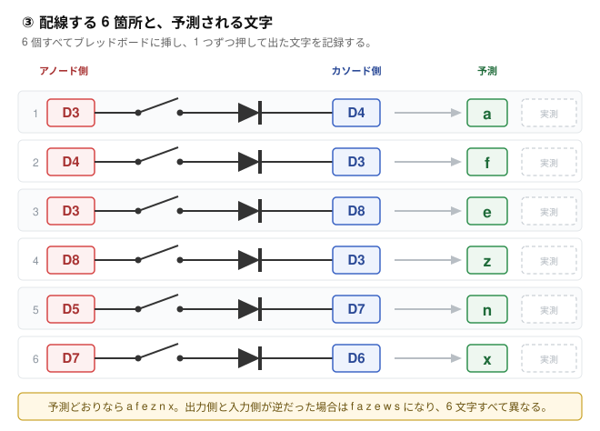

# Task C2 — チャープレックス配線の実測検証

**所要時間の目安: 半田付け 20 分 ＋ 配線と測定 30 分**

---

## 1. なぜやるか

分割の左右をつなぐのは無線だが、**片手ぶんのキーを読む部分**は各半分の中で完結する。
XIAO nRF52840 は使える GPIO が 11 本しかないのに対し、片手は最大 34 キーある。
そこで 1 本のピンが出力にも入力にもなる**チャープレックス**方式を使う。
6 本で 30 箇所、7 本で 42 箇所を区別できる。

問題は、**どの配線がどのキー位置として報告されるか**が配線図そのものになる点だ。
ここを取り違えたまま基板を発注すると、**42 キー全部が入れ替わった基板**が届く。
ソフトで直せる範囲を超える。だから基板設計（フェーズ D）の前にここを閉じる。

現状 `config/boards/shields/hhkb_split/hhkb_split_left.overlay` の
`matrix-transform` は【暫定】と書いてある。このタスクの結果で確定させる。

---

## 2. 事前に導出した規則

ZMK の実装（`app/module/drivers/kscan/kscan_gpio_charlieplex.c`、2026-08-07 時点の main）
を読んで、こう動くはずだと分かっている。

- `gpios` プロパティに書いた**順序**が、そのまま添字 `0, 1, 2, …` になる
- 走査ループは `gpios[row]` を出力にして **HIGH を出し**、
  `gpios[col]` を**プルダウン付きの入力**で読む
- 押下は `RC(row, col)` として報告される

つまり:

> **`RC(row, col)` は、`gpios[row]` から `gpios[col]` へ電流が流れるキー。
> ダイオードのアノードが `gpios[row]` 側、カソード（帯のある側）が `gpios[col]` 側。**

**これはソースを読んだだけの推測であって、まだ確かめていない。**
以下でこれを実機にかける。

---

## 3. 用意するもの

| 品目 | 数 | 備考 |
|---|---|---|
| XIAO nRF52840 | 1 | |
| ピンヘッダ 7 ピン | **2 本** | 基板の**両側**に必要（後述） |
| タクトスイッチ | 6 | |
| 1N4007 | 6 | キー用途なら速度は不問 |
| ブレッドボード | 1 | |
| ジャンパ線 | 12 本程度 | |
| USB-C ケーブル | 1 | **データ通信対応のもの。充電専用では書き込めない** |

---

## 4. ピンヘッダの半田付け

XIAO はヘッダ未実装で出荷される。ブレッドボードに挿すには**両側 7 ピンずつ、
計 14 ピン**を立てる必要がある。

前回「D3〜D8 を含む列」と書いたのは誤りだった。**D3〜D6 は左列、D7・D8 は右列**で、
片側には収まらない。どのみち両側に立てないとブレッドボードで安定しないので、
**素直に両側 7 ピンずつ立てる**のが正解。

### ピンの数え方

**ピン番号のシルクは基板の裏面にしかない。** ブレッドボードに挿すと下を向いて
見えなくなるので、位置で覚えること。

USB コネクタを**奥**に向けて上から見たとき:

- **左列** … 上から D0 D1 D2 **D3 D4 D5 D6**（使うのは下 4 本）
- **右列** … 上から 5V GND 3V3 D10 D9 **D8 D7**（使うのは下 2 本、**D7 が最下端**）

D7 と D8 は上下が逆転している（D8 が上、D7 が下）。ここだけ直感に反するので注意。

### ブレッドボードへの挿し方

XIAO は幅 17.8mm で、ブレッドボード中央の溝をまたいで挿さる。
左列と右列が別々の列になり、それぞれのピンから 4 穴ぶん配線を引ける。

---

## 5. ファームウェアの書き込み

1. [GitHub Actions の最新の成功ビルド](https://github.com/ms0216/hhkb-split/actions)を開く
2. 下部の Artifacts から `firmware` をダウンロードして展開
3. 中の **`proto_charlie-xiao_ble__zmk-zmk.uf2`** を使う
4. XIAO を USB でつなぐ
5. 基板上の **RESET ボタンを素早く 2 回**押す
6. `XIAO-SENSE` という名前のドライブがマウントされる
   （通常版でもこの名前になる。Sense を買ったわけではない）
7. そこへ `.uf2` をコピーする。自動で再起動して書き込み完了

この治具は `CONFIG_ZMK_BLE=n` にしてある。検証中に BLE のペアリング状態が
変数として混ざらないようにするため。**USB 接続のまま、普通のキーボードとして
文字が入る。**

---

## 6. 1 キーぶんの配線

注意点が 2 つある。

**タクトスイッチは 4 本足で、同じ辺の 2 本が内部で最初からつながっている。**
そこを使うと押していなくても常時導通し、全部のキーが押しっぱなしになる。
向かい合う辺から 1 本ずつ選ぶこと。テスターの導通モードで
「押したときだけ鳴る」組み合わせを確かめてから挿すのが確実。

**ダイオードの帯の向きが、このタスクの答えそのもの。** 逆に挿すと別の文字が出る。
向きを確かめるのが目的なので、ここを間違えると検証にならない。

---

## 7. 配線する 6 箇所

30 箇所を総当たりする必要はない。**規則が間違っていた場合に別の答えになる
組み合わせ**を選べば、6 箇所で決まる。

6 個すべてを同時にブレッドボードへ挿す。テキストエディタを開いて、
1 番から順に押し、出た文字を記録する。

**予測は `a f e z n x`。** もし出力側と入力側の役割が逆だった場合、
同じ配線で `f a z e w s` が出る。6 文字すべて異なるので取り違えようがない。

### 記録欄

| # | アノード側 → カソード側 | 予測 | 実測 |
|---|---|---|---|
| 1 | D3 → D4 | a | |
| 2 | D4 → D3 | f | |
| 3 | D3 → D8 | e | |
| 4 | D8 → D3 | z | |
| 5 | D5 → D7 | n | |
| 6 | D7 → D6 | x | |

---

## 8. 判定

**6 箇所すべて一致した場合**
規則は確定。残る 24 箇所も同じ規則に従うので実測不要。
`config/boards/shields/proto_charlie/proto_charlie.keymap` の冒頭にある 30 行の表が、
そのまま基板の配線指示になる。フェーズ D（KiCad での基板設計）へ進む。

**1 つでも食い違った場合**
規則の読み違い。実測値を上の表に残したうえで、食い違いのパターンから規則を
立て直し、**別の 6 箇所で再検証する**。
推測で `map` を書き換えて先へ進まないこと。

**何も入力されない場合**
検証以前の問題。次の順で切り分ける。

1. **ダイオードを外し**、スイッチだけで 2 本のピンを直結して押す
   → 文字が出れば向きの問題、出なければ配線か書き込みの問題
2. `proto_direct` のファームに戻し、**D0 と GND** の間でスイッチを押す
   → ここが動かなければ XIAO・USB ケーブル・書き込みのいずれか
3. それでも駄目なら `config/boards/shields/proto_charlie/proto_charlie.conf` の
   待ち時間（`WAIT_BEFORE_INPUTS` / `WAIT_BETWEEN_OUTPUTS`）を 20 から 200 へ上げる
   → ブレッドボードの配線容量で信号が鈍っている可能性

**一部のキーだけ反応しない場合**
そのスイッチの足の選び方（同じ辺を使っていないか）と、
ダイオードの断線をまず疑う。

---

## 9. このタスクで確定しないこと

- **7 ピン側（右半分・42 箇所）** — 規則は同じなので追加の実測は不要。
  ピンが 1 本増えるだけで走査の仕組みは変わらない。
- **同時押し** — 別途確認する。チャープレックスはダイオードがあるので
  原理的にゴーストは出ないが、実機で裏を取る。
- **BLE 分割** — XIAO 2 個目が要る（Task C3）。
- **電池駆動** — 電池ボックスが要る（Task C4）。

---

## 付録: 30 箇所の完全な対応表

規則が確定したあと、基板設計で参照する表。
`proto_charlie.keymap` のコメントと同じ内容。

| 文字 | RC(row,col) | アノード → カソード | | 文字 | RC(row,col) | アノード → カソード |
|---|---|---|---|---|---|---|
| a | RC(0,1) | D3 → D4 | | p | RC(3,0) | D6 → D3 |
| b | RC(0,2) | D3 → D5 | | q | RC(3,1) | D6 → D4 |
| c | RC(0,3) | D3 → D6 | | r | RC(3,2) | D6 → D5 |
| d | RC(0,4) | D3 → D7 | | s | RC(3,4) | D6 → D7 |
| e | RC(0,5) | D3 → D8 | | t | RC(3,5) | D6 → D8 |
| f | RC(1,0) | D4 → D3 | | u | RC(4,0) | D7 → D3 |
| g | RC(1,2) | D4 → D5 | | v | RC(4,1) | D7 → D4 |
| h | RC(1,3) | D4 → D6 | | w | RC(4,2) | D7 → D5 |
| i | RC(1,4) | D4 → D7 | | x | RC(4,3) | D7 → D6 |
| j | RC(1,5) | D4 → D8 | | y | RC(4,5) | D7 → D8 |
| k | RC(2,0) | D5 → D3 | | z | RC(5,0) | D8 → D3 |
| l | RC(2,1) | D5 → D4 | | 1 | RC(5,1) | D8 → D4 |
| m | RC(2,3) | D5 → D6 | | 2 | RC(5,2) | D8 → D5 |
| n | RC(2,4) | D5 → D7 | | 3 | RC(5,3) | D8 → D6 |
| o | RC(2,5) | D5 → D8 | | 4 | RC(5,4) | D8 → D7 |
