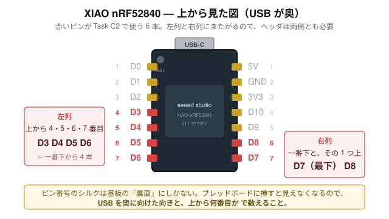
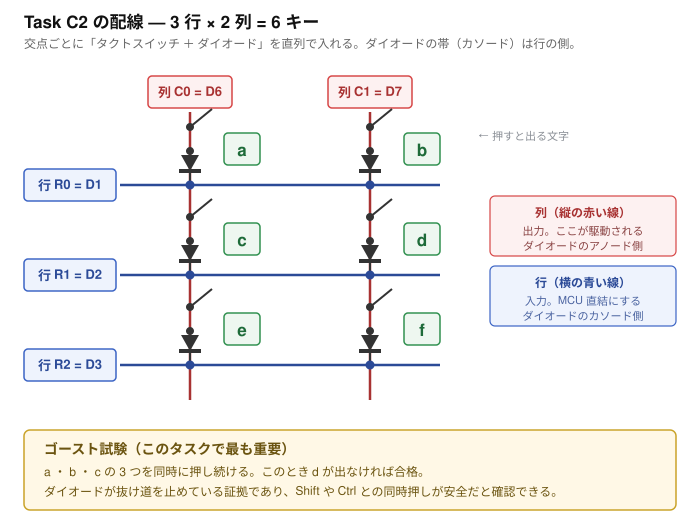
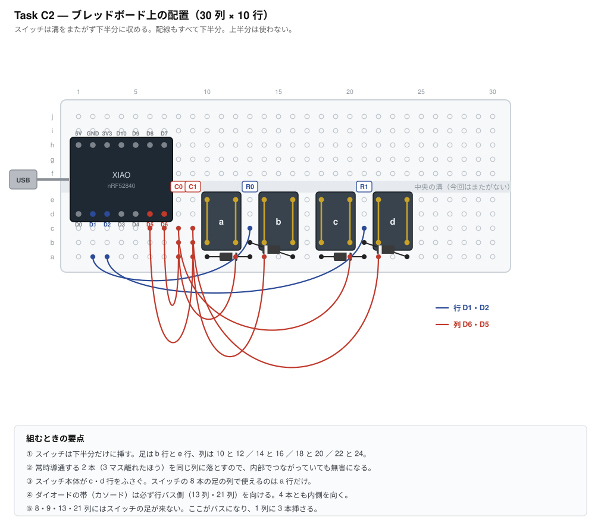
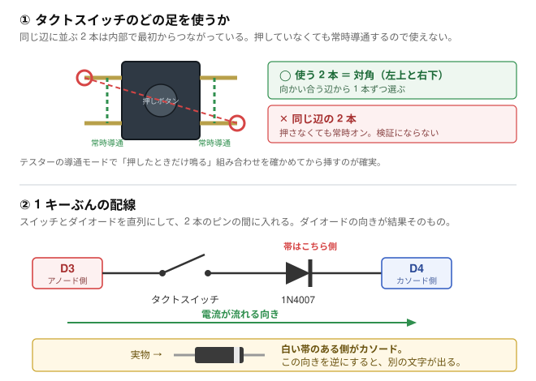
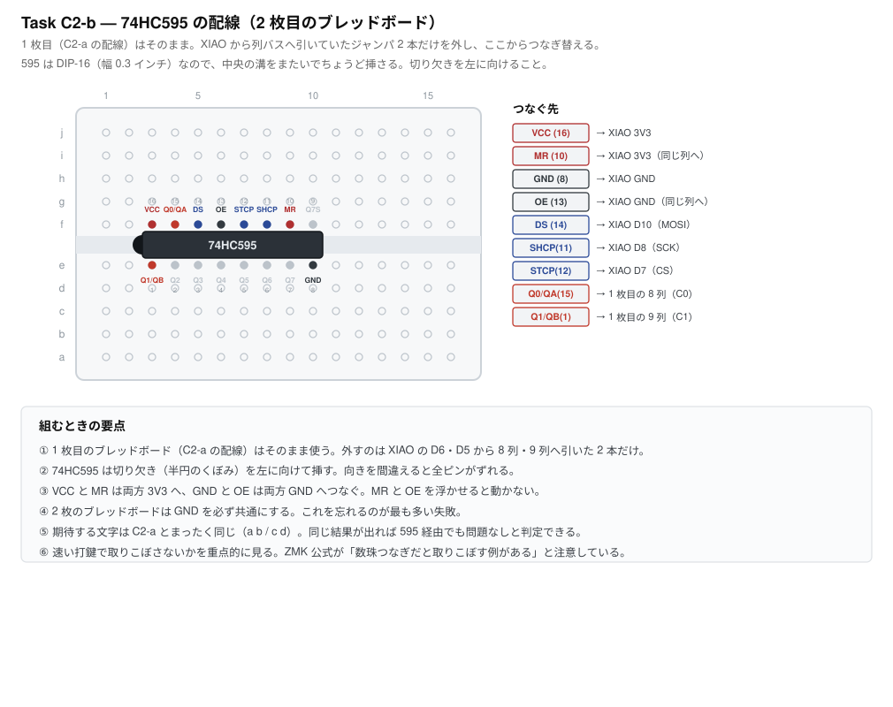

# Task C2 — キースキャンの実測検証

**所要時間の目安: 配線と測定 30 分**

> 先に [Task C1（疎通確認）](task-c1-smoke-test.md) を済ませておくこと。
> XIAO・USB ケーブル・書き込み手順・ZMK のビルドが健全だと確定していれば、
> ここで失敗したときの原因が配線の 3 通りに絞れる。

> この文書は 2026-08-07 に全面的に書き直した。それ以前はチャープレックス方式の
> 検証手順だったが、方式ごと破棄したため。経緯は
> [decisions/2026-08-07-keyscan.md](decisions/2026-08-07-keyscan.md)。

---

## 1. なぜやるか

キースキャンの配線は**基板の配線図そのもの**になる。ここを取り違えたまま
JLCPCB へ発注すると、61 キーぶんの配線が無駄になる。ソフトで直せる範囲を
超えるので、フェーズ D（基板設計）の前に実測で閉じる。

確かめることは 3 つ。

1. **ダイオードの向きが設計どおりか** — 逆だと 1 つも反応しない
2. **同時押しでゴーストが出ないか** — ここが本命
3. **74HC595 で列を駆動できるか** — 部品が届いてから

このうち **1 と 2 は手持ちの部品だけで今すぐできる。**

## 2. 本番の構成（確認しておくこと）

「ごく普通の行×列マトリクス ＋ キーごとにダイオード 1 個」。
列を駆動するピンが足りないぶんをシフトレジスタ 74HC595 で作る。



| | 行 | 列 | 収容数 | 実キー数 |
|---|---|---|---|---|
| 左 | 5 | 6 | 30 | 27 |
| 右 | 5 | 8 | 40 | 34 |

---

## 3. 用意するもの

### C2-a（今すぐできる）

| 品目 | 数 | 手持ち |
|---|---|---|
| XIAO nRF52840 | 1 | ✅ |
| ピンヘッダ 7 ピン | **2 本** | 要確認（後述） |
| タクトスイッチ | **4** | ✅（6 個あるので 2 個は予備） |
| 1N4007 | **4** | ✅ |
| ブレッドボード 30 列 × 10 行 | 1 | ✅ |
| ジャンパ線 | 8 本 | ✅ |
| USB-C ケーブル | 1 | **データ通信対応のもの。充電専用では書き込めない** |

**なぜ 4 キーなのか。** ゴーストは「同じ行の 2 キー ＋ 同じ列の 1 キー」で
起きるので、2 行 2 列あれば再現条件を満たす。行を増やしても新しいことは
分からない。加えて、スイッチ 1 個が 3 列を占め、その列では a 行しか使えない
（本体が他の穴をふさぐ）ため、6 個並べると 30 列に収まらない。

### C2-b（部品待ち）

| 品目 | 数 | 概算 |
|---|---|---|
| 74HC595（DIP-16・スルーホール） | 1 | ¥50 |
| ブレッドボード（2 枚目） | 1 | 手持ち |
| ジャンパ線（追加） | 9 本 | 手持ち |

ブレッドボードで試すので、表面実装ではなく**DIP パッケージ**を買うこと。
本番基板では表面実装品を JLCPCB が実装する。

---

## 4. ピンヘッダの半田付け

XIAO はヘッダ未実装で出荷される。**両側 7 ピンずつ、計 14 ピン**を立てる。
C2 で使うのは左列（D1・D2・D5・D6）だけだが、[Task C1](task-c1-smoke-test.md) で
右列の GND を使うのと、片側だけではブレッドボード上で安定しないため。

### ピンの数え方

**ピン番号のシルクは基板の裏面にしかない。** ブレッドボードに挿すと下を向いて
見えなくなるので、位置で覚えること。USB コネクタを**奥**に向けて上から見たとき:

- **左列**（上から）D0 D1 D2 D3 D4 D5 D6
- **右列**（上から）5V GND 3V3 D10 D9 D8 **D7**（D7 が最下端）

D7 と D8 は上下が逆転している。ここだけ直感に反するので注意。

**ピン間隔は 0.6 インチ（15.24mm）で、基板の外形 17.8mm とは違う。**
ブレッドボードに挿すと **d 行と h 行**に入る（c 行ではない）。

---

## 5. ファームウェアの書き込み

1. [GitHub Actions の最新の成功ビルド](https://github.com/ms0216/hhkb-split/actions)を開く
2. 下部の Artifacts から `firmware` をダウンロードして展開
3. 中の **`proto_matrix-xiao_ble__zmk-zmk.uf2`** を使う
4. XIAO を USB でつなぐ
5. 基板上の **RESET ボタンを素早く 2 回**押す
6. `XIAO-SENSE` という名前のドライブがマウントされる
   （通常版でもこの名前になる。Sense を買ったわけではない）
7. そこへ `.uf2` をコピーする。自動で再起動して書き込み完了

この治具は `CONFIG_ZMK_BLE=n` にしてある。検証中に BLE のペアリング状態が
変数として混ざらないようにするため。**USB 接続のまま、普通のキーボードとして
文字が入る。**

---

## 6. C2-a: 配線と疎通確認

まず回路として何を作るか。



これをブレッドボードに落とすと、こう置く。**列番号のとおりに挿せばそのまま完成する。**



**手持ちのタクトスイッチは中央の溝をまたげない。** 押して導通する 2 本が
2 マス（5.08mm）しか離れておらず、溝は 3 マス（7.62mm）あるため。
そこで**スイッチも配線もすべて下半分に収める**設計にした。溝をまたぐジャンパが
1 本も要らないので、間違いが減る。

行にも列にも XIAO の左列（D0〜D6）だけを使うのはそのため。本番では列は
シフトレジスタから来るので、ここでどのピンを使うかは本番と無関係でよい。

配置は電気的にも検算してある（各スイッチが意図した列ピンと行ピンを結ぶこと、
列同士・行同士が短絡しないこと、行バス列にスイッチの足が来ないこと）。

1 キーぶんの回路は次のとおり。



### タクトスイッチをどちら向きに挿すか

**必ずテスターで確かめること。品種によって向きが逆になる。**

4 本足のタクトスイッチは、同じ辺から出た 2 本が内部で常時つながっており、
押して初めてつながるのは**反対の辺との間**。どちらの間隔が広いかは品種で違う。

| 品種 | 常時導通する 2 本の間隔 | 押して導通する 2 本の間隔 |
|---|---|---|
| 6mm 角の定番品 | 4.5mm（狭いほう） | 6.5mm（**広いほう**） |
| 別品種の例（このプロジェクトの手持ち品） | 7.62mm ＝ 3 マス（**広いほう**） | 5.08mm ＝ 2 マス（狭いほう） |

**「広いほうがスイッチ側」と決めつけない。** 当初この文書にはそう書いていたが、
6mm 角の本体寸法から導いた話であって、他の品種には通用しなかった。

**10 秒でできる確認。** テスターを導通モードにして、足の組み合わせを当たる。

- **押したときだけ鳴る 2 本** → これがスイッチとして使う 2 本
- **押さなくても鳴る 2 本** → 内部でつながっている。この 2 本の間には何も入れない

**この 2 本が何マス離れているかを測ってから配置を決める。** 配置図の穴番号は
その寸法に合わせて作ってある。

### 挿す場所の一覧

図を見ながら、上から順に挿していけば完成する。**列番号は図の目盛りと同じ。**

| # | 部品 | 挿す場所 |
|---|---|---|
| 1 | XIAO nRF52840 | 1〜7 列。上側の足が **h 行**、下側の足が **d 行**。USB は左へはみ出す |
| 2 | タクトスイッチ **a** | **10 列と 12 列**（足は **b 行と e 行**） |
| 3 | タクトスイッチ **b** | **14 列と 16 列** |
| 4 | タクトスイッチ **c** | **18 列と 20 列** |
| 5 | タクトスイッチ **d** | **22 列と 24 列** |
| 6 | ダイオード（a 用） | **a 行**の 10 列 → 13 列。**帯は 13 列側** |
| 7 | ダイオード（b 用） | 16 列の **a 行** → 13 列の **b 行**。**帯は 13 列側** |
| 8 | ダイオード（c 用） | **a 行**の 18 列 → 21 列。**帯は 21 列側** |
| 9 | ダイオード（d 用） | 24 列の **a 行** → 21 列の **b 行**。**帯は 21 列側** |
| 10 | ジャンパ（行 R0） | 2 列の **a 行** → 13 列の **c 行**（**D1**） |
| 11 | ジャンパ（行 R1） | 3 列の **a 行** → 21 列の **c 行**（**D2**） |
| 12 | ジャンパ（列 C0） | 7 列の **c 行** → 8 列の **a 行**（**D6**） |
| 13 | ジャンパ（列 C0） | 12 列の **a 行** → 8 列の **b 行** |
| 14 | ジャンパ（列 C0） | 20 列の **a 行** → 8 列の **c 行** |
| 15 | ジャンパ（列 C1） | 6 列の **c 行** → 9 列の **a 行**（**D5**） |
| 16 | ジャンパ（列 C1） | 14 列の **a 行** → 9 列の **b 行** |
| 17 | ジャンパ（列 C1） | 22 列の **a 行** → 9 列の **c 行** |

**スイッチの足が入る 8 つの列（10・12・14・16・18・20・22・24）で使える穴は
a 行だけ。** c 行と d 行はスイッチ本体の下に隠れる。

**8・9・13・21 列にはスイッチの足が来ない。** ここが 4 本のバスになり、
それぞれ 3 本（ジャンパまたはダイオード）が挿さる。

挿し終わったら、テスターの導通モードで **8 列と 9 列がつながっていないこと**、
**13 列と 21 列がつながっていないこと**を確かめておくと安心。

### ダイオードの向き

**帯（カソード）は必ず行バスの列へ向ける。** 4 本とも内側を向く。
逆に挿したキーは、そのキーだけ反応しなくなる。

配置は電気的に検算してある（各スイッチが意図した列ピンと行ピンを結ぶこと、
列同士・行同士が短絡しないこと、行バス列にスイッチの足が来ないこと）。

### 記録欄

4 個を 1 つずつ押して、出た文字を記録する。

| スイッチ | 列 | 行 | 期待 | 実測 |
|---|---|---|---|---|
| a（10・12 列） | C0 (D6) | R0 (D1) | a | **a** ✅ |
| b（14・16 列） | C1 (D5) | R0 (D1) | b | **b** ✅ |
| c（18・20 列） | C0 (D6) | R1 (D2) | c | **c** ✅ |
| d（22・24 列） | C1 (D5) | R1 (D2) | d | **d** ✅ |

**2026-08-07 に 4 キーすべて一致を確認。**

---

## 7. C2-a: ゴースト試験（このタスクの本命）

**`a` `b` `c` の 3 つを同時に押し続ける。このとき `d` が出なければ合格。**

`d` は「列 C1・行 R1」の位置にあり、押していない。もしダイオードが無ければ、
`a`（C0-R0）と `b`（C1-R0）と `c`（C0-R1）を通って C1 と R1 がつながり、
`d` が押されたと誤検出される。**ダイオードがこの抜け道を止めていることを
実際に見て確かめる。**

これが破棄したチャープレックス方式で消せなかった現象であり、
方式変更の根拠そのもの。**必ず実施すること。**

| 押すキー | 出てよい文字 | 出てはいけない文字 |
|---|---|---|
| a・b・c を同時 | abc（順不同） | **d** |
| b・c・d を同時 | bcd | **a** |
| a・d を同時（対角） | ad | b・c |

念のため 3 通りとも試す。1 つでも余計な文字が出たら、
ダイオードの向きか、配線の間違いを疑う。

### 対照実験を忘れない

**先に 4 キーを 1 つずつ押して、全部が反応することを確かめておくこと。**

もし `d` の配線が間違っていて**そもそも死んでいる**なら、ゴースト試験は
自動的に「合格」してしまう。押していないキーが出ないのは当たり前だからだ。
**対照実験がないと、この試験は何も証明しない。**

### 実測結果（2026-08-07）

| 試験 | 出た文字 | 出てはいけない文字 | 判定 |
|---|---|---|---|
| **d 単体（対照実験）** | d × 10 | a・b・c → **0** | ✅ |
| a・b・c 同時 | a=13 b=12 c=13（計 38） | **d → 0** | ✅ |
| b・c・d 同時 | b=9 c=10 d=16（計 35） | **a → 0** | ✅ |
| a・d 同時（対角） | a=12 d=10（計 22） | b・c → **0** | ✅ |

**どの組み合わせでもゴーストは発生しなかった。** キーごとにダイオードを
入れた行×列マトリクスが、設計どおり抜け道を止めていることを実測で確認した。
チャープレックスを破棄した判断（[decisions/2026-08-07-keyscan.md](decisions/2026-08-07-keyscan.md)）が
実機で裏づけられたことになる。

同時押しの順序がばらつくのは、手で同時に押す以上避けられないもので、
ZMK がスキャン順に報告しているだけ。問題ではない。

なお `b・c・d` の試験で `d` だけ回数が多い（16 対 9・10）。ブレッドボードの
長いジャンパ線と剥き出しのタクトスイッチによるチャタリングと思われる。
本番基板では起きにくいはずだが、必要なら ZMK の `debounce-press-ms` /
`debounce-release-ms` で詰められる。**キーの取り違えではないので合否には影響しない。**

---

## 8. C2-b: シフトレジスタの確認

本番では列を 74HC595 で駆動する。ここで確かめるのは **1 点だけ**。

> **SPI 経由でも取りこぼさずに列を駆動できるか。**

ダイオードの向きもゴーストの有無も C2-a で確認済みで、**列の駆動方法を
変えても変わらない性質**なので、ここでは問わない。

### C2-a の配線をそのまま使う

シールド `proto_shift` は、行列の構成を `proto_matrix` と**まったく同じ
2 行 × 2 列**にしてある。違うのは列の供給元だけ。期待する文字も同じ
（`a` `b` / `c` `d`）なので、**C2-a の結果と直接比べられる**。

1 枚目のブレッドボードで外すのは、**XIAO の D6・D5 から 8 列・9 列へ引いた
ジャンパ 2 本だけ**。スイッチもダイオードも行の配線も、そのままでよい。

### 2 枚目のブレッドボードに 595 を置く



| 74HC595 のピン | つなぐ先 |
|---|---|
| **VCC (16)** | XIAO の 3V3 |
| **MR (10)** | XIAO の 3V3（VCC と同じ列でよい） |
| **GND (8)** | XIAO の GND |
| **OE (13)** | XIAO の GND（GND と同じ列でよい） |
| **DS (14)** | XIAO の **D10**（MOSI） |
| **SHCP (11)** | XIAO の **D8**（SCK） |
| **STCP (12)** | XIAO の **D7**（CS） |
| **Q0/QA (15)** | 1 枚目の **8 列**（列 C0） |
| **Q1/QB (1)** | 1 枚目の **9 列**（列 C1） |

**ピン割り当ては本番と同じ**（SCK=D8 / MOSI=D10 / CS=D7）。ここで動けば
本番の基板でもそのまま通る。

### 間違えやすいところ

**切り欠き（半円のくぼみ）を左に向けて挿す。** 逆向きだと全ピンがずれる。
1 番ピンは切り欠きの側の下段（e 行）の左端。

**MR と OE を浮かせない。** MR（マスタリセット）は Low で中身が消えるので
3V3 へ、OE（出力許可）は Low で有効なので GND へつなぐ。どちらも浮かせると
動かないか不安定になる。

**2 枚のブレッドボードの GND を必ず共通にする。** 電源を別々にした
2 枚組で最も多い失敗。

### 書き込むファーム

**`proto_shift-xiao_ble__zmk-zmk.uf2`**

### 記録欄

| スイッチ | 期待 | 実測 |
|---|---|---|
| a（10・12 列） | a | |
| b（14・16 列） | b | |
| c（18・20 列） | c | |
| d（22・24 列） | d | |

**4 つとも C2-a と同じ文字が出れば合格。**

### 速い打鍵の確認

**ここが本番。** ZMK 公式が「シフトレジスタを数珠つなぎにすると
`spi-max-frequency` を上げない限り速い打鍵をまれに取りこぼす」と
注意している。こちらは 1 個で数珠つなぎしないので起きにくいはずだが、
**実測で確かめる**。

`a` と `b` を**できるだけ速く交互に連打**して、打った回数と出た文字数が
合うかを見る。取りこぼすようなら `proto_shift.conf` に次を足して
再ビルドする（既定は 200kHz）。

```
# spi-max-frequency は overlay 側の値。上げる場合は overlay を編集する
```

取りこぼしが出た場合は、`proto_shift.overlay` の
`spi-max-frequency = <200000>` を `<1000000>` などへ上げて試す。

### 対応表の確認

`&shifter 0` が **QA（15 番ピン）**、`&shifter 1` が **QB（1 番ピン）**に
対応するはず。ZMK のドライバ実装（値の下位ビットから順に QA へ載せる）から
導いた。**もし `a` と `b`、`c` と `d` が入れ替わって出たら、この対応が逆**
ということなので、`col-gpios` の順序を入れ替えて再ビルドする。

## 9. 判定

**✅ C2-a は 2026-08-07 に合格した。** 方式は成立。
フェーズ D（KiCad での基板設計）へ進んでよい。
74HC595 の確認（C2-b）は基板設計と並行して行う。

**特定のキーだけ反応しない場合**
そのキーのダイオードの向きと、タクトスイッチの足の選び方をまず疑う。

**何も入力されない場合**

1. **ダイオードを 1 つ外し**、スイッチだけで列と行を直結して押す
   → 文字が出れば全部のダイオードの向きが逆、出なければ配線か書き込みの問題
2. `proto_direct` のファームに戻し、**D0 と GND** の間でスイッチを押す
   → ここが動かなければ XIAO・USB ケーブル・書き込みのいずれか

**押していないキーが出る場合**
配線の間違い（列と行を取り違えている、隣の穴に挿さっている）をまず疑う。
配線が正しいのにゴーストが出るなら**設計上の重大な問題**なので、
先へ進まずに報告すること。

---

## 10. このタスクで確定しないこと

- **BLE 分割** — XIAO 2 個目が要る（Task C3）
- **乾電池駆動と逆流** — 電池ボックスが要る（Task C4・C5）
- **61 キー全部の配線** — 方式が成立すれば残りは同じ規則の繰り返しなので、
  実測ではなく基板設計時の照合で担保する
