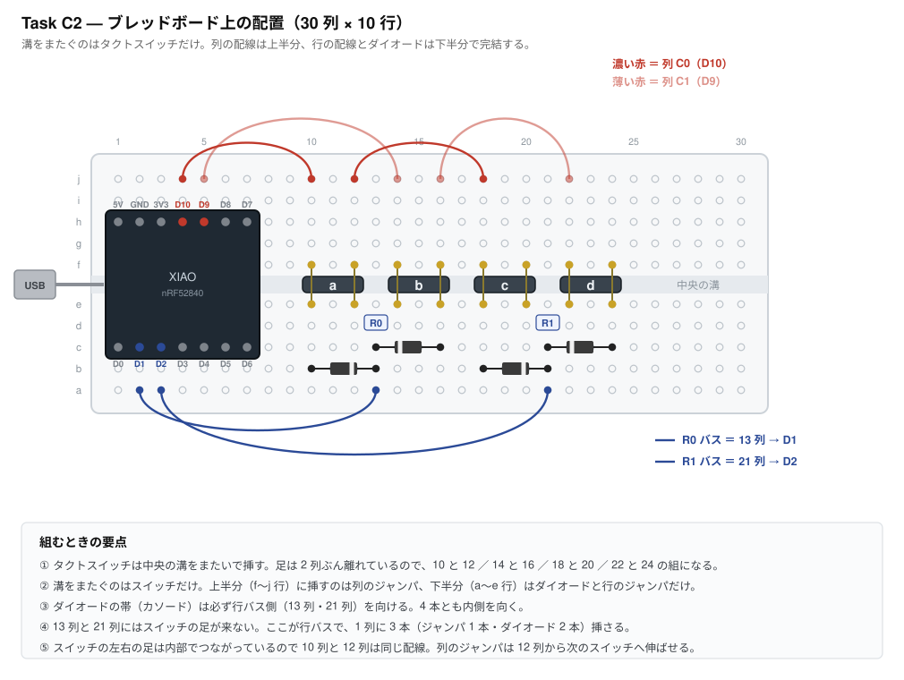

# Task C2 — キースキャンの実測検証

**所要時間の目安: 配線と測定 30 分**

> 先に [Task C1（疎通確認）](task-c1-smoke-test.md) を済ませておくこと。
> XIAO・USB ケーブル・書き込み手順・ZMK のビルドが健全だと確定していれば、
> ここで失敗したときの原因が配線の 3 通りに絞れる。

> この文書は 2026-08-07 に全面的に書き直した。それ以前はチャープレックス方式の
> 検証手順だったが、方式ごと破棄したため。経緯は
> [decisions/2026-08-07-keyscan.md](decisions/2026-08-07-keyscan.md)。

---

## 1. なぜやるか

キースキャンの配線は**基板の配線図そのもの**になる。ここを取り違えたまま
JLCPCB へ発注すると、61 キーぶんの配線が無駄になる。ソフトで直せる範囲を
超えるので、フェーズ D（基板設計）の前に実測で閉じる。

確かめることは 3 つ。

1. **ダイオードの向きが設計どおりか** — 逆だと 1 つも反応しない
2. **同時押しでゴーストが出ないか** — ここが本命
3. **74HC595 で列を駆動できるか** — 部品が届いてから

このうち **1 と 2 は手持ちの部品だけで今すぐできる。**

## 2. 本番の構成（確認しておくこと）

「ごく普通の行×列マトリクス ＋ キーごとにダイオード 1 個」。
列を駆動するピンが足りないぶんをシフトレジスタ 74HC595 で作る。

| | 行 | 列 | 収容数 | 実キー数 |
|---|---|---|---|---|
| 左 | 5 | 6 | 30 | 27 |
| 右 | 5 | 8 | 40 | 34 |

---

## 3. 用意するもの

### C2-a（今すぐできる）

| 品目 | 数 | 手持ち |
|---|---|---|
| XIAO nRF52840 | 1 | ✅ |
| ピンヘッダ 7 ピン | **2 本** | 要確認（後述） |
| タクトスイッチ | **4** | ✅（6 個あるので 2 個は予備） |
| 1N4007 | **4** | ✅ |
| ブレッドボード 30 列 × 10 行 | 1 | ✅ |
| ジャンパ線 | 6 本 | ✅ |
| USB-C ケーブル | 1 | **データ通信対応のもの。充電専用では書き込めない** |

**なぜ 4 キーなのか。** ゴーストは「同じ行の 2 キー ＋ 同じ列の 1 キー」で
起きるので、2 行 2 列あれば再現条件を満たす。行を増やしても新しいことは
分からない。加えて 30 列のブレッドボードには XIAO（本体長 21mm ＝ 約 8 列）と
スイッチ 6 個が並ばず、6 個にするとダイオードを 1 列間隔で折り曲げて
挿すことになる。4 個ならすべて 3 列間隔で素直に挿せる。

### C2-b（部品待ち）

| 品目 | 数 | 概算 |
|---|---|---|
| 74HC595（DIP・スルーホール） | 1 | ¥50 |

ブレッドボードで試すので、表面実装ではなく**DIP パッケージ**を買うこと。
本番基板では表面実装品を JLCPCB が実装する。

---

## 4. ピンヘッダの半田付け

XIAO はヘッダ未実装で出荷される。ブレッドボードに挿すには**両側 7 ピンずつ、
計 14 ピン**を立てる。使うピンが左右の列にまたがるので、片側だけでは足りない。

### ピンの数え方

**ピン番号のシルクは基板の裏面にしかない。** ブレッドボードに挿すと下を向いて
見えなくなるので、位置で覚えること。USB コネクタを**奥**に向けて上から見たとき:

- **左列**（上から）D0 D1 D2 D3 D4 D5 D6
- **右列**（上から）5V GND 3V3 D10 D9 D8 **D7**（D7 が最下端）

D7 と D8 は上下が逆転している。ここだけ直感に反するので注意。

---

## 5. ファームウェアの書き込み

1. [GitHub Actions の最新の成功ビルド](https://github.com/ms0216/hhkb-split/actions)を開く
2. 下部の Artifacts から `firmware` をダウンロードして展開
3. 中の **`proto_matrix-xiao_ble__zmk-zmk.uf2`** を使う
4. XIAO を USB でつなぐ
5. 基板上の **RESET ボタンを素早く 2 回**押す
6. `XIAO-SENSE` という名前のドライブがマウントされる
   （通常版でもこの名前になる。Sense を買ったわけではない）
7. そこへ `.uf2` をコピーする。自動で再起動して書き込み完了

この治具は `CONFIG_ZMK_BLE=n` にしてある。検証中に BLE のペアリング状態が
変数として混ざらないようにするため。**USB 接続のまま、普通のキーボードとして
文字が入る。**

---

## 6. C2-a: 配線と疎通確認

まず回路として何を作るか。

これをブレッドボードに落とすと、こう置く。**列番号のとおりに挿せばそのまま完成する。**

行に D1・D2、列に D9・D10 を選んだのは**配線が交差しないようにするため**。
XIAO は左列（D0〜D6）と右列（5V〜D7）が溝の両側に出るので、行を左列・
列を右列に寄せると、行の配線は下半分だけ、列の配線は上半分だけで完結する。
本番でも列は SPI 側（右列）から来るので、役割の割り振りも一致する。

配置は電気的にも検算してある（各スイッチが意図した列ピンと行ピンを結ぶこと、
列同士・行同士が短絡しないこと、行バス列にスイッチの足が来ないこと）。

1 キーぶんの作り方は次のとおり。

注意点が 2 つある。

**タクトスイッチは 4 本足で、同じ辺の 2 本が内部で最初からつながっている。**
そこを使うと押していなくても常時導通し、全部のキーが押しっぱなしになる。
向かい合う辺から 1 本ずつ選ぶこと。テスターの導通モードで
「押したときだけ鳴る」組み合わせを確かめてから挿すのが確実。

**ダイオードの帯（カソード）は必ず行バスの列（13 列・21 列）へ向ける。**
4 本とも内側を向く。逆に挿したキーはそのキーだけ反応しなくなる。

### 挿す場所の一覧

図を見ながら、上から順に挿していけば完成する。**列番号は図の目盛りと同じ。**

| # | 部品 | 挿す場所 |
|---|---|---|
| 1 | XIAO nRF52840 | 1〜7 列。上側の足が **h 行**、下側の足が **c 行**。USB は左へはみ出す |
| 2 | タクトスイッチ **a** | 溝をまたいで **10 列と 12 列**（足は e 行と f 行） |
| 3 | タクトスイッチ **b** | **14 列と 16 列** |
| 4 | タクトスイッチ **c** | **18 列と 20 列** |
| 5 | タクトスイッチ **d** | **22 列と 24 列** |
| 6 | ダイオード（a 用） | **b 行**の 10 列 → 13 列。**帯は 13 列側** |
| 7 | ダイオード（b 用） | **c 行**の 16 列 → 13 列。**帯は 13 列側** |
| 8 | ダイオード（c 用） | **b 行**の 18 列 → 21 列。**帯は 21 列側** |
| 9 | ダイオード（d 用） | **c 行**の 24 列 → 21 列。**帯は 21 列側** |
| 10 | ジャンパ（列 C0） | **j 行**の 4 列 → 10 列 |
| 11 | ジャンパ（列 C0） | **j 行**の 12 列 → 18 列 |
| 12 | ジャンパ（列 C1） | **j 行**の 5 列 → 14 列 |
| 13 | ジャンパ（列 C1） | **j 行**の 16 列 → 22 列 |
| 14 | ジャンパ（行 R0） | **a 行**の 2 列 → 13 列 |
| 15 | ジャンパ（行 R1） | **a 行**の 3 列 → 21 列 |

11 番と 13 番が「スイッチの反対側の足から次のスイッチへ」伸びているのは、
**スイッチの左右の足が内部でつながっている**ため。10 列と 12 列は同じ配線なので、
12 列を中継点として使える。

挿し終わったら、テスターの導通モードで **13 列と 21 列がつながっていないこと**、
**4 列（D10）と 5 列（D9）がつながっていないこと**を確かめておくと安心。

### 記録欄

4 個を 1 つずつ押して、出た文字を記録する。

| スイッチの位置 | 列 | 行 | 期待 | 実測 |
|---|---|---|---|---|
| 10 列 | C0 (D10) | R0 (D1) | a | |
| 14 列 | C1 (D9) | R0 (D1) | b | |
| 18 列 | C0 (D10) | R1 (D2) | c | |
| 22 列 | C1 (D9) | R1 (D2) | d | |

---

## 7. C2-a: ゴースト試験（このタスクの本命）

**`a` `b` `c` の 3 つを同時に押し続ける。このとき `d` が出なければ合格。**

`d` は「列 C1・行 R1」の位置にあり、押していない。もしダイオードが無ければ、
`a`（C0-R0）と `b`（C1-R0）と `c`（C0-R1）を通って C1 と R1 がつながり、
`d` が押されたと誤検出される。**ダイオードがこの抜け道を止めていることを
実際に見て確かめる。**

これが破棄したチャープレックス方式で消せなかった現象であり、
方式変更の根拠そのもの。**必ず実施すること。**

| 押すキー | 出てよい文字 | 出てはいけない文字 |
|---|---|---|
| a・b・c を同時 | abc（順不同） | **d** |
| b・c・d を同時 | bcd | **a** |
| a・d を同時（対角） | ad | b・c |

念のため 3 通りとも試す。1 つでも余計な文字が出たら、
ダイオードの向きか、配線の間違いを疑う。

---

## 8. C2-b: シフトレジスタの確認（74HC595 が届いてから）

本番では列を 74HC595 で駆動する。C2-a で確かめた性質はそのまま通用するので、
ここで確かめるのは「SPI 経由でも取りこぼさずに列を駆動できるか」だけ。

手順は 74HC595 を入手してから追記する。要点だけ先に書いておく。

- 接続は SER→D10（MOSI）、SRCLK→D8（SCK）、RCLK→D7（CS）、OE→GND、SRCLR→3V3
- ZMK 側は `proto_shift` シールドとして用意する
- **速い打鍵で取りこぼさないか**を重点的に見る。ZMK 公式が
  「数珠つなぎのときは `spi-max-frequency` を上げないと速い打鍵をまれに
  取りこぼす」と注意している。こちらは 1 個で数珠つなぎしないので
  起きにくいはずだが、実測で確かめる

---

## 9. 判定

**C2-a の 4 キーが表どおりに出て、ゴースト試験を 3 通りとも通った場合**
方式は成立。フェーズ D（KiCad での基板設計）へ進んでよい。
74HC595 の確認（C2-b）は基板設計と並行してよい。

**特定のキーだけ反応しない場合**
そのキーのダイオードの向きと、タクトスイッチの足の選び方をまず疑う。

**何も入力されない場合**

1. **ダイオードを 1 つ外し**、スイッチだけで列と行を直結して押す
   → 文字が出れば全部のダイオードの向きが逆、出なければ配線か書き込みの問題
2. `proto_direct` のファームに戻し、**D0 と GND** の間でスイッチを押す
   → ここが動かなければ XIAO・USB ケーブル・書き込みのいずれか

**押していないキーが出る場合**
配線の間違い（列と行を取り違えている、隣の穴に挿さっている）をまず疑う。
配線が正しいのにゴーストが出るなら**設計上の重大な問題**なので、
先へ進まずに報告すること。

---

## 10. このタスクで確定しないこと

- **BLE 分割** — XIAO 2 個目が要る（Task C3）
- **乾電池駆動と逆流** — 電池ボックスが要る（Task C4・C5）
- **61 キー全部の配線** — 方式が成立すれば残りは同じ規則の繰り返しなので、
  実測ではなく基板設計時の照合で担保する
