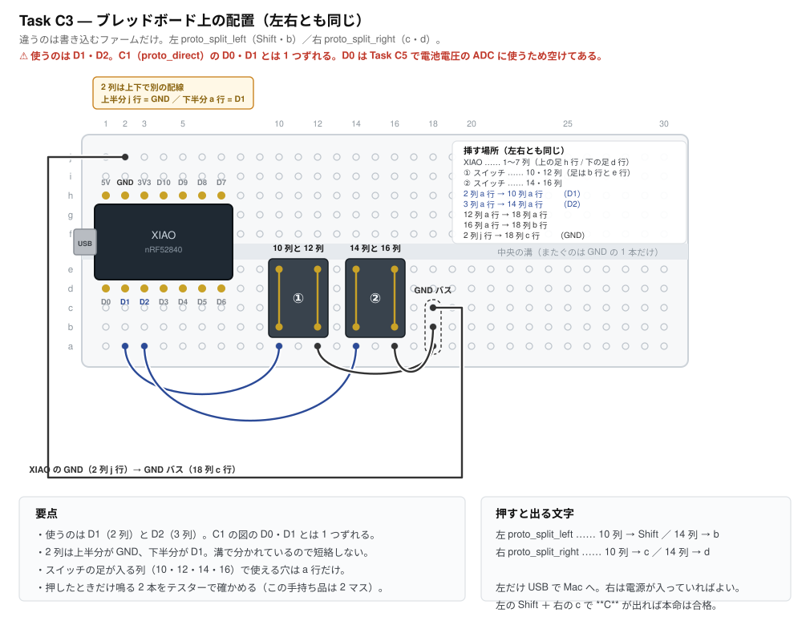
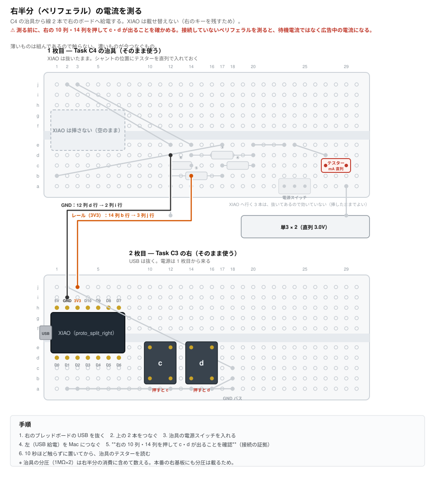
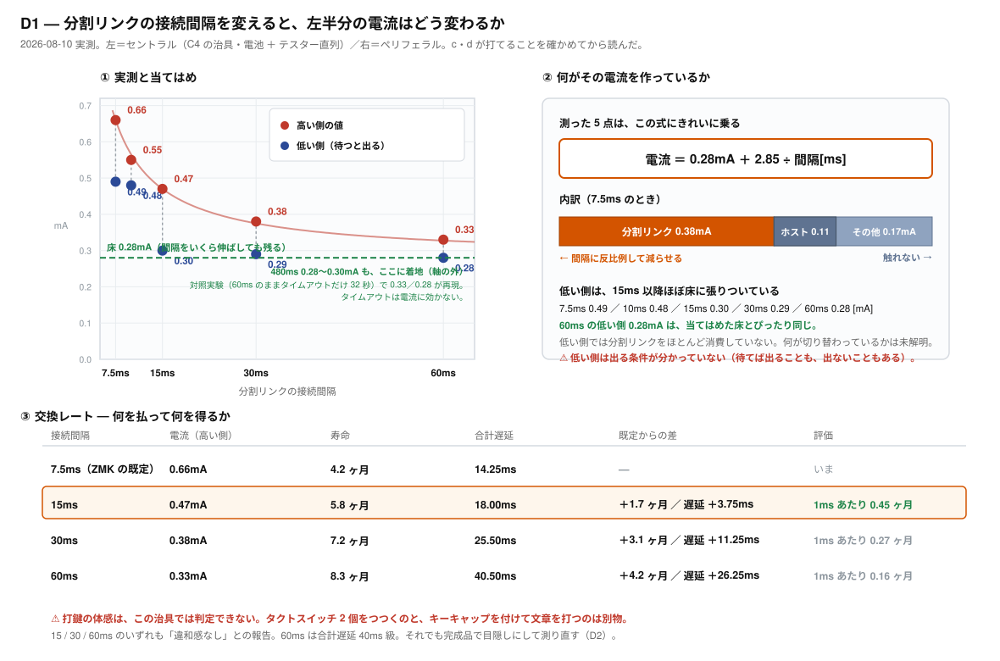

# Task C3 — BLE 分割の検証

**所要時間の目安: 半田付け 20 分 ＋ 配線と測定 30 分**

> 先に [Task C1](task-c1-smoke-test.md) を済ませておくこと。
> 2 個目の XIAO も、まず C1 を通してから使う。

---

## 1. なぜやるか

**左右間も無線であることは、この計画の必須要件**（仕様書の優先度「必須」）。
TRRS ケーブルは切り分け用に基板へフットプリントだけ残すが、常用構成には
含めない。したがって**分割無線が成立しなければ計画そのものが揺らぐ**。

確かめることは 3 つ。

| # | 確認対象 | 不成立だと |
|---|---|---|
| 1 | 左右がペアリングして、右のキーが左を経由してホストへ届く | 分割が成立しない |
| 2 | **左右同時押しが崩れない**（Shift＋文字など） | HHKB の使い勝手を再現できない |
| 3 | 遅延が体感できる水準でない | 実用にならない |

**2 が本命。** HHKB では左 Shift ＋ 右手の文字、左 Ctrl ＋ 右手の文字を
常時使う。ここが崩れると目的を満たさない。

## 2. なぜ本番シールドを使わないか

本番の `hhkb_split_left` / `right` は **74HC595 と 61 キー**が前提で、
分割の検証には重すぎる。配線を間違えたときに「BLE の問題か、
マトリクスの問題か」が切り分けられない。

そこで `proto_split` は**キースキャンを直結**にした。
ダイオードもシフトレジスタも使わない。左 2 キー、右 2 キーだけ。
**BLE 分割だけが変数になる。**

なお C1・C2 では変数を減らすため `CONFIG_ZMK_BLE=n` にしていたが、
**このタスクでは BLE が主役なので当然有効のまま**。

---

## 3. 用意するもの

| 品目 | 数 | 備考 |
|---|---|---|
| XIAO nRF52840 | **2** | 2 個目は先に [Task C1](task-c1-smoke-test.md) を通す |
| ピンヘッダ 7 ピン | 4 本 | 2 個目にも両側必要 |
| タクトスイッチ | 4 | 左右 2 個ずつ |
| ブレッドボード | **2** | 左右で 1 枚ずつ |
| ジャンパ線 | 10 本 | |
| USB-C ケーブル | 1〜2 | 左は常時接続。右は書き込み時のみ |

**ダイオードは使わない。**

---

## 4. 配線

**C1 とほぼ同じだが、⚠️ 使うピンが 1 つずれる。**

| | 使うピン |
|---|---|
| C1（`proto_direct`） | **D0・D1** |
| **C3（`proto_split`）** | **D1・D2** |

**Task C5 で D0 を ADC に取られたので、2026-08-08 にキーを D1・D2 へ
移した**（[proto_split.dtsi](../../config/boards/shields/proto_split/proto_split.dtsi)）。
**[Task C1](task-c1-smoke-test.md) の図をそのまま使うと、D0 につないだキーは
一生反応しない。**



この図は [tools/gen_breadboard_c3.py](../../tools/gen_breadboard_c3.py) が生成する。
**SVG を手で編集しない。**挿す穴は同ファイルの `LINKS` が唯一の出どころで、
**穴の取り合い・本体の下に隠れる穴・節点のつながり方**を
`tools/test_constants.py` が検査している（D0 につないでしまう間違いも見張る）。

> **一度は「C1 の図に『1 列ずらして読め』と注記を足す」で済ませようとした。**
> だが台の上で見るのは図であって注記ではない。読み替えを利用者に押し付ける
> のは、図を作りたくない側の都合でしかない。

### 挿す場所（左右とも同じ）

| # | 挿すもの | 場所 |
|---|---|---|
| 1 | XIAO nRF52840 | 1〜7 列。上側の足が **h 行**、下側の足が **d 行** |
| 2 | タクトスイッチ **1** | **10 列と 12 列**（足は **b 行と e 行**） |
| 3 | タクトスイッチ **2** | **14 列と 16 列** |
| 4 | ジャンパ | **2 列の a 行 → 10 列**（**D1** へ）|
| 5 | ジャンパ | **3 列の a 行 → 14 列**（**D2** へ）|
| 6 | ジャンパ | 12 列の **a 行** → 18 列（GND バスへ） |
| 7 | ジャンパ | 16 列の **a 行** → 18 列の **b 行** |
| 8 | ジャンパ | **2 列の j 行** → 18 列の **c 行**（GND を上半分から引く） |

**2 列は上下で別の配線。**上半分（j 行）が **GND**、下半分（a 行）が **D1**。
中央の溝で分かれているので短絡しない。

**スイッチの足が入る列（10・12・14・16）で使える穴は a 行だけ。**
c・d 行はスイッチ本体の下に隠れる。

**タクトスイッチの向きはテスターで確かめる。**押したときだけ鳴る 2 本が
スイッチとして使う 2 本で、この案件の手持ち品では **2 マス（5.08mm）離れた
組**がそれ（[Task C2 の §6](task-c2-keyscan.md)）。

左右で違うのは**書き込むファームウェアだけ**。

| | 書き込むファーム | 押すと出る文字 |
|---|---|---|
| 左（セントラル） | `proto_split_left-xiao_ble__zmk-zmk.uf2` | 10 列 → **Shift**、14 列 → **b** |
| 右（ペリフェラル） | `proto_split_right-xiao_ble__zmk-zmk.uf2` | 10 列 → **c**、14 列 → **d** |

> **左の 1 つ目を Shift にしてある（2026-08-09）。**当初は a・b・c・d の
> 4 文字だったが、それでは**確かめたいものを確かめていなかった**。
> 守りたいのは「左 Shift ＋ 右手の文字」で、HID では修飾キーは通常のキーと
> **別のバイト**に載る。文字キー同士のロールオーバーが通っても保証にならない。
> 詳しくは [proto_split.keymap](../../config/boards/shields/proto_split/proto_split.keymap)。

**左右を取り違えないこと。** 両方に左用を書き込むと、2 台とも
セントラルになってペアリングしない。書き込んだらマスキングテープなどで
印を付けておくとよい。

---

## 5. 手順

### 5-1. 2 個目の XIAO を C1 で通す

**いきなり分割を試さない。** 2 個目の個体・ケーブル・書き込みが健全かを
先に確定させる。[Task C1](task-c1-smoke-test.md) をそのまま実施する。

### 5-2. 左右に書き込む

1. 左の XIAO に `proto_split_left` を書き込む
2. 右の XIAO に `proto_split_right` を書き込む
3. **左だけ** USB で Mac につなぐ
4. 右は USB でもモバイルバッテリーでも、電源が入っていればよい
   （この段階では乾電池はまだ使わない。乾電池は Task C4）

### 5-3. ペアリングを待つ

ZMK の分割は**自動でペアリングする**。ユーザー操作は不要。
初回は数秒〜十数秒かかることがある。

うまくいかないときは、両方を一度リセットする。それでも駄目なら
**`settings_reset` を焼く**（[build.yaml](../../build.yaml) に入れてある）。
ボンド（BLE の結合情報）が全部消える。**消したあと本来のファームを
焼き直すこと**（2 回焼く）。

> **Task C4 で実際にこれで直った（2026-08-09）。**「リストには出るのに
> 接続できない」は、ホストと装置のどちらか片方だけが相手を覚えている
> 状態の典型的な症状。この治具にはレイヤーが無く `&bt BT_CLR` を
> 割り当てたキーも無いので、`settings_reset` が唯一の手段になる。

---

## 5-4. 【C4 から持ち越し】起きているときの電流を測る

**配線を変えずにできる。先にこれを済ませると電池寿命が確定する。**

Task C4 の測定 C は **3.7mA** だったが、**その大半は「右半分を探し続けて
いる」ぶん**だった。ZMK のセントラルはペリフェラルが全部つながるまで
スキャンを止めず、Zephyr の既定は 30ms 受信 / 60ms 周期＝**デューティ 50%**。
nRF52840 の RX 4.6mA から、スキャンだけで 2.3mA 級になる
（[Task C4・C5 の §6](task-c4-c5-power.md)）。

**右がつながれば `stop_scanning()` が呼ばれて止まる。**そこが本来の待機電流で、
**電池寿命はこの 1 つの数字で決まる**（スリープ電流 2〜3µA とは 3 桁違うので、
平均は起きている時間の割合でほぼ決まる）。

### やり方

**左は C4 の治具のまま。**テスターが 29 列 c 行 ↔ 27 列 c 行 に直列に
入っている状態を崩さない。**左にキーは要らない。**

1. 2 個目の XIAO に `proto_split_right` を焼く
2. 右を USB かモバイルバッテリで給電し、左のそばに置く（キーは無くてよい）
3. 左右がペアリングするのを待つ（数秒〜十数秒）
4. **左のテスターの mA を読む**

### 実測結果（2026-08-09）

| 状態 | 実測 |
|---|---|
| 右が居ない | **3.7mA**（3.7〜5.0mA を上下） |
| **右がつながっている** | **0.66mA。安定** |

**5.6 分の 1 になった。**スキャンが原因だったことが実測で確定。

**「上下が止まる」ことがペアリング成立の合図**として使えた。接続に失敗して
再スキャンに戻るループが電流に出るので、**テスターが診断器として働く。**

### ここまでで確定したこと

**ペアリングは成立する**（キーが無くても左右はつながる）。
2 個目の XIAO・ケーブル・書き込みも同時に健全と分かった。

### 引っかかったこと

**右が別のセントラルとのボンドを持っていて、繋がらなかった。**
左は右を見つけているのに接続できず、電流が 3.7〜5.0mA を上下し続けた。
`settings_reset` → `proto_split_right` の 2 回焼きで解けた。

ソースにそう書いてある（[central.c](https://github.com/zmkfirmware/zmk/blob/main/app/src/split/bluetooth/central.c) の `split_central_eir_found`）。

> Once the central has bonded to its peripherals, the peripheral MAC
> addresses will be validated internally and the slot reservation will
> fail if there is a mismatch.

**新品でも中古でも、まず `settings_reset` を通してから始めるほうが速い。**

---

## 5-5. 右半分（ペリフェラル）の電流を測る

**いま「電池寿命 4.1〜11.6 ヶ月」と言っているのは左半分だけの話。**
左右で電池は独立しているので、**右が重ければ右が先に切れる**。そちらが
製品の寿命になる。



この図は [tools/gen_breadboard_right_current.py](../../tools/gen_breadboard_right_current.py) が
生成する。配線とスイッチの位置は**両方の生成器の `LINKS` から読んでいる**ので、
片方を直したときにこの図だけ古いまま、が起きない。

### ⚠️ XIAO を載せ替えない

右の XIAO を治具へ移せば配線は 1 か所で済む。**だが右のスイッチが
使えなくなり、「本当にペアリングしているか」を確かめる手段が消える。**

**広告中のペリフェラルを測って「これが待機電流だ」と書くのは、左で
3.7mA を掴んだのとまったく同じ間違い**（[Task C4・C5 の §6](task-c4-c5-power.md)）。
あのときは電流の上下で気づけたが、**今度は右の電流そのものが測定対象**なので、
それを判定に使えない。

→ **線 2 本で給電すれば右のキーが残るので、`c` `d` が出ることを確かめてから
測れる。**

### つなぐ 2 本

**右のブレッドボードは組んだまま。USB だけ抜く。**

| | 治具側 | → | 右のボード側 |
|---|---|---|---|
| **レール（3V3）** | **14 列 b 行** | → | **3 列 j 行** |
| **GND** | **12 列 d 行** | → | **2 列 i 行** |

治具の 14 列はショットキーの後（レール 2.77V）で、XIAO の動作範囲内。
右のボードの 3 列上半分が 3V3、2 列上半分が GND。
**2 列 j 行は C3 の GND ジャンパで埋まっている**ので i 行を使う。

治具の XIAO ソケットは**空のままでよい**。分圧（1MΩ×2）は節点 A に
ぶら下がったままだが、**それも右半分の消費に含めて数えるのが正しい**
（本番の右基板にも分圧は載るため）。

### ⚠️ 電流計を入れたまま「つながるか」を試さない

**電流計の負担電圧は、電流がいちばん大きいとき＝つながっていないときに
最大になる。**つまり**測りたい状態を測定器が壊す。**

**この案件で実際に起きた（2026-08-09）。**テスターの 2000µA レンジを
直列に入れたまま試したところ、未接続時（1mA 級）に右が接続できなくなった。
**外してただのジャンパにすると直った。**

**降下の大きさは測っていない。**取説（A&D AD-5526）に DCA の負担電圧の
記載が無く、同時に電圧を測るにはテスターがもう 1 台要る。**分かっているのは
「入れると繋がらない・外すと繋がる」という事実だけ。**

**正のフィードバックになる。**繋がらない → 電流が増える → 降下が増える →
もっと繋がらない。**「電源を入れる順序でつながらない」という別の不具合に
見えた**（当初 open-gaps #27 として記録し、あとで取り消した）。

→ **順序を分ける。**

| | やること |
|---|---|
| **1. つながることを確かめる** | **電流計を外し、ただのジャンパにする** |
| 2. つながった状態で電流を測る | 電流計を入れる。**接続中は 40µA なので降下 40mV で無害** |

**接続中の電流を測るぶんには問題ない。**接続中は 40µA なので降下は小さい。
壊れるのは未接続の状態だけ。

**レンジも選ぶ。**1mA を超える区間を含むなら **20mA レンジ**（分解能
0.01mA）。スリープの µA を読むときだけ 2000µA へ落とす。

### 手順

1. 右のブレッドボードの **USB を抜く**
2. 上の 2 本をつなぐ
3. 治具の**電源スイッチを入れる**
4. 左（USB 給電）を Mac につなぐ
5. **右の 10 列・14 列を押して `c` `d` が出ることを確認** ← **接続の証拠**
6. **10 秒ほど触らずに置いてから**、治具のテスター（mA レンジ）を読む

**5 を飛ばさない。**`c` `d` が出ないまま測った値は、待機電流ではなく
広告中の電流。

### 実測結果（2026-08-09）

**接続を確認してから測った**（右の 10 列・14 列で `cdcdcdcd` が出た）。
**テスターは接続が確立してから直列に入れた**（上の警告）。

| | 実測 | 平均電流（8.5h/日） | 寿命 |
|---|---|---|---|
| 左（セントラル・[§5-4](#5-4-c4-から持ち越し起きているときの電流を測る)） | **0.66mA** | 0.235mA | **11.6 ヶ月** |
| **右（ペリフェラル）** | **0.040mA** | 0.014mA | 5.7 年（電池の自己放電が支配） |

**右は左の 16 分の 1。**セントラルはホストとペリフェラルの 2 つの接続を
持ち、HID も送るが、ペリフェラルは接続 1 本を保つだけ。

### 未接続のときの右（2026-08-09・20mA レンジで測り直した）

| 状態 | 実測 | |
|---|---|---|
| 接続中 | **0.040mA** | |
| **未接続（低デューティの広告）** | **0.11mA** | 接続中の 2.75 倍。**2000mAh で 2 年相当。実質無害** |
| **起動直後／相手が消えた直後（一瞬）** | **5.5mA** | **高デューティの名指し広告** |

**5.5mA の一瞬は、ZMK のソースの読みを裏づけている。**ボンド後の
ペリフェラルは「相手を名指しした広告」を高デューティで始め、
**Bluetooth の仕様で 1.28 秒で打ち切られて低デューティへ落ちる**
（[peripheral.c](https://github.com/zmkfirmware/zmk/blob/main/app/src/split/bluetooth/peripheral.c)）。
**「一瞬」という体感が 1.28 秒と符合する。ソースを読んだだけの話が、
電流計で見えた。**

> **2000µA レンジで読むと、同じ未接続の状態が「1mA」に見えた。**
> 負担電圧でレールが沈み、**沈むと電流が増える**という正のフィードバックが
> 働いた結果で、9 倍ずれていた。**レンジの選び方が値を変える。**

**✅ 寿命を決めるのは左半分。**右は考えなくてよい。§5-4 で出した
**4.1〜11.6 ヶ月がそのまま製品の見込み**になる。

（40µA には治具の分圧 1.53µA が含まれる。本番の右基板にも分圧は載るので、
含めたまま数えるのが正しい。）

---

## 5-6. 電池を伸ばす余地（BLE 側）— **調査結果。今は変えない**

**2026-08-09 に調べた。実行はしていない。**将来「電池が足りない」となった
ときの判断材料として残す。**寿命 4.1〜11.6 ヶ月は仕様（3〜8ヶ月）を
すでに満たしているので、いま使い勝手を削る理由が無い。**

### 前提: 左は 2 つの接続を持ち、役割が違う

| リンク | 左の役割 | 決めるのは | 現状 |
|---|---|---|---|
| **左 ↔ 右（分割）** | **セントラル** | **左＝私たちのファーム** | **7.5ms / latency 30 / 1M PHY** |
| **左 ↔ ホスト** | **ペリフェラル** | **ホスト（macOS 等）** | **未測定**（左は 7.5〜15ms / latency 30 を希望するだけ） |

**セントラルは接続間隔ごとに必ず電波を出す。**ペリフェラルがいつ聞きに来るか
分からないのでサボれない。**slave latency はペリフェラルしか救わない。**

**これが 16 倍の差の理由。**

```
左（セントラル役）  7.5ms ごとに必ず起きる     → 133 回/秒 → 0.66mA
右（ペリフェラル役）latency 30 で 232ms に 1 回 →  4.3 回/秒 → 0.040mA
```

**左のホスト側は latency が効くので、すでに軽いはず**（許可されていれば
465ms に 1 回＝2.2 回/秒）。**つまり左の消費は分割リンクが支配的。**

### 伸ばせる要素は 4 つ

| # | 要素 | 効き | 払うもの | 使えるか |
|---|---|---|---|---|
| **1** | **分割リンクの接続間隔を伸ばす** | **大**（推定 +2〜3 ヶ月） | **打鍵の遅延** | **体感次第。要検証** |
| **2** | **分割リンクの PHY を 2M に** | 中（推定 2 割の短縮） | 受信感度 約 3dB | **アンテナの件（#23）が片づけば** |
| 3 | TX 電力を下げる | 小（推定 +1 ヶ月） | 通信距離 | **本番環境で余裕が過剰だと測れれば可**（下記） |
| 4 | ホストリンクの間隔を長く希望 | **条件つき** | 遅延 | **ホストが latency を拒否していた場合のみ** |

**1 と 2 は分割リンク＝私たちが完全に制御できる場所。**

**2 はホストに依存しない。**分割リンクの PHY は左右 2 台で決まるので、
**Mac でも Windows でも同じように 2M にできる。**

### 3（TX 電力）について — 「使えない」ではない

**距離を設計側で仮定してはいけない**（分割の目的）のと、**実測して余裕が
過剰だと分かったうえで削る**のは別の話。後者は根拠のある判断。

**ただし左では、分割リンクとホストリンクで送信電力を分けられない**
（接続ごとに変えるには `BT_CTLR_TX_PWR_DYNAMIC_CONTROL` ＋ VS HCI が要る。
Zephyr に機能はあるが **ZMK は未対応で前例も無い**）。

→ **律速はおそらくホスト側。**分割の距離は利用者が決めるが、ホストは机の下や
画面の裏で 1〜3m ということがある。**「分割の余裕が過剰」だけでは足りず、
「ホスト側の余裕も過剰」が要る。**

送信電力ごとの電流と技適の制約は [open-gaps #23](open-gaps.md) の
「判断材料: 送信電力」にまとめてある。

### 実測: ホストが許可した接続パラメータ（2026-08-09）

```
le_param_updated: 3C:A6:F6:3F:0B:48 (public): interval 12 latency 0 timeout 72
```

| | 値 | ZMK が希望した値 |
|---|---|---|
| 接続間隔 | **15ms**（12 × 1.25ms） | 7.5〜15ms → **最大値が採られた** |
| **latency** | **0** | **30 → 拒否された** |
| 監視タイムアウト | 720ms | 4000ms → 拒否 |

**macOS は latency 0 を返した。**4 回の更新すべて同じ値。

**つまりホストリンクは軽くなかった。**この節の冒頭に「左のホスト側は
latency が効くので、すでに軽いはず」と書いたが、**効いていない。**

```
分割リンク（セントラル）  7.5ms → 133 回/秒
ホストリンク（latency 0）  15ms →  67 回/秒
                          合計    200 回/秒   ← ホストが 3 分の 1
```

**遅延の鎖が埋まった。**

```
デバウンス        3ms
分割リンクの待ち  平均 3.75ms
ホストリンクの待ち 平均 7.5ms   ← **最大。しかも触れない**
合計              平均 14.25ms
```

**end-to-end の遅延には約 10.5ms（3 + 7.5）の下限がある。**分割を 7.5ms に
して買っているのは、その上の 3.75ms。

| 分割の間隔 | 合計遅延（平均） | 左の無線イベント |
|---|---|---|
| **7.5ms（今）** | **14.25ms** | 200 回/秒 |
| 15ms | 18.0ms（+26%） | 134 回/秒（**−33%**） |

**要素 4（ホスト側の間隔）が生き返った。**latency 0 なので 67 回/秒を
消費している。ただし払うのは**いちばん大きい遅延項**なので、分割側より分が悪い。

> **この測定は USB を繋いだ状態だった。**「BLE だけのときは違うかもしれない」
> という疑いが残ったので、**UART ログで測り直した（下記）。同じ値だった。**

### 分割リンクの PHY は測らない（設定から決まる）— **⚠️ 電波では見ていない**

```
BT_CTLR_PHY = y / BT_CTLR_PHY_2M = y（nRF52840 は 2M 対応）
BT_AUTO_PHY_CENTRAL = 2M（セントラルが接続直後に 2M を要求）
ZMK は上書きしていない
→ **定常状態は 2M。要素 2 に削りしろは無い。**
```

> **⚠️ これは設定から導いた結論で、電波では確かめていない。**
> Zephyr の Kconfig という外の事実は読んでいるが、**実際に 2M へ遷移した
> ことは見ていない。**「残っている調査」の B。

ログの `PHY: 1` は、**ZMK が接続時にしか PHY をログしないため**
（`split_central_process_connection` は `split_central_connected` からのみ
呼ばれる）。PHY 更新はその直後に走る。

> **`CONFIG_BT_CONN_LOG_LEVEL_DBG` を入れてはいけない。**分割リンクは
> 133 回/秒で、`bt_conn_tx_processor` が毎回ログを吐く。CDC の 1024 バイトの
> リングバッファが溢れ、**1.48 秒でログが止まり、ホストとの BLE 接続まで
> 確立しなくなった**（2026-08-09 に実際に起きた）。**測定器が測定対象を壊す形。**

### UART ログで測り直した（2026-08-09・**完了**）

**USB を挿していると測れないものが 2 つあった。**

| | |
|---|---|
| ① BLE だけのときの接続パラメータ | USB を挿すと ZMK は HID を USB へ流す |
| ② ログを取りながらの消費電流 | **USB 給電だと電池側に電流が流れない。原理的に同時に測れない** |

→ **ログを UART（D6・P1.11）へ出し、Saleae で読んだ。**

**「J-Link が要る」と一度書いたが誤り。**手元の道具（Saleae）を数えずに、
無い道具を前提に「できない」と言っていた。

**結果 — USB の有無で変わらなかった。**

```
[00:00:01.256] le_param_updated: 3C:A6:F6:3F:0B:48 (public): interval 12 latency 0 timeout 72
[00:00:05.348] le_param_updated: 3C:A6:F6:3F:0B:48 (public): interval 12 latency 0 timeout 72
[00:00:05.439] le_param_updated: 3C:A6:F6:3F:0B:48 (public): interval 12 latency 0 timeout 72
```

| | USB あり | **BLE のみ** |
|---|---|---|
| 接続間隔 | 12（15ms） | **12（15ms）** |
| latency | 0 | **0** |
| タイムアウト | 72（720ms） | **72（720ms）** |

**macOS は USB の有無で扱いを変えていない。**前回の測定は歪んでいなかった。
**ホストリンクは 67 回/秒を消費している**という結論はそのまま立つ。

分割リンク側も同じログで取れた。**設計どおり。**

```
split_central_process_connection: New connection params: Interval: 6, Latency: 30, PHY: 1
```

#### **ここで 3 回つまずいた。すべて「設定しただけでは効いていない」**

**1 回目 — ログの出口。**`CONFIG_LOG_BACKEND_UART=y` と書いても、
**Zephyr はこれを `zephyr,console` が指すデバイスへ出す。**XIAO の既定は
`xiao_ble_common.dtsi` が `common/usb/cdc_acm_serial.dtsi` を include して
いるので **USB CDC**。充電器給電では受け手が居ない。

→ overlay で `chosen { zephyr,console = &uart0; }` を書いて向け直した。

**2 回目 — ドライバが入っていない。**console を uart0 に向けたらビルドが
落ちた（`__device_dts_ord_128 undeclared`）。`.config` に
`CONFIG_UART_NRFX` が無かった。**ボードの dtsi は `status = "okay"` と
書いているのに、デバイスの実体が無い。**

→ overlay で `&uart0 { status = "okay"; }` を明示して引き込んだ。

**3 回目 — ログ水準。**読みたい `le_param_updated` は ZMK の `LOG_DBG`。
既定の INFO ではコンパイル時に消える。`CONFIG_ZMK_USB_LOGGING` はこれを
暗黙に上げていたので USB のときは出ていた。**USB から UART へ移したときに
その副作用を引き継いでいなかった。**

→ `CONFIG_ZMK_LOG_LEVEL_DBG=y`。**装置を壊した `BT_CONN_LOG_LEVEL_DBG`
とは別物**（あちらは Zephyr の BT スタック・133 回/秒）。

**切り分けに効いた手は 1 つ。**「リセットしても 1 ビットも動かない」を
確かめたこと。**ブートのメッセージは INFO なので、線が生きていれば必ず
出る。**出ないなら配線ではなく、喋っていないほうが疑わしい。

#### 測ったときの構成

| | |
|---|---|
| ファーム | `9080501`・**左のみ**・UART ログ有効 |
| 配線 | Saleae **CH0 → XIAO の `D6`**、**GND → XIAO の `GND`** |
| Saleae | Async Serial / **1000000 bps** / 8N1 / LSB first / 24MS/s |
| 電源 | 左は **USB 充電器**（Mac には繋がない）。右も電源オン |

**XIAO のピンは 14 本。**番号ではなく**基板の印字**で挿すこと（数え方が
食い違って往復した）。

**ログは 2 か所で溢れた**（`--- 72 messages dropped ---`）。1Mbps でも
起動直後の数百行には足りない。**読みたい行が残ったので追わなかったが、
起動直後を詳しく見るなら `CONFIG_LOG_BUFFER_SIZE` を上げる必要がある。**

**⚠️ `proto_split_left.conf` と `.overlay` の [一時的] は消すこと。**

### D1 — 分割リンクの接続間隔を変えて左の電流を測った（2026-08-10・**完了**）



図は [tools/gen_d1_interval.py](../../tools/gen_d1_interval.py) が生成する。
**SVG を手で編集しない。**実測値はそのファイルの `MEASURED` が唯一の出どころ。

**測り方。**左（セントラル）を C4 の治具に載せ、電池 ＋ テスター（mA 直列）で
読む。右（ペリフェラル）はタクトのボード。**毎回 `c` `d` が打てることを
確かめてから読んだ**（繋がっていないペリフェラルを測る間違いを避けるため）。

#### 結果

| 間隔 | 電流（高い側） | 寿命 | 合計遅延 | 打鍵感 |
|---|---|---|---|---|
| **7.5ms**（ZMK の既定） | 0.66mA | 4.2 ヶ月 | 14.25ms | — |
| **15ms** | **0.47mA** | **5.8 ヶ月** | 18.0ms | 違和感なし |
| 30ms | 0.38mA | 7.2 ヶ月 | 25.5ms | 違和感なし |
| 60ms | 0.33mA | 8.3 ヶ月 | 40.5ms | **違和感なし** |
| 480ms（2 変数） | 0.28〜0.30mA | — | 247ms | **明確に体感** |

**電流 ＝ 0.28mA ＋ 2.85 ÷ 間隔[ms]**

**7.5 と 15 の 2 点だけで作った式が、30・60・480ms を予言した。**当てはめに
使っていない点で当たったので、これは合わせ込みではない。

#### **床が 0.28mA ある**

**分割リンクをどれだけ削っても 0.28mA は残る。**480ms（分割リンクの寄与が
0.006mA）で 0.28〜0.30mA に着地したことで確定した。

→ **電池をさらに伸ばしたいとき、次に削るのは分割リンクではない。**
「接続間隔をもっと伸ばせば」という発想は、ここで頭打ちになる。

#### 交換レート

| | 得るもの | 払うもの | 1ms あたり |
|---|---|---|---|
| **7.5 → 15ms** | **＋1.7 ヶ月** | 遅延 ＋3.75ms | **0.45 ヶ月** |
| 15 → 30ms | ＋1.4 ヶ月 | 遅延 ＋7.5ms | 0.19 ヶ月 |
| 30 → 60ms | ＋1.1 ヶ月 | 遅延 ＋15ms | 0.07 ヶ月 |

**7.5 → 15ms がいちばん割がいい。**そこから先は効率が落ちる。

#### 変数を 1 つずつ動かした

**タイムアウトを変えずに伸ばせるのは 64ms まで。**

```
BLE の規格:  タイムアウト > (1 + latency) × 間隔 × 2
既定（4 秒・latency 30）:  間隔 < 4000 / 62 = 64.5ms
```

**480ms にはタイムアウト 32 秒（規格の上限）が要る。**変数が 2 つになるので、
**対照実験をした。60ms のままタイムアウトだけ 32 秒にして焼き直したら
0.33 / 0.28mA が再現した。→ タイムアウトは電流に効かない。**

**この対照は利用者の指摘で入った。**「まずは接続間隔以外いじりたくない」。
**入れていなければ、480ms の点は 2 つの変数が混ざったまま結論に使われていた。**

#### ⚠️ 未解明 — 低い側の値

**触っていないのに、電流が 2 つの値を行き来する。**

| 間隔 | 低い側 | 高い側 |
|---|---|---|
| 7.5ms | 0.49 | 0.66 |
| 15ms | 0.30 | 0.47 |
| 30ms | 0.29 | 0.38 |
| 60ms | **0.28** | 0.33 |

**低い側は 15ms 以降ほぼ床に張りついている。**60ms の 0.28mA は、
高い側の当てはめから出た床とぴったり同じ。

**出る条件が分かっていない。**打鍵のあとに落ちることも、何もせずに
落ちることもある。**だから条件間の比較には使っていない。**上の表と
寿命の計算は、すべて**高い側**（＝厳しい側）で書いてある。

> **一度「低い側も反比例する」と当てはめて、30ms で 0.205mA と予測した。
> それは床 0.28mA を割る値で、最初から成立していなかった。**
> 利用者の指摘（「0.29 ≒ 0.28 は床では」）で気づいた。
> **2 点だけで引いた線を、3 点目が来る前に信じていた。**

**ログで追った（2026-08-10・段 2）。**15ms ＋ UART ログで焼き、Saleae で
4 分ぶん取った（配線は [img/saleae-uart-hookup.svg](img/saleae-uart-hookup.svg)）。
ログを出すぶん電流は底上げされ、**0.90 → 0.77mA**（落ち幅 0.13mA）で
同じ現象が起きた。

```
起動 1.8 秒   スキャン開始
     5.4 秒   le_param_updated: interval 12 latency 0 timeout 72   ← ホスト
    13.5 秒   split_central_connected
    13.5 秒   New connection params: Interval: 12, Latency: 30, PHY: 1
    14.4 秒   security_changed: level 2
    ────────  **以降 4 分間、1 行も出ない**
    60〜80 秒  ← **電流が落ちた瞬間。ログは沈黙**
```

**分かったこと 2 つ。**

**① 接続間隔の設定は効いている。**`Interval: 12` ＝ 15ms。**「設定しただけでは
効いていない」ではなかった。**（8.75ms が当てはめから外れる件は、別の理由か
ばらつき）

**② 低い側は、BLE の接続の変化ではない。**

| 疑い | 判定 |
|---|---|
| ホストが接続間隔を変えた | **否定。**`le_param_updated` が出ていない |
| 分割リンクが張り直された | **否定。**`connected` / `disconnected` が出ていない |
| nRF52840 のコントローラ側の省電力 | **残る** |
| ZMK / Zephyr の電力管理（ログに出ない経路） | **残る** |

**接続パラメータは最初から最後まで同じ。**それでも電流が 2 つの値を行き来する。

#### ⚠️ ログという道具の限界（**上の結論を弱める**）

**ZMK は起動直後にしか喋らない。**接続が落ち着けば、DBG でも出す事が無い。

| 取り込み | 出たログ |
|---|---|
| 4 分 | device 時刻 14 秒までの分だけ。以降ゼロ |
| 2 分 | 10 秒ぶんだけ（電池報告を 10 秒周期にしていたとき） |
| **5 分** | **ゼロ。**その間に電流は落ちている |

**「ログに何も出ていない」は「何も起きていない」ではない。**ZMK が報告
しない層で起きていれば、同じように沈黙する。**上の「BLE の接続の変化では
ない」は、この弱さを抱えた結論。**

#### 現象の形（2026-08-10・テスターでの観察）

| | |
|---|---|
| **切り替わりの速さ** | **1〜2 秒で完了。**なだらかではない → **状態の切り替え** |
| **低い状態の長さ** | **毎回ちょうど 60 秒** |
| 高い状態の長さ | 60〜80 秒 → 3 分 → 4 分 20 秒 → 6 分と**伸びていった** |

**60 秒は電池報告ではない。**この観察の時点で左右とも 10 秒に変えてあった。
**ZMK の設定で 60 秒のものは残っていない。**Zephyr か nRF のコントローラの
層にある。

#### 次は電流を時系列で取る

**テスターの数字を目で追う限り、ここが限界。**

→ **オシロで GND 側シャントを読む。**配線は
[img/scope-shunt-hookup.svg](img/scope-shunt-hookup.svg)。
**USB を挿さなくなったので GND 側に入れられる**ようになった（片側が電池の
− なので、普通のプローブ 1 本で読める）。100Ω で 0.3〜0.9mA が 30〜90mV。

**ログではなく電流を見るのが要点。**ログは ZMK が報告することしか見えない
が、電流は何が起きても見える。

**それでも詰まるなら `CONFIG_BT_HCI_LOG` や `CONFIG_PM_LOG_LEVEL_DBG`。**
ただし **`BT_CONN_LOG_LEVEL_DBG` で装置を壊した領域の隣**なので慎重に。

#### 電池報告について分かったこと（副産物）

`CONFIG_ZMK_BATTERY_REPORT_INTERVAL` の既定は **60 秒**
（ZMK の `app/Kconfig.defaults`）。**10 秒に縮めると、高い状態が長く続いた**
（左右それぞれで確認）。**電池報告は高い状態を引き起こす要因の 1 つではある。**

**ただし低い状態の長さ（60 秒）は説明できない。**10 秒周期にしても 60 秒
だった。**「これが原因」とは言えない。**

**副産物として、削りしろが 1 つ見つかった。**乾電池の残量を 60 秒ごとに
報告する必要は無い。**遅延を一切払わずに、高い状態の時間を減らせる可能性**
がある。**ただし効き目は未測定。**

#### 別セッションへ — 「60 秒」の出どころを探す

**装置は要らない。ソースと資料だけで進む調査。**下のプロンプトをそのまま
投げる。

```
ZMK / Zephyr / nRF52840 のソースと資料から、**ちょうど 60 秒周期の
タイマー**を特定してほしい。装置は使わない。机の上で完結する調査。

## 何が起きているか（実測・2026-08-10）

ZMK の分割キーボードの**セントラル側**（左）の消費電流が、**触っていないのに
2 つの値を行き来する。**

  高い状態  0.47mA
  低い状態  0.30mA        （分割リンクの接続間隔 15ms のとき）

- **低い状態はちょうど 60 秒で終わる。**毎回。
- 高い状態の長さは 60 秒 → 3 分 → 4 分 20 秒 → 6 分と伸びていった
- **切り替わりは 1〜2 秒で完了。**なだらかではない＝状態の切り替え
- 差 0.17mA は、ホストリンク 1 本ぶん（0.11mA）と同じ桁

## 構成

  ボード    Seeed XIAO nRF52840（board: xiao_ble//zmk）
  ZMK       main（Zephyr 4.1 系）
  役割      左＝セントラル（分割リンク）＋ ペリフェラル（ホストとの HID）
  分割リンク interval 15ms / latency 30 / supervision timeout 4 秒
  ホスト    macOS。interval 15ms / latency 0 / timeout 720ms（実測）
  PHY       設定上は 2M（BT_AUTO_PHY_CENTRAL=2M）
  電源      単3 × 2 → ショットキー → 3V3 ピン直結。USB は挿していない

## すでに潰した候補

- **ZMK の電池報告**（`CONFIG_ZMK_BATTERY_REPORT_INTERVAL`・既定 60 秒）
  → **左右とも 10 秒に変えても、低い状態は 60 秒のままだった。**
  ただし報告を頻繁にすると高い状態が長引くので、**無関係ではない**
- **BLE の接続パラメータの変化** → ZMK の DBG ログに `le_param_updated` も
  `connected` / `disconnected` も出ていない。
  **ただしこの否定は弱い**（下記）

## ログという道具の限界（**重要**）

ZMK は起動直後にしか喋らない。UART ログを Saleae で取ったが、
**5 分の取り込みでフレーム 0** だった。**「ログに何も出ていない」は
「何も起きていない」の証拠にならない。**

## やってほしいこと

1. **ZMK / Zephyr / nrfx / Nordic のコントローラに、60 秒（または 30 秒 ×2、
   1 分）の定数・既定値・タイマーがどれだけあるかを列挙する。**
   必要ならソースを取得して検索してよい（zmkfirmware/zmk、
   zephyrproject-rtos/zephyr）
2. **そのうち、セントラルの消費電流を 0.17mA 級で変えうるものに絞る。**
   「無線の起きる回数・受信窓の長さ・CPU の状態」に触るものだけが候補
3. **各候補について、`ファイル:行` と既定値を示す。**推測で名前を挙げない
4. **候補を分ける実験を提案する。**設定を 1 つ変えて周期が変わるか、が理想

## 評価の基準（この案件で高くついた教訓）

- **「〜のはず」を書かない。**ソースの行か、資料の記述を示す
- **自分の生成物どうしの一致は検証ではない。**外の事実と突き合わせる
- **接頭辞での走査をしない。**`60` で grep すると無関係が大量に出る。
  単位（秒・ミリ秒・システムティック）を確かめてから候補に入れる
- **設定しただけでは効いていない。**Kconfig に定義があることと、
  この構成で有効になっていることは別。依存関係をたどる

## 禁止

- **`CONFIG_BT_CONN_LOG_LEVEL_DBG` を勧めないこと。**この案件で実際に
  装置を壊した（133 回/秒のログで CDC のリングバッファが溢れ、1.48 秒で
  ログが止まり、ホストとの BLE 接続まで確立しなくなった）

## 出力

  | 候補 | ファイル:行 | 既定値 | 電流に効く筋道 | 分ける実験 |

**「見つからなかった」も結論として歓迎する。**その場合は、
探した範囲（どのリポジトリの、どのディレクトリを、どう検索したか）を書くこと。
```

#### いま焼いてあるもの（2026-08-10 時点・**次に測るときは焼き直す**）

| | |
|---|---|
| 左 | 15ms ＋ UART ログ ＋ 電池報告 10 秒（`e0546ac`） |
| 右 | 電池報告 10 秒（`a3a08e7`） |

**リポジトリからは一時的な設定をすべて外した。**次にビルドすれば
**7.5ms・ログ無し・電池報告 60 秒**（ZMK の既定）に戻る。

#### 打鍵感については、まだ決めない

**60ms（合計遅延 40ms 級）でも「違和感なし」との報告。**480ms で初めて
明確に体感した。**閾値は 60〜480ms のどこか。**

**ただし、タクトスイッチ 2 個をつつくのと、キーキャップを付けて文章を
打つのは別物。**完成品で目隠しにして測り直す（D2）。**そのときは、上の
交換レートを持って判断できる。**

### 残っている調査（2026-08-09 に列挙）

**この節を書く過程で出て、まだ調べていないもの。**会話に置いたままだと
消えるので残す。**順は「安いものから」。**

#### ⚠️ まず 2 つ — **確かめずに書いたものが、結論として載っている**

| # | どこに | 何を書いたか | 何で確かめたか |
|---|---|---|---|
| **A** | `proto_split_left.conf` のコメント | **「ZMK は idle で BLE の接続間隔を伸ばして消費を下げる」** | **何も。**ただし 2026-08-10 に「触らずにいると電流が落ちることがある」を実測（上の D1 の「低い側」）。**下がる向きは実在するが、接続間隔が伸びているかは未確認** |
| **B** | この節「PHY は測らない」 | **「定常状態は 2M」** | **設定（`BT_AUTO_PHY_CENTRAL=2M`）だけ。**電波では見ていない |

**B は「自分の生成物どうしの一致」ではないので全くの無根拠ではない**
（Zephyr の Kconfig という外の事実を読んでいる）。**が、実際に 2M に
遷移したかは見ていない。**要素 2 に削りしろが無いという結論は、
ここに乗っている。

**A は根拠が無い。**消すか、測るかのどちらか。

#### そのほか

| # | 何 | なぜ要るか |
|---|---|---|
| **C** | **Windows でも latency 0 を返すか** | 下記。**本番機ができてから測る**（2026-08-09 に判断） |
| **D** | **分割リンクの間隔と体感**（D2） | **電流は測った（上の D1）。残るは体感だけ。**完成品で目隠しにする |
| **E** | 要素 3（送信電力）の実環境での余裕 | **本番の筐体がまだ無い。**筐体ができてから |
| **F** | 右の起動直後 5.5mA・未接続時 0.11mA の中身 | 値は記録したが、**何をしている電流かは調べていない**（[#26](open-gaps.md)） |
| **G** | **左をセントラルにした理由** | 記録が無いと分かっただけ。**入れ替える価値は未検討。**電池の減りが 16 倍違う側の話 |
| **H** | マンガン電池が全ケースで厳しい側か | 今回は厳しい側と確認済み。**全ケースでそうかは未確認** |

#### C（Windows）について — **本番機で測る。ただし「対策が無い」わけではない**

**macOS がワーストケースだとは確かめていない。むしろ逆かもしれない。**

Windows の BLE スタックは HID 機器に短い接続間隔を採るとされる。もし
7.5ms を選ぶなら:

```
macOS   15ms  →  67 回/秒
Windows 7.5ms → 133 回/秒   ← **倍。Mac より悪い**
```

**左の無線負荷は 200 → 266 回/秒。**電池寿命 4.1〜11.6 ヶ月は
**macOS で測った挙動から出した数字**なので、**Windows では仕様
（3〜8 ヶ月）を割る可能性がある。**

**打てる手はある。**ホストは私たちが出した範囲から選ぶので、
**希望の下限を上げれば、どのホストもそれより短くはできない。**

```
いま ZMK が希望する範囲   7.5ms 〜 15ms   （CONFIG_BT_PERIPHERAL_PREF_MIN_INT）
下限を 15ms に上げると    15ms 固定
```

**それでも本番機まで待つ**（2026-08-09 に判断）:

| | |
|---|---|
| 発注をせき止めない | ファームの設定。**基板ができてからでも直せる** |
| 本番のほうが正確 | ブレッドボードの XIAO 単体とケース入りでは条件が違う |
| 払うものが見えてから決めたい | 下限を上げると、ホストが短い間隔を選ぶ余地を潰す |

**そのときは Mac と Windows の両方で `le_param_updated` を読む。**

#### 道具の側で残っているもの

| | |
|---|---|
| ログが溢れる | 1Mbps でも起動直後は足りない（`--- 72 messages dropped ---`）。**起動直後を詳しく見るなら `CONFIG_LOG_BUFFER_SIZE` を上げる** |
| Saleae が落ちる | `OtherUsbError` が 2026-08-09 に 5 回。**USB を挿し直すと復帰するが、原因不明。**次の測定でも足を引っ張る |

### 遅延の鎖（要素 1 を判断するための土台）

```
キーを押す
 → デバウンス            3ms（設定値）
 → 分割リンクの待ち      0〜7.5ms（平均 3.75ms）  ← 要素 1 が触る場所
 → 左で HID を組み立て    ほぼ 0
 → ホストリンクの待ち    0〜?ms（**未測定**）      ← 触れない
 → ホストの処理
```

**ホストが 15ms なら、分割を 7.5ms にしても end-to-end で稼げるのは
平均 3.75ms だけ。**そのために左の分割リンクの電力を 2 倍払っている。
**割に合っているかは、打ってみないと分からない。**

### 参考: なぜ左をセントラルにしたか — **記録が無い**

計画書に「右には `CONFIG_ZMK_SPLIT_ROLE_CENTRAL` を書かない」とあるだけで、
**理由が残っていない。**ZMK の慣習に従っただけと思われる。

結果として生じている差（大きい順）:

| # | 差 |
|---|---|
| 1 | **電池の減りが 16 倍。**セントラル側だけ年 1 回交換、反対側はほぼ不要 |
| 2 | **セントラルが落ちると全体が死ぬ。**ペリフェラルなら半分は生きる |
| 3 | 相手が居ないときの浪費もセントラルが大きい（走査 3.7mA vs 広告 0.11mA・[#26](open-gaps.md)） |
| 4 | セントラルは接続を 2 本維持する。電波環境の要求が高い |
| 5 | ホストとのペアリング（5 プロファイル）を持つ。`&bt` 系のキーは左に置く |
| 6 | キー数は右が多い（34 vs 27）。ペリフェラルのキーが多いほど分割リンクを通る量が増える。影響は小さい |

**4 に良い符合がある。**アンテナの禁止域を入れられたのは左だけ（[#23](open-gaps.md)）。
**電波の条件が良いほうに、接続を 2 本持つ重い役が乗っている。**
理由は記録されていないが、結果としては筋が通っている。

**ファームだけで入れ替えられる**（基板は無関係）。ただし入れ替えても
**電池交換の負担が右手側に移るだけで、総量は変わらない。**

---

## 6. 判定

### 6-1. 疎通

**a・b・c・d の割り当てで実施**（Shift へ変える前）。

| 押すキー | 期待 | 実測（2026-08-09） |
|---|---|---|
| 左 10 列 | **a** | **a** ✅ |
| 左 14 列 | **b** | **b** ✅ |
| **右 10 列** | **c** | **c** ✅ |
| **右 14 列** | **d** | **d** ✅ |

**`c` と `d` が出れば、BLE 分割は成立している。** 右の XIAO は Mac と
直接つながっていないので、これは左を経由して届いたということ。

**✅ 合格。4 つとも出たので、以降の試験の対照実験も兼ねている。**

### 6-2. 左右同時押し（本命）

**`a` と `c` を同時に押す。** 両方出れば成立。

| 押すキー | 期待 | 実測（各 5 回） |
|---|---|---|
| 左 a ＋ 右 c を同時 | ac または ca（順不同） | **a=5 c=5** ✅ |
| 左 b ＋ 右 d を同時 | bd または db | **b=5 d=5** ✅ |
| 4 つ全部を同時 | abcd（順不同） | a=5 b=5 **c=3** d=5 ⚠️ |

### ⚠️ 4 つ同時で c が 2 回落ちた → **スイッチの浮きだった**

**「4 つ同時は押しにくいから」で片づけない。**候補は 3 つあった。

| 候補 | |
|---|---|
| 機械的 | 押すときスイッチがブレッドボードから浮く |
| 右半分 | c と d を同時に押すと片方を落とす |
| 分割の経路 | 右から左への伝送で落ちる |

**落ちた条件だけを取り出して測り直した**（各 10 回）。

| 試験 | 実測 | 意味 |
|---|---|---|
| **順に押して 4 つ保持** | **40 文字すべて `abcd`** | 順序まで乱れない |
| **右 c ＋ d だけ同時** | **c=10 d=10** | **右半分も分割の経路も落としていない** |
| 左 a ＋ b だけ同時 | a=10 b=10 | 分割を通らない対照実験 |

**2 つ目が決め手。**落ちた条件そのものが 10/10 なので、原因は**押したときに
スイッチが板から浮いていたこと**で確定。本番の基板では半田付けなので起きない。

**治具の都合で落ちたときほど、条件を分けて測り直す。**「押しにくいからだろう」
で通していたら、右半分か分割の経路の不具合を見逃していた可能性が残った。

**✅ 合格。**「順に押して保持」が 10 回とも順序まで揃ったことのほうが、
同時押しより実用に近い（タイピングは同時ではなく重なり）。

**順序が入れ替わっても問題ない。** 無線分割では周辺側に数ミリ秒の遅延が
乗るため、ほぼ同時に叩くと順番が前後することがある。仕様書にも
既知のリスクとして記載済み。

**問題になるのは「出ない」「重複する」「押しっぱなしになる」場合。**

### 6-3. 修飾キーの保持（最も実用に近い試験）

実際のタイピングで効くのは「修飾キーを先に押して保持したまま、
反対側の文字を叩く」形。これが崩れないことを確かめる。

1. **左 a を押したまま**、右 c を叩く → `ac` が出る
2. 押したままさらに右 d を叩く → `ad` が続く
3. 左 a を離す

**実測（2026-08-09）: `acd`。**左の a を保持したまま、右の c と d が
独立に届いた。**離しても `a` が流れ続けない。** ✅

> **`d` を押し続けると macOS のアクセント候補（`ď ð`）が出るが、これは
> macOS の長押し入力で、不具合ではない。**むしろ**押しっぱなしが途切れずに
> 届き続けている証拠**になる。しかも `d` は右半分のキーなので、
> 「右 → 左 → Mac」の経路が保たれていることを示す。
> 邪魔なら `defaults write -g ApplePressAndHoldEnabled -bool false`。

### 6-3b. 修飾キーそのもの（**本命。文字キーでは代用にならない**）

**HID のキーボードレポートでは、修飾キーは通常のキーとは別のバイトに載る。**
文字キー同士のロールオーバーが通っても、修飾キーの保証にはならない。
C2 で 200kHz のファームを焼いてやり直したのと同じ形。

そこで治具の左の 1 つ目を `&kp LSHFT` に変えた。**この割り当て自体が
対照実験になる**（同じ半分の中で効くか／またいで効くか）。

| # | 押すもの | 期待 | 実測（各 5 回） |
|---|---|---|---|
| 1 | 左 14 列だけ | `b` | **b×5** ✅ |
| 2 | 右 10 列 / 14 列 | `c` / `d` | **c=5 d=5** ✅ |
| 3 | **左 Shift ＋ 左 b**（対照） | `B` | **B×5** ✅ |
| 4 | **左 Shift ＋ 右 c（本命）** | **`C`** | **C×5** ✅ |
| 5 | Shift 保持で c → d | `CD` | **CD×5** ✅ |
| 6 | 4 つ全部を保持 | `BCD` | **BCD×5** ✅ |
| 7 | **Shift を離してから c** | **`c`（小文字）** | **c×5** ✅ |

**✅ 合格。4 が本命** — 左半分の Shift が右半分の文字に効いている。
**7 も重要** — 修飾キーの離しが伝わらないと以後すべて大文字になる。
文字キーなら 1 文字化けるだけだが、修飾キーは**離すまで効き続ける**ので
被害が違う。

### 6-4. 遅延の体感

右のキーを連打して、**引っかかりを感じるか**を見る。数値で測る手段は
無いので体感でよい。気になる場合は BLE の接続間隔を詰める余地がある
（`CONFIG_BT_PERIPHERAL_PREF_MIN_INT` 等を最短の 7.5ms 付近へ）。

**実測（2026-08-09）: 引っかかりは感じられなかった。** ✅
接続間隔を詰める必要は無い。

### 6-5. 距離と遮蔽

**左右の距離は利用者が決める。**分割キーボードは肩幅に合わせたり、机の
両端へ離したりするために分けるもので、**設計側が距離を仮定してはいけない**
（2026-08-09 に指摘された）。ここで測るのは「どこまで離せるか」であって、
「どれくらい離すか」ではない。間に手や腕が入るのは共通。

- 左右を **40cm** 離して打つ
- 左右の間に**手をかざした状態**で打つ

途切れなければよい。

### 実測（2026-08-09）

| 条件 | 結果 |
|---|---|
| **130cm・遮蔽なし** | **違和感なし** ✅ 手順書の 40cm を大きく超えている |
| 130cm ＋ **左をアルミ缶で包む** | 稀に右のキーが遅れる。c=16 d=42 と偏った |

**アルミ缶は実使用より遥かに厳しい**（電波を金属で囲う）。**130cm・遮蔽なしで
問題が無かったことが、意味のある結果。**利用者がどれだけ離すかは分からないので、
余裕がどこまであるかを測っておく意味がある。

金属で囲うと劣化することは分かった。**ケースの材質は 3D プリントの樹脂**なので
この条件は当てはまらないが、[§6-6](#6-6-電波の強さを測る子基板が届いた日にまとめて)
で子基板の GND ベタの影響を測るときに、劣化がどう見えるかの目安になる。

---

## 6-6. 電波の強さを測る（**子基板が届いた日に、まとめて**）

### なぜ測るか

子基板は **XIAO のアンテナの真下と周囲を GND ベタが覆い、アンテナから
0.5mm のところに FFC コネクタがあり、そこから 12 芯・50〜115mm の
ケーブルが伸びる**設計（open-gaps #23）。電波には不利な条件が重なる。

### ⚠️ 日を分けて測っても比較にならない

**最初この手順は「いまブレッドボードで基準値を取り、あとで子基板と
比べる」と書いていた。それは誤り。**日を分けると、変わるのは子基板の
有無だけではない。

- その日の電波環境（WiFi・他の BLE 機器・人の出入り）
- スマホの位置と向きの再現性
- 部屋の金属の配置

さらに**子基板ができたときには、それはケースの中で電池と本体基板の隣に
ある**。組み立て全体の影響を測ることになり、**20dB 落ちても何が原因か
分からない**。子基板を作り直しても直らないかもしれない。

### 正しいやり方: 同じ日に、変数を 1 つずつ足す

**すべて同じ日・同じ場所・続けて測る。**各段階で足す変数は 1 つだけ。

| 段階 | 構成 | この段階で分かること |
|---|---|---|
| **① 基準** | XIAO 単体（ブレッドボード。ベタもケーブルも無い） | 最良の値。以降の原点 |
| **② ＋子基板** | XIAO を子基板に載せる。**ケーブルは繋がない・ケースに入れない** | **GND ベタの影響だけ** |
| **③ ＋ケーブル** | FFC ケーブルを繋ぐ（本体基板には繋がなくてよい） | **ケーブルの影響だけ** |
| **④ ＋ケース・電池・本体基板** | 実際に組み立てた状態 | 実使用の値 |

**①〜④ を続けて測るから比較になる。**①を今日測って④を来月測るのでは、
差がどこから来たのか永久に分からない。

**今日やるべきは測定ではなく、測り方の確認。**スマホの BLE スキャナで
XIAO が見えるか、RSSI がどれくらいふらつくかを見ておく。当日に
「そもそも測れない」となるのを防ぐため。

### 測り方（①〜④ 共通）

スマートフォンの BLE スキャナ（nRF Connect など）で RSSI を読む。

**固定するもの**（変えると比較にならない）:

- 距離 **30cm**（メジャーで測り、机に印を付ける。①〜④ で同じ印を使う）
- 向き（XIAO のアンテナ端をスマホへ向ける）
- 高さ（同じ机の上）
- **スマホは手で持たない。**体が電波を吸う。台に置いて動かさない
- 周りの金属を動かさない

**読み方**: 10 秒ほど眺めて**最強値と最弱値**を記録する。RSSI は常に
ふらつくので 1 回の値では判断できない。**ふらつきの幅より小さい差は、
差ではない。**

### 記録欄（**同じ日に上から順に**）

| 段階 | 最強 | 最弱 | ① との差 |
|---|---|---|---|
| ① XIAO 単体 | dBm | dBm | — |
| ② ＋子基板 | dBm | dBm | dB |
| ③ ＋FFC ケーブル | dBm | dBm | dB |
| ④ ＋ケース・電池・本体基板 | dBm | dBm | dB |

### 判定

**①→② の差**（GND ベタの影響）で子基板の改版を判断する。
④ の値には電池もケースも混ざるので、**改版の判断材料にはしない**。

| ①→② の差 | 判断 |
|---|---|
| ふらつきの幅以内 | **影響なし。そのまま進む** |
| 〜10dB 悪化 | 想定内。**そのまま進む** |
| 10〜20dB 悪化 | 改版の価値あり。③④ と実使用を見て判断 |
| **20dB 以上悪化** | **子基板を改版する。**アンテナを基板の縁から張り出させ、FFC を USB 側へ移す |

**②→③ が大きい場合はケーブルが主因**なので、子基板の改版では直らない。
ケーブルの引き回し（アンテナから離す・向きを変える）で対処する。

### 併せて実使用で確かめる

左右を**利用者が実際に使う間隔**に置き（決め打ちにせず、近い・遠いの両方を
試す）、**手を鍵盤に乗せた状態**で高速に
打鍵し、取りこぼしや切断が起きないか。人体は 2.4GHz をよく吸うので、
RSSI が良くても実使用で落ちることがある。

### 参考: 余裕は大きい

2.4GHz の自由空間損失と BLE の受信感度（-90dBm）から計算した余裕。

| 距離 | 受信レベル | 余裕 |
|---|---|---|
| 0.3m（左右間） | -30dBm | **60dB** |
| 2.0m | -46dBm | **44dB** |

**20〜30dB 劣化してもまだ 30dB 残る。**測るのは「動くか」ではなく
**「どれだけ悪いかを知って、改版するかを決める」**ため。

---

## 6-6b. 発注前に測る（**子基板が無くても測れる。費用 ¥0**）

> **⚠️ C 以降は open-gaps #29（組み立て検査に入っていない実物）のあとで。**
> 構造の見直しで配置が動くと、ケースを模擬した測定はやり直しになる。
>
> **B だけは今すぐやってよい。**B に出てくるのは **XIAO とリード線だけ**で、
> ケースも子基板も本体基板も関係しない。**配置が動いても結果は無効にならない。**
> しかも B が答えるのは、**机上では判定できない唯一の点（共振）**。

**「発注をまとめる以上、届くまで測れない」は誤りだった**（open-gaps #23）。
測りたいのは電波の**絶対値ではなく、金属を近づけたときの差**で、
その差を作っているのは**金属そのもの**であって、基板である必要が無い。

**そして発注してからでは直せない。**子基板の配線は XIAO の本体の下に隠れ、
予備の板にも同じ配線が乗っている。**戻す手段は再発注だけ（$25〜35・2〜3 週間）。**

### 用意するもの（**買わない。家にあるもので足りる**）

| 要るもの | どうする |
|---|---|
| XIAO 2 個 | C3 の治具のもの |
| スマホの BLE スキャナ | nRF Connect など。§6-6 と同じ |
| **リード線 100mm 1 本** | 手持ち。**これがいちばん大事** |
| アルミホイル（15cm 角くらい） | 台所 |
| 単3 電池 2 本 | 手持ち |
| 定規 | 距離を測る |

### スペーサーは「厚紙」でなくてよい

**金属でなければ何でもよい。**大事なのは**厚みが分かっていること**だけ。

| 欲しい厚み | 代用できるもの |
|---|---|
| **約 4mm** | **コピー用紙を重ねる（1 枚 0.09mm → 45 枚）**／付箋 1 束／段ボール 1 枚／プラ定規を数枚重ね／レゴのプレート／割り箸 |
| **約 1.6mm** | コピー用紙 18 枚／名刺 6 枚／プラ定規 1 枚 |

**ぴったりでなくてよい。**4mm のつもりが 3.5mm でも、**測って記録してあれば読める**
（しかも薄いほうが厳しい側なので、安全側に外れる）。

### 段階（**同じ日に・同じ場所で・上から順に**）

測り方（距離 30cm・向き・スマホを置いたまま・最強と最弱を記録）は
**[§6-6](#6-6-電波の強さを測る子基板が届いた日にまとめて) と同じ**。

| # | 構成 | 何が分かるか | 要るもの |
|---|---|---|---|
| **A** | XIAO 単体 | 原点 | ― |
| **B** | **＋ GND のパッドにリード線をはんだ付けし、アンテナの脇を通して伸ばす。長さを 3 通り（50 / 100 / 150mm）試す** | **★ いちばん知りたいこと。**FFC ケーブルが共振してアンテナを引っぱるか | リード線 |
| **C** | ＋ アルミホイル（10cm 角）を**アンテナの横 6mm に立てる**（縁をアンテナへ向ける） | 本体基板の地板の**縁**の影響 | ホイル |
| **D** | ＋ 単3 電池 2 本を**アンテナの横 10mm** | 電池の影響 | 電池 |
| **E** | B＋C＋D を全部 | 実機に近い状態 | |
| **F** | 参考: ホイルを**アンテナの真上 4mm に水平に置く** | **作り直す前の姿。**今回の変更がどれだけ効いたか | ホイル＋スペーサー |

**スペーサーが要るのは F だけ。**A〜E はホイルを立てる／横に置くだけなので不要。

> **B を最初に置いているのは意図的。**面（ベタ）はもう設計から消してあり、
> 残っているのは 0.2mm の線 2 本と、その先の 100mm の FFC ケーブル。
> **面積の議論では判定できないのはここだけ**なので、いちばん先に測る。

### 記録欄

| # | 構成 | 最強 | 最弱 | A との差 |
|---|---|---|---|---|
| A | XIAO 単体 | dBm | dBm | — |
| B-1 | ＋リード線 50mm | dBm | dBm | dB |
| B-2 | ＋リード線 100mm | dBm | dBm | dB |
| B-3 | ＋リード線 150mm | dBm | dBm | dB |
| C | ＋ホイルを横 6mm | dBm | dBm | dB |
| D | ＋電池を横 10mm | dBm | dBm | dB |
| E | 全部 | dBm | dBm | dB |
| F | 参考: ホイルを真上 4mm | dBm | dBm | dB |

### 判定

| 見るもの | 判断 |
|---|---|
| **B が 3 本とも、ふらつきの幅以内** | **共振していない。**いちばん大きな未知が消える |
| **B が長さによって大きく変わる（1 本だけ悪い等）** | **共振している。**長さに敏感 ＝ 最も危ない形。**FFC の長さを設計で決め打ちにできない** |
| **B が 3 本とも同じくらい悪い（10dB 以上）** | 共振ではなく、**近くに導体があること自体**が効いている。引き回しで離す |

> **長さを 3 通り試すのは、あとで FFC の長さが変わっても使える結果にするため。**
> `FFC_LENGTH = 100mm` は暫定値で、#29 で配置が変われば動く。
> **1 本だけ測ると、その長さでたまたま良かった／悪かったのかが分からない。**
| C・D が大きい | 幾何の問題。ケース側で離せないか見る |
| **E の差が 20dB 以上** | **発注しない。**#23 の案 A（USB を内部で延長）か案 B（モジュール変更）へ戻る |
| F と E の差 | 今回の作り直し（アンテナを基板の下から出した）が何 dB 買ったか。**記録に残す** |

**この結果を open-gaps #23 に書けば、あの節は閉じられる。**

---

## 6-7. 判定（2026-08-09）

**✅ C3 は合格した。BLE 分割は成立する。**

| # | 確認対象 | 結果 |
|---|---|---|
| 1 | 左右がペアリングして、右のキーが左を経由して届く | ✅ `c` `d` が出た |
| 2 | **左右同時押しが崩れない** | ✅ 順に押して 4 つ保持が 10 回とも `abcd` |
| 3 | 遅延が体感できる水準でない | ✅ 引っかかりなし |
| — | **左 Shift ＋ 右手の文字**（仕様の必須要件） | ✅ `C` が出た |
| — | 修飾キーの離しが伝わる | ✅ 離すと小文字へ戻る |
| — | 距離 | ✅ 130cm・遮蔽なしで問題なし |

**残っているのは [§6-6](#6-6-電波の強さを測る子基板が届いた日にまとめて)（電波の強さ）だけ**で、
これは子基板が届いた日にまとめて測る。

### 引っかかったこと

**ペアリングで 2 度詰まった。**どちらも「見つかるのに繋がらない」で、
片方だけが古いボンドを持っている状態だった。

**`settings_reset` を焼くのが唯一の手段**（この治具にはレイヤーが無く
`&bt BT_CLR` を割り当てたキーも無い）。**片方だけ消すと、もう片方が
取り残される**ので、詰まったら**左・右・ホストの 3 者を全部消す。**

**新品でも中古でも、まず `settings_reset` を通してから始めるほうが速い。**

---

## 7. うまくいかないとき

### 右のキーがまったく出ない

1. **左右を取り違えていないか。** 両方に左用を書き込むと、2 台とも
   セントラルになってペアリングしない
2. 右の電源が入っているか（USB を挿しているか）
3. 右単体で C1 のファームを入れて、スイッチが反応するか確かめる
   → 反応しなければ配線の問題で、BLE は無関係

### 左のキーは出るが右が出ない

BLE のペアリングが成立していない。両方を同時にリセットする。
それでも駄目なら、両方のフラッシュを一度消して書き直す。

### 数秒おきに途切れる

距離を縮めて再現するか確認する。近くても途切れるなら、
**USB ハブや他の 2.4GHz 機器の干渉**を疑う。Mac に直挿しで試す。

---

## 8. このタスクで確定しないこと

- **乾電池での駆動** — Task C4。ここでは USB 給電で構わない
- **61 キーでの動作** — 方式が成立すればキー数は問題にならない
- **電池の持ち** — Task C4・C5

---

## 9. 不成立だった場合

仕様書では「左右間の無線は必須要件であり、有線化では逃げない」としている。
それでも成立しない場合に取りうる手は次の順。

1. **BLE の接続間隔を詰める**（遅延が原因のとき）
2. **アンテナの向き・位置を変える**（途切れが原因のとき）。XIAO の
   アンテナは基板の USB と反対側の端にある。金属や電池で覆わない
3. ここまでで駄目なら、**設計そのものを見直す**。TRRS 有線は
   常用構成として想定していないが、最終手段としてフットプリントは残す

**1・2 を試さずに 3 へ飛ばないこと。**
