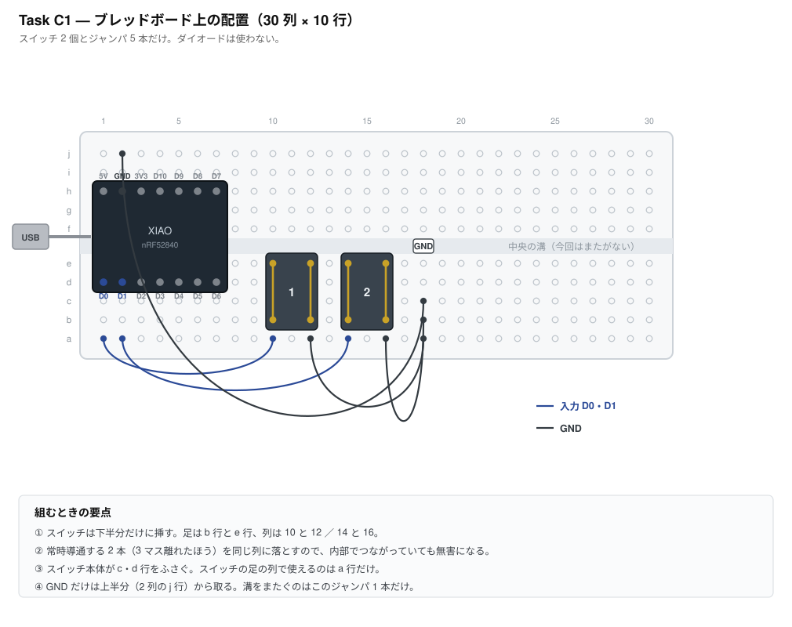

# Task C3 — BLE 分割の検証

**所要時間の目安: 半田付け 20 分 ＋ 配線と測定 30 分**

> 先に [Task C1](task-c1-smoke-test.md) を済ませておくこと。
> 2 個目の XIAO も、まず C1 を通してから使う。

---

## 1. なぜやるか

**左右間も無線であることは、この計画の必須要件**（仕様書の優先度「必須」）。
TRRS ケーブルは切り分け用に基板へフットプリントだけ残すが、常用構成には
含めない。したがって**分割無線が成立しなければ計画そのものが揺らぐ**。

確かめることは 3 つ。

| # | 確認対象 | 不成立だと |
|---|---|---|
| 1 | 左右がペアリングして、右のキーが左を経由してホストへ届く | 分割が成立しない |
| 2 | **左右同時押しが崩れない**（Shift＋文字など） | HHKB の使い勝手を再現できない |
| 3 | 遅延が体感できる水準でない | 実用にならない |

**2 が本命。** HHKB では左 Shift ＋ 右手の文字、左 Ctrl ＋ 右手の文字を
常時使う。ここが崩れると目的を満たさない。

## 2. なぜ本番シールドを使わないか

本番の `hhkb_split_left` / `right` は **74HC595 と 61 キー**が前提で、
分割の検証には重すぎる。配線を間違えたときに「BLE の問題か、
マトリクスの問題か」が切り分けられない。

そこで `proto_split` は**キースキャンを直結**にした。
ダイオードもシフトレジスタも使わない。左 2 キー、右 2 キーだけ。
**BLE 分割だけが変数になる。**

なお C1・C2 では変数を減らすため `CONFIG_ZMK_BLE=n` にしていたが、
**このタスクでは BLE が主役なので当然有効のまま**。

---

## 3. 用意するもの

| 品目 | 数 | 備考 |
|---|---|---|
| XIAO nRF52840 | **2** | 2 個目は先に [Task C1](task-c1-smoke-test.md) を通す |
| ピンヘッダ 7 ピン | 4 本 | 2 個目にも両側必要 |
| タクトスイッチ | 4 | 左右 2 個ずつ |
| ブレッドボード | **2** | 左右で 1 枚ずつ |
| ジャンパ線 | 10 本 | |
| USB-C ケーブル | 1〜2 | 左は常時接続。右は書き込み時のみ |

**ダイオードは使わない。**

---

## 4. 配線

**左右とも [Task C1](task-c1-smoke-test.md) とまったく同じ配線。**
XIAO を 1〜7 列、スイッチを 10・14 列、GND バスを 18 列に置く。

左右で違うのは**書き込むファームウェアだけ**。

| | 書き込むファーム | 押すと出る文字 |
|---|---|---|
| 左（セントラル） | `proto_split_left-xiao_ble__zmk-zmk.uf2` | 10 列 → **a**、14 列 → **b** |
| 右（ペリフェラル） | `proto_split_right-xiao_ble__zmk-zmk.uf2` | 10 列 → **c**、14 列 → **d** |

**左右を取り違えないこと。** 両方に左用を書き込むと、2 台とも
セントラルになってペアリングしない。書き込んだらマスキングテープなどで
印を付けておくとよい。

---

## 5. 手順

### 5-1. 2 個目の XIAO を C1 で通す

**いきなり分割を試さない。** 2 個目の個体・ケーブル・書き込みが健全かを
先に確定させる。[Task C1](task-c1-smoke-test.md) をそのまま実施する。

### 5-2. 左右に書き込む

1. 左の XIAO に `proto_split_left` を書き込む
2. 右の XIAO に `proto_split_right` を書き込む
3. **左だけ** USB で Mac につなぐ
4. 右は USB でもモバイルバッテリーでも、電源が入っていればよい
   （この段階では乾電池はまだ使わない。乾電池は Task C4）

### 5-3. ペアリングを待つ

ZMK の分割は**自動でペアリングする**。ユーザー操作は不要。
初回は数秒〜十数秒かかることがある。

うまくいかないときは、両方を一度リセットする。それでも駄目なら
左で `Fn + Ctrl + `` ` ``（＝ `&bt BT_CLR`）……ではなく、
**この治具にはレイヤーが無いので、両方のフラッシュを消して書き直す**。

---

## 6. 判定

### 6-1. 疎通

| 押すキー | 期待 | 実測 |
|---|---|---|
| 左 10 列 | **a** | |
| 左 14 列 | **b** | |
| **右 10 列** | **c** | |
| **右 14 列** | **d** | |

**`c` と `d` が出れば、BLE 分割は成立している。** 右の XIAO は Mac と
直接つながっていないので、これは左を経由して届いたということ。

### 6-2. 左右同時押し（本命）

**`a` と `c` を同時に押す。** 両方出れば成立。

| 押すキー | 期待 | 実測 |
|---|---|---|
| 左 a ＋ 右 c を同時 | ac または ca（順不同） | |
| 左 b ＋ 右 d を同時 | bd または db | |
| 4 つ全部を同時 | abcd（順不同） | |

**順序が入れ替わっても問題ない。** 無線分割では周辺側に数ミリ秒の遅延が
乗るため、ほぼ同時に叩くと順番が前後することがある。仕様書にも
既知のリスクとして記載済み。

**問題になるのは「出ない」「重複する」「押しっぱなしになる」場合。**

### 6-3. 修飾キーの保持（最も実用に近い試験）

実際のタイピングで効くのは「修飾キーを先に押して保持したまま、
反対側の文字を叩く」形。これが崩れないことを確かめる。

1. **左 a を押したまま**、右 c を叩く → `ac` が出る
2. 押したままさらに右 d を叩く → `ad` が続く
3. 左 a を離す

**これが安定すれば実用上の心配はない。** ZMK の分割は修飾キーを保持する
通常のタイピングでは順序が崩れにくい。

### 6-4. 遅延の体感

右のキーを連打して、**引っかかりを感じるか**を見る。数値で測る手段は
無いので体感でよい。気になる場合は BLE の接続間隔を詰める余地がある
（`CONFIG_BT_PERIPHERAL_PREF_MIN_INT` 等を最短の 7.5ms 付近へ）。

### 6-5. 距離と遮蔽

実使用では左右が 20〜40cm 離れ、間に手や腕が入る。

- 左右を **40cm** 離して打つ
- 左右の間に**手をかざした状態**で打つ

途切れなければよい。

---

## 6-3. 電波の強さを測る（**子基板を作る前に必ず**）

### なぜ測るか

子基板は **XIAO のアンテナの真下と周囲を GND ベタが覆い、アンテナから
0.5mm のところに FFC コネクタがあり、そこから 12 芯・50〜115mm の
ケーブルが伸びる**設計になっている（open-gaps #23）。電波にとっては
どれも不利な条件。

**この設計が実際に問題かどうかは、測らないと分からない。**そして
**基準値をいまのうちに取っておかないと、あとで比べられない。**
いまのブレッドボードは GND ベタもケーブルも無い＝**いちばん良い状態**で、
これが比較の原点になる。

### まず理解しておくこと: 余裕は大きい

2.4GHz の自由空間損失と BLE の受信感度（-90dBm）から計算した余裕。

| 距離 | 受信レベル | 余裕 |
|---|---|---|
| 0.3m（左右間） | -30dBm | **60dB** |
| 1.0m | -40dBm | **50dB** |
| 2.0m | -46dBm | **44dB** |

**アンテナが 20〜30dB 劣化しても、まだ 30dB 残る。**だから「多少悪くても
たぶん動く」。測るのは**どれだけ悪いかを知って、改版するかを決める**ため。

### 測り方

スマートフォンの BLE スキャナ（nRF Connect など）で RSSI を読む。

**変えてはいけないもの**（変えると比較にならない）:

- 距離（**30cm を基準にする**。メジャーで測って印を付ける）
- 向き（XIAO のアンテナ端をスマホに向ける。毎回同じ向き）
- 高さ（机の上、同じ高さ）
- スマホの機種・持ち方（**手で持たない。**体が電波を吸うので台に置く）
- 周りの金属（同じ場所で測る）

**測る値**: 10 秒ほど眺めて、**いちばん強い値**と**いちばん弱い値**を記録する。
RSSI は常にふらつくので、1 回の値では判断できない。

### 記録欄（基準値・ブレッドボード）

**子基板を作る前に、いまの状態で測る。**

| | 最強 | 最弱 | 備考 |
|---|---|---|---|
| 左（中央側） 30cm | dBm | dBm | |
| 右（周辺側） 30cm | dBm | dBm | |

### 記録欄（子基板・実物ができてから）

| | 最強 | 最弱 | 基準値との差 |
|---|---|---|---|
| 左 30cm | dBm | dBm | dB |
| 右 30cm | dBm | dBm | dB |

### 判定

| 基準値との差 | 判断 |
|---|---|
| **0〜10dB 悪化** | 想定内。**そのまま進む** |
| 10〜20dB 悪化 | 動くはずだが、改版の価値あり。**実使用で切れないかを確かめる** |
| **20dB 以上悪化** | **子基板を改版する。**アンテナを基板の縁から張り出させ、FFC を USB 側へ移す |

**併せて実使用で確かめる**: 左右を実際の間隔（20〜40cm）に置き、
**手を鍵盤に乗せた状態**で高速に打鍵して、取りこぼしや切断が起きないか。
人体は 2.4GHz をよく吸うので、RSSI が良くても実使用で落ちることがある。

---

## 7. うまくいかないとき

### 右のキーがまったく出ない

1. **左右を取り違えていないか。** 両方に左用を書き込むと、2 台とも
   セントラルになってペアリングしない
2. 右の電源が入っているか（USB を挿しているか）
3. 右単体で C1 のファームを入れて、スイッチが反応するか確かめる
   → 反応しなければ配線の問題で、BLE は無関係

### 左のキーは出るが右が出ない

BLE のペアリングが成立していない。両方を同時にリセットする。
それでも駄目なら、両方のフラッシュを一度消して書き直す。

### 数秒おきに途切れる

距離を縮めて再現するか確認する。近くても途切れるなら、
**USB ハブや他の 2.4GHz 機器の干渉**を疑う。Mac に直挿しで試す。

---

## 8. このタスクで確定しないこと

- **乾電池での駆動** — Task C4。ここでは USB 給電で構わない
- **61 キーでの動作** — 方式が成立すればキー数は問題にならない
- **電池の持ち** — Task C4・C5

---

## 9. 不成立だった場合

仕様書では「左右間の無線は必須要件であり、有線化では逃げない」としている。
それでも成立しない場合に取りうる手は次の順。

1. **BLE の接続間隔を詰める**（遅延が原因のとき）
2. **アンテナの向き・位置を変える**（途切れが原因のとき）。XIAO の
   アンテナは基板の USB と反対側の端にある。金属や電池で覆わない
3. ここまでで駄目なら、**設計そのものを見直す**。TRRS 有線は
   常用構成として想定していないが、最終手段としてフットプリントは残す

**1・2 を試さずに 3 へ飛ばないこと。**
