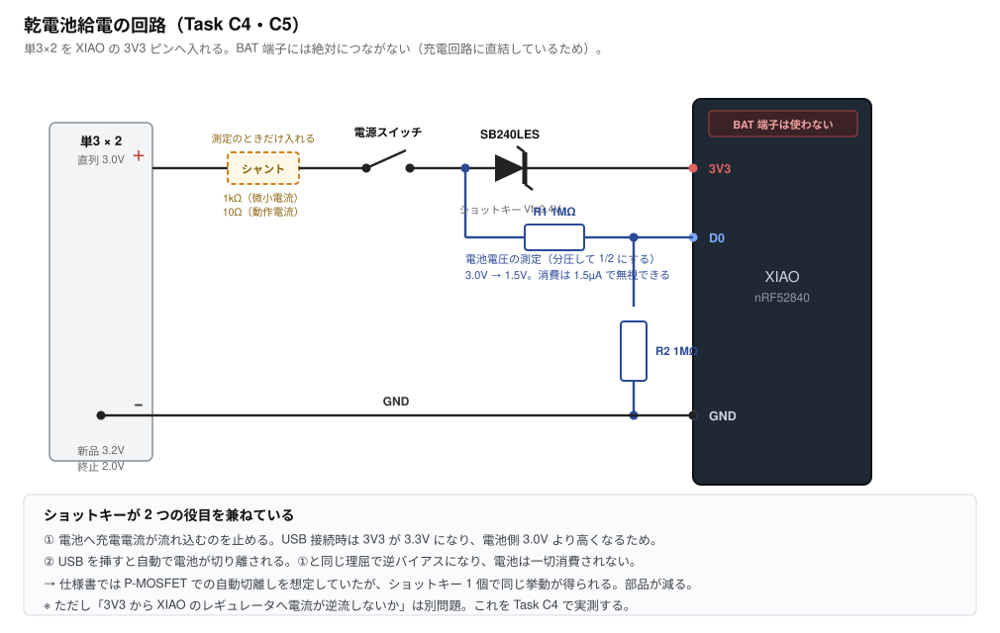

# Task C4・C5 — 乾電池給電と電池残量測定

**所要時間の目安: 配線 20 分 ＋ 測定 40 分**

> 先に [Task C1](task-c1-smoke-test.md) を済ませておくこと。

> **C3 より先にやる（2026-08-08 に順番を入れ替えた）。**
> どちらも失敗すれば基板 2 枚を作り直すが、**確率が違う**。
> C3（BLE 分割）は ZMK ＋ nRF52840 で何千件も実績のある踏み固められた道。
> こちら（乾電池 3.0V を 3V3 ピンへ直接）は、**この文書自身が「少数派の
> 構成で、踏み固められた道ではない」と書いている**。加えて C4 には
> 「USB を挿したとき乾電池へ充電電流が流れないか」という**安全の項目**が
> 含まれる。期待損失で並べればこちらが先。
>
> **ただしオシロスコープが要る。**無ければ C3 を先にやりつつ道具を手配する。
> テスターの電流レンジでも桁は分かるので、寿命の見積もりには足りる。
>
> 電池ボックスは**横並びの手持ち品でよい**（ケースには入らないが、
> ブレッドボード試験には支障がない）。

---

## 1. なぜやるか

**電源は単3×2。** HHKB と同じ思想で、リポには逃げない（仕様書の基本方針）。
だがこれは ZMK キーボードとしては少数派の構成で、踏み固められた道ではない。
**基板を発注する前に実測で閉じる。**

確かめることは 4 つ。

| # | 確認対象 | 不成立だと |
|---|---|---|
| 1 | 乾電池 3.0V で ZMK が動く | 電源方式が成立しない |
| 2 | **3V3 から XIAO のレギュレータへ電流が逆流しないか** | 電池が無駄に減る |
| 3 | **USB を挿したとき電池へ充電電流が流れないか** | **液漏れ・破裂の危険** |
| 4 | どこまで電圧が下がっても動くか | 電池の使い切りどころが決まらない |

**3 が安全に関わる。** アルカリ乾電池は充電すると危険なので、ここは
必ず確認する。

---

## 2. 回路



### BAT 端子には絶対につながない

**XIAO の BAT 端子はリポ用充電回路に直結している。** ここに乾電池を
つなぐと、USB 接続時に一次電池を充電しようとして**液漏れ・破裂**の危険が
ある。乾電池は必ず **3V3 ピン**へ入れる。

### ショットキーが 2 つの役目を兼ねている

| 役目 | 理屈 |
|---|---|
| 電池への充電電流を止める | USB 接続時は 3V3 が 3.3V になり、電池側 3.0V より高い → 逆バイアス |
| USB を挿すと自動で電池を切り離す | 同じ理屈。電池は一切消費されない |

**仕様書では P-MOSFET での自動切離しを想定していたが、ショットキー 1 個で
同じ挙動が得られる。** 部品が 1 つ減る。

### ⚠️ ブレッドボードの `SB240LES` は本番の部品ではない

**本番は `B5819W`（LCSC C8598・JLCPCB の基本部品）に決まった。**
`SB240LES` は手元にあっただけで、本番では使わない。

| | SB240LES | **1N5819（手持ち・これを使う）** | B5819W（本番） |
|---|---|---|---|
| 定格 | 2A 40V | **1A 40V** | 1A 40V |
| パッケージ | SMD | DO-41（軸形） | SOD-123 |
| 本番との一致 | **合わない** | **規格が一致** | — |

**`1N5819` を使うこと。**`B5819W` は 1N5819 の SOD-123 版で、規格表の
数値（1A で 0.6V・40V）も同じ。**買い足しは要らない。**

（Vf そのものを測る手順は消した。マトリクスのダイオードを BAT46W に
替えて打ち止めがマイコン律速になったので、ショットキーの Vf は
打ち止めを決めなくなった。`SCHOTTKY_VF = 0.4` は保守値のままでよい。）

**ここで測った Vf を `SCHOTTKY_VF` に入れてはいけない。**ダイオードは
定格電流が大きいほど同じ電流での Vf が低い。SB240LES（2A）の値は
B5819W（1A）より**低く出る**ので、そのまま使うと打ち止めが下がりすぎ、
**電池がまだあるのにブラウンアウトする**。

- **SB240LES しか無い場合**は、構成の確認（動くか・逆流しないか・
  充電しないか）だけに使う。そこはどちらのショットキーでも結論が同じ。
  **Vf は測っても使えない**
- 測った Vf は `tools/circuit.py` の `SCHOTTKY_VF` に入れる。
  いまは保守値 0.4V（B5819W のデータシートは 1A で 0.6V しか保証せず、
  特性グラフも 0.1A まで。10〜15mA は図の外なので実測でしか埋まらない）

ショットキーである理由そのものは変わらない。ここに 1N4007（0.7〜1.1V）を
使うと、電池を使い切る前にマイコンの下限を割る。

### 電圧の見積もり

| 電池の状態 | 電池電圧 | ショットキー後 | 判定 |
|---|---|---|---|
| 新品アルカリ | 3.2V | 2.8V | ✅ 余裕 |
| 標準 | 3.0V | 2.6V | ✅ |
| エネループ×2 | 2.4V | 2.0V | ✅ |
| 終止付近 | 2.0V | **1.6V** | ⚠️ nRF52840 の下限 1.7V を割る |

**終止付近が際どい。** どこまで使えるかを Task C4 で実測する。

---

## 3. 用意するもの

| 品目 | 数 | 備考 |
|---|---|---|
| XIAO nRF52840 | 1 | C1 を通したもの |
| 電池ボックス（単3×2 直列） | 1 | リード線付き |
| 単3電池 | 2 | |
| **1N5819**（ショットキー） | **1** | 手持ち。**本番の B5819W と規格が同じ**（1A 40V）。SB240LES（2A）は定格が違い、④ の打ち止めが楽観的に出るので使わない |
| スライドスイッチ | 1 | 無ければジャンパの抜き差しで代用可。**本番用（C&K OS102011MA1QN1）を待つ必要は無い** |
| **抵抗 1MΩ** | 2 | 分圧用（Task C5） |
| **抵抗 1kΩ / 10Ω** | 各 1 | シャント（測定用） |
| **電解コンデンサ 100µF** | 1 | 3V3–GND 間。**本番の `C_BULK` と同じ部品**（[tools/circuit.py](../../tools/circuit.py)）。無いと 1kΩ シャントでの測定が成立しない（下記） |
| オシロスコープ | 1 | 電流測定に使う。**逆流の判定はテスターの µA レンジのほうが確実**（下記） |
| ブレッドボード・ジャンパ線 | 一式 | |

リード線の先は**より線**なのでそのままではブレッドボードに挿さらない。
はんだメッキして棒状に固めるか、ジャンパ線のオスピンを巻き付けて
はんだ付けする。

---

## 4. Task C4-1: 乾電池で動くか

### 手順

1. USB を**抜いた**状態で、回路図どおりに配線する（分圧抵抗はまだ不要）
2. スイッチを入れる
3. XIAO の LED が点くか、`proto_direct` のスイッチを押して反応するか見る

USB が無いので文字は Mac に届かない。**動作の確認は BLE で行う。**
**`proto_split_left` を書き込む。**Mac の Bluetooth 設定に現れるはず。
相手（右）がいなくてもセントラルはホストへ広告するので、片側だけで足りる。

> **`proto_split` のキーは D1・D2 に移した（2026-08-08）。**
> Task C5 で D0 を ADC に使うため。同じ治具に電池分圧（1MΩ×2 → D0）も
> 入れてあるので、**C4-1・C5・C3 が 1 つのファームで通る**。
> 本番 `hhkb_split_left` は 74HC595 の配線が前提なので、ここでは使わない。

### 記録欄

| 項目 | 実測 |
|---|---|
| 電池電圧（テスターで直接） | V |
| ショットキー後の電圧（3V3 ピン） | V |
| BLE で見えるか | |

---

## 5. Task C4-2: 逆流の測定（安全に関わる）

### オシロスコープを電流計として使う

**シャント抵抗**を直列に入れ、その両端の電圧を測る。`電流 = 電圧 ÷ 抵抗`。

| 測りたいもの | 想定値 | シャント | 読める電圧 |
|---|---|---|---|
| スリープ時 | 50〜100µA | **1kΩ** | 50〜100mV |
| 動作時 | 5〜15mA | **10Ω** | 50〜150mV |
| **逆流（最重要）** | 0 であるべき | **1kΩ** | 10µA なら 10mV |

抵抗を使い分けるのは、1kΩ のまま 10mA を流すと 10V も電圧降下して
しまうため。

**逆流の判定にオシロは十分。** ここで知りたいのは「ほぼゼロか」と
「**符号が負でないか**（＝充電方向に流れていないか）」で、精密さより
向きの問題だから。オシロは極性が直接見えるので、むしろテスターより
分かりやすい。

限界も承知しておく。スリープ電流を「78µA」のような精度で測るのは
ノイズに埋もれて難しく、**桁が分かる程度**。電池寿命の見積もりは
桁が合えば十分なので実害はない。

### ⚠️ シャントを入れる前に読む（2026-08-08 に足した）

**1. 1kΩ を電源に直列で入れたままだと BLE の送信でブラウンアウトする。**
スリープ 100µA なら降下は 0.1V で無害だが、BLE の送信バーストは 10mA 級。
1kΩ では **10V も降下する**ので、レールが落ちてリセットする。
そのままでは「スリープ電流を測る」まで到達しない。

→ **3V3–GND 間に 100µF を入れる。**バーストはコンデンサから出るので
レールが保つ（10mA × 3ms ÷ 100µF ≒ 0.3V の落ち込み）。シャントを流れる
平均電流は変わらないので、読みたい値はそのまま読める。
**これは本番基板に載っている `C_BULK` と同じ部品**で、入れたほうが実機に近い。

**2. シャントを GND 側に入れると、アース経由で短絡して 0V に見える。**
オシロのプローブ GND は筐体アース（≒コンセントのアース）につながっている。
測定 A では USB も挿すので、**Mac が充電器につながっていると
「オシロのアース — Mac — USB シールド — 回路 GND」の経路ができ、
シャントを迂回する**。電流が流れていても両端は 0V。**「安全確認が通った」と
誤読する最悪の形。**

→ 対策はどれか 1 つ。
- **Mac は充電器を抜いてバッテリ駆動にする**（いちばん簡単）
- USB 5V は **モバイルバッテリか単体の充電器**から与える。測定 A に
  ホストは要らない。5V が来ていることだけが条件
- **テスターを直列に入れる。**テスターは電池駆動で浮いているので
  この経路が最初から無い

**逆流の判定にはテスターの µA レンジのほうが向いている。**知りたいのは
「ほぼ 0 か」と「符号」だけで、テスターも符号を表示する。オシロが要るのは
波形（バーストの形）を見たいときで、それは測定 C の話。

### 測定 A: USB 接続時に電池へ流れ込まないか（最重要）

1. シャントを **1kΩ** にする
2. スイッチを入れる
3. **USB を挿す**
4. シャント両端をオシロで測る

**期待値: ほぼ 0V。** 電池からも電池へも電流が流れないこと。

| | 期待 | 実測 |
|---|---|---|
| シャント両端の電圧 | ±数 mV 以内 | mV |
| **符号** | **電池へ流れ込む向きでないこと** | |

**もし電池へ流れ込む向きに電流が出たら、直ちに USB を抜いて中止する。**
ショットキーの向きを確認する。それでも流れるならショットキーの不良を疑う。

### 測定 B: USB を抜いたときの消費電流

1. USB を抜く
2. シャント **1kΩ** のまま、キーを触らず放置してスリープさせる
3. シャント両端の電圧を読む

| | 想定 | 実測 |
|---|---|---|
| スリープ時 | 50〜200µA（50〜200mV） | mV → µA |

**ここが 1mA を超えるようなら、3V3 から XIAO のレギュレータへ
逆流している疑いが濃い。** 仕様書の「検証必須項目」がこれ。

### 測定 C: 動作時の消費電流

1. シャントを **10Ω** に替える
2. キーを連打しながら読む

| | 想定 | 実測 |
|---|---|---|
| 動作時 | 5〜15mA（50〜150mV） | mV → mA |

### 電池寿命の見積もり

アルカリ単3 の容量は約 2000mAh。

```
寿命（時間） ≒ 2000mAh ÷ 平均電流(mA)
```

打鍵は 1 日のうちごく一部なので、**平均はスリープ電流に近い**。
100µA なら 20,000 時間 ≒ 2.3 年、1mA なら 2,000 時間 ≒ 83 日。

**仕様書の見込みは 3〜8ヶ月。** これを満たすには平均 0.3〜0.9mA 以下で
ある必要がある。

---

## 5.9. マトリクスのダイオードの実測は不要になった

**BAT46W（C54110）に替えたので、保証値で詰まる。**
VF ≦ 0.25V @ IF=0.1mA（走査電流そのもの）、IR ≦ 0.3µA @ VR=1.5V。
打ち止めはマイコン律速の 1.10V/本。

（1N4148W のままだと 1mA 未満の VF 最大値が規定されておらず、打ち止めが
1.12〜1.48V/本 で不定だった。バックアップとして残してある。tools/parts.py）

## 6. Task C4-3: どこまで電圧が下がっても動くか

> **ここで出る値が、そのまま実機の打ち止めになる。**
>
> 打ち止めは 3 つの制約の最大値で決まる（`tools/circuit.py` が計算）。
>
> | 制約 | 必要なレール |
> |---|---|
> | **マイコン（nRF52840 1.7V ＋ 余裕 0.1V）** | **1.80V ← これが律速** |
> | シフトレジスタ 74LVC595（1.1〜3.6V） | 1.10V |
> | マトリクス（BAT46W の VF 0.30V ÷ 0.3） | 1.17V |
>
> **マイコンが律速なので、この治具（マトリクス無し）で測った値が
> そのまま答えになる。**設計値は 1.10V/本（電池 2.20V）。
> 実測がこれより高く出たら設計値を上げること。


**可変電源があれば**電圧を下げながら動作限界を探る。無ければ、
使い古しの電池を使うか、この項目は後回しでよい。

| 電圧 | 動くか |
|---|---|
| 3.0V | |
| 2.6V | |
| 2.4V（エネループ相当） | |
| 2.2V | |
| 2.0V | |

**限界が分かれば、電池残量表示のしきい値を決められる。**

---

## 7. Task C5: 電池残量の測定

### 回路

分圧抵抗 1MΩ × 2 で電池電圧を半分にして **D0（AIN0）** へ入れる。

- 3.0V → 1.5V。nRF52840 の ADC 範囲（内部基準 0.6V ＋ 1/6 ゲインで
  フルスケール 3.6V）に十分収まる
- 消費は 3.0V ÷ 2MΩ = **1.5µA**。スリープ電流に対して無視できる

**測定点はショットキーの手前**（電池側）にする。USB 接続中もダイオードで
切り離されているだけで電池電圧そのものは読めるため。

### 注意

**ADC に入る電圧が VDD を超えないこと。** 電池 3.2V のとき分圧後 1.6V、
VDD は 2.8V なので問題ない。ただし**分圧比を変えるときは必ず再計算する**。

### ファームウェア

ZMK の `zmk,battery-voltage-divider` を使う。`output-ohms` は下側の抵抗
（1MΩ）、`full-ohms` は合計（2MΩ）。

**`proto_split` に入れてある**（本番 `hhkb_split` と同じ値）。書き足す作業は
不要で、C4-1 と同じファームのまま測れる。

抵抗の実測値（1MΩ と銘打っていても誤差 5% はある）をテスターで測り、
±5% を超えていたら `output-ohms` / `full-ohms` にその値を入れ直す。

**ZMK が出す「残量 %」は当てにならない。**リチウムイオンの放電曲線で
計算されるので、乾電池 2 本（2.2〜3.2V）では正しい % にならない
（[open-gaps.md](open-gaps.md) #13）。ここで確かめるのは
**ADC が電池電圧を正しく読めているか**で、%表示の正しさは別の話。

### 判定

| 項目 | 期待 | 実測 |
|---|---|---|
| 抵抗の実測値（上側 / 下側） | 1MΩ ±5% | / Ω |
| **D0 の電圧（テスターで直接）** | 電池電圧のちょうど半分 | V |
| ホスト側に電池残量の項目が現れる | 現れること（＝ADC と BLE の経路が生きている） | |
| 表示された % | **0% でも正常**（[open-gaps.md](open-gaps.md) #13） | % |

**%の一致は見ない。**リチウムイオンの曲線で計算されるので、乾電池では
一致しないのが分かっている。**ここで閉じるのは「分圧が設計どおりの電圧を
D0 に出しているか」だけ**で、それが D フェーズに必要なこと（分圧抵抗の値）。

> テスターを D0 に当てると 10MΩ 級の入力抵抗が 1MΩ に並列に入り、
> 読みが数 % 低く出る。**2MΩ の分圧はテスターで測るには高すぎる。**
> 半分±数 % で合っていれば通ったと見る。厳密に見たいなら分圧を一時的に
> 100kΩ×2 に落として比を確かめ、確認後 1MΩ に戻す。

---

## 8. 判定と、不成立だった場合

**C4-2 の測定 A で電池へ流れ込む → 直ちに中止。** ショットキーの向きと
品種を確認する。ここは安全に関わるので妥協しない。

**測定 B が 1mA を超える（逆流の疑い）** 場合、取りうる手は次の順。

1. **ショットキーをもう 1 本、3V3 とレギュレータの間に入れる** —
   ただし XIAO の基板上なので現実には難しい
2. **XIAO 基板上のレギュレータを外す** — 一般的な改造だが、USB 給電も
   同時に殺すことになる。基板直付けが前提になる
3. **MCU を XIAO ではなく nRF52840 単体で基板に載せる** — 技適の問題が
   再燃するので最後の手段

**1・2 を検討せずに 3 へ飛ばないこと。**

---

## 9. このタスクで確定すること

ここが通れば、**フェーズ D（基板設計）の電源部が確定する**。

- ショットキー 1 個で足りるか、P-MOSFET が要るか
- 分圧抵抗の値
- 電池残量表示のしきい値
- 電池寿命の見込み

**逆に、ここが通らないと基板を発注できない。**
