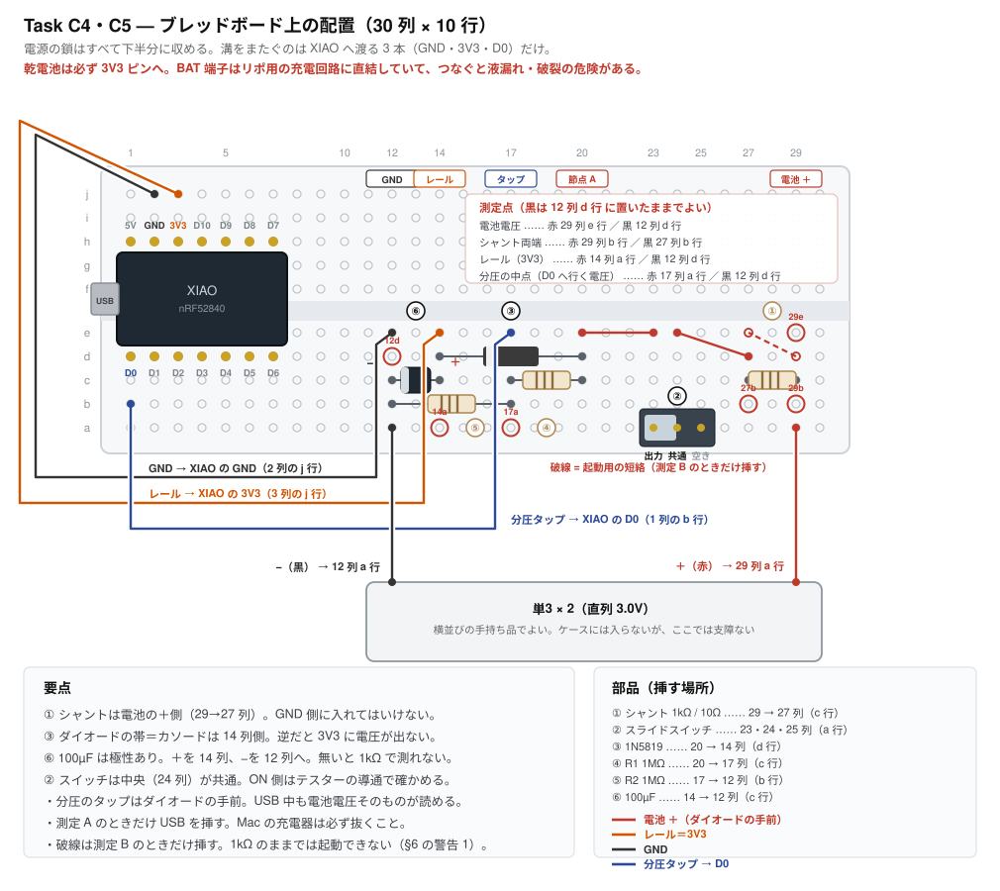

# Task C4・C5 — 乾電池給電と電池残量測定

**所要時間の目安: 配線 20 分 ＋ 測定 40 分**

> 先に [Task C1](task-c1-smoke-test.md) を済ませておくこと。

> **C3 より先にやる（2026-08-08 に順番を入れ替えた）。**
> どちらも失敗すれば基板 2 枚を作り直すが、**確率が違う**。
> C3（BLE 分割）は ZMK ＋ nRF52840 で何千件も実績のある踏み固められた道。
> こちら（乾電池 3.0V を 3V3 ピンへ直接）は、**この文書自身が「少数派の
> 構成で、踏み固められた道ではない」と書いている**。加えて C4 には
> 「USB を挿したとき乾電池へ充電電流が流れないか」という**安全の項目**が
> 含まれる。期待損失で並べればこちらが先。
>
> **ただしオシロスコープが要る。**無ければ C3 を先にやりつつ道具を手配する。
> テスターの電流レンジでも桁は分かるので、寿命の見積もりには足りる。
>
> 電池ボックスは**横並びの手持ち品でよい**（ケースには入らないが、
> ブレッドボード試験には支障がない）。

---

## 0. 全体の流れ

**配線は 1 回で済む。**組んだあとは測るだけで、触るのはシャントの差し替え
（1kΩ ⇔ 10Ω）と、C4-3 で電池を可変電源に置き換えるところだけ。

| | やること | 何を使うか |
|---|---|---|
| **§4** | ブレッドボードに組む | 図と表のとおりに挿す |
| **§5** | C4-1 乾電池で動くか | テスター（電池・レール）＋ BLE |
| **§6** | C4-2 逆流・消費電流 | シャント。**測定 A が安全の項目** |
| **§7** | C4-3 打ち止め電圧 | 可変電源（無ければ後回し可） |
| **§8** | C5 電池残量 | テスター＋ホストの表示 |

書き込むファームは**全部を通して `proto_split_left` の 1 つ**。

---

## 1. なぜやるか

**電源は単3×2。** HHKB と同じ思想で、リポには逃げない（仕様書の基本方針）。
だがこれは ZMK キーボードとしては少数派の構成で、踏み固められた道ではない。
**基板を発注する前に実測で閉じる。**

確かめることは 4 つ。

| # | 確認対象 | 不成立だと |
|---|---|---|
| 1 | 乾電池 3.0V で ZMK が動く | 電源方式が成立しない |
| 2 | **3V3 から XIAO のレギュレータへ電流が逆流しないか** | 電池が無駄に減る |
| 3 | **USB を挿したとき電池へ充電電流が流れないか** | **液漏れ・破裂の危険** |
| 4 | どこまで電圧が下がっても動くか | 電池の使い切りどころが決まらない |

**3 が安全に関わる。** アルカリ乾電池は充電すると危険なので、ここは
必ず確認する。

---

## 2. 回路


### BAT 端子には絶対につながない

**XIAO の BAT 端子はリポ用充電回路に直結している。** ここに乾電池を
つなぐと、USB 接続時に一次電池を充電しようとして**液漏れ・破裂**の危険が
ある。乾電池は必ず **3V3 ピン**へ入れる。

### ショットキーが 2 つの役目を兼ねている

| 役目 | 理屈 |
|---|---|
| 電池への充電電流を止める | USB 接続時は 3V3 が 3.3V になり、電池側 3.0V より高い → 逆バイアス |
| USB を挿すと自動で電池を切り離す | 同じ理屈。電池は一切消費されない |

**仕様書では P-MOSFET での自動切離しを想定していたが、ショットキー 1 個で
同じ挙動が得られる。** 部品が 1 つ減る。

### ⚠️ ブレッドボードの `SB240LES` は本番の部品ではない

**本番は `B5819W`（LCSC C8598・JLCPCB の基本部品）に決まった。**
`SB240LES` は手元にあっただけで、本番では使わない。

| | SB240LES | **1N5819（手持ち・これを使う）** | B5819W（本番） |
|---|---|---|---|
| 定格 | 2A 40V | **1A 40V** | 1A 40V |
| パッケージ | SMD | DO-41（軸形） | SOD-123 |
| 本番との一致 | **合わない** | **規格が一致** | — |

**`1N5819` を使うこと。**`B5819W` は 1N5819 の SOD-123 版で、規格表の
数値（1A で 0.6V・40V）も同じ。**買い足しは要らない。**

**Vf そのものを測る手順は消した。**マトリクスのダイオードを BAT46W に
替えて打ち止めがマイコン律速（レール 1.80V）になったので、**ショットキーの
Vf は打ち止めを決めなくなった**。`SCHOTTKY_VF = 0.4` は保守値のままでよい。

**SB240LES（2A）を使わない理由**も同じ筋。定格電流が大きいほど同じ電流での
Vf が低く出るので、④ の打ち止めが楽観的に出る。構成の確認（動くか・
逆流しないか・充電しないか）だけなら SB240LES でも結論は同じだが、
**手持ちの 1N5819 があるなら使う理由が無い。**

ショットキーである理由そのものは変わらない。ここに 1N4007（0.7〜1.1V）を
使うと、電池を使い切る前にマイコンの下限を割る。

### ⚠️ リチウム一次電池（FR6 / L91）は使わない

3V3 ピンへ直接入れるので、上限は nRF52840 の推奨 3.6V・絶対最大 3.9V
（[tools/circuit.py](../../tools/circuit.py) の `MCU_V_MAX`）。

| 電池 | 開放電圧 × 2 本 |
|---|---|
| マンガン / アルカリ 新品 | 3.2〜3.3V |
| エネループ | 2.4〜2.9V |
| **リチウム一次（FR6・L91）** | **3.6V ← 推奨上限ちょうど** |

**マンガンでもアルカリでも、この危険は見えない。**どちらで試験しても
上限側は 3.3V 止まりだから。**完成品の説明に書く項目**として残す。

### 電圧の見積もり

**アルカリ単3 × 2 を前提にした表**（マンガンは開放 1.55〜1.65V/本で
似た値から始まるが、容量が 1/2〜1/3 で下がり方も急。試験には使えるが
寿命の前提には使わない）。

| 電池の状態 | 電池電圧 | ショットキー後 | 判定 |
|---|---|---|---|
| 新品アルカリ | 3.2V | 2.8V | ✅ 余裕 |
| 標準 | 3.0V | 2.6V | ✅ |
| エネループ×2 | 2.4V | 2.0V | ✅ |
| 終止付近 | 2.0V | **1.6V** | ⚠️ nRF52840 の下限 1.7V を割る |

**終止付近が際どい。** どこまで使えるかを Task C4 で実測する。

---

## 3. 用意するもの

| 品目 | 数 | 備考 |
|---|---|---|
| XIAO nRF52840 | 1 | C1 を通したもの |
| 電池ボックス（単3×2 直列） | 1 | リード線付き |
| 単3電池 | 2 | |
| **1N5819**（ショットキー） | **1** | 手持ち。**本番の B5819W と規格が同じ**（1A 40V）。SB240LES（2A）は定格が違い、④ の打ち止めが楽観的に出るので使わない |
| スライドスイッチ | 1 | 無ければジャンパの抜き差しで代用可。**本番用（C&K OS102011MA1QN1）を待つ必要は無い** |
| **抵抗 1MΩ** | 2 | 分圧用（Task C5） |
| **抵抗 1kΩ / 10Ω** | 各 1 | シャント（測定用） |
| **電解コンデンサ 100µF** | 1 | 3V3–GND 間。**本番の `C_BULK` と同じ部品**（[tools/circuit.py](../../tools/circuit.py)）。無いと 1kΩ シャントでの測定が成立しない（下記） |
| オシロスコープ | 1 | 電流測定に使う。**逆流の判定はテスターの µA レンジのほうが確実**（下記） |
| ブレッドボード・ジャンパ線 | 一式 | |

リード線の先は**より線**なのでそのままではブレッドボードに挿さらない。
はんだメッキして棒状に固めるか、ジャンパ線のオスピンを巻き付けて
はんだ付けする。

---

## 4. 配線する

**一度組めば、C4-1・C4-2・C4-3・C5 が全部このままの配線で測れる。**
途中で組み替えるのはシャント（1kΩ ⇔ 10Ω）だけ。



この図は [tools/gen_breadboard_c4.py](../../tools/gen_breadboard_c4.py) が生成する。
**SVG を手で編集しない。**配線を変えるときは生成器を直して実行する
（`.venv/bin/python3 tools/gen_breadboard_c4.py`）。挿す穴はそのファイルの
`LINKS` が唯一の出どころで、**穴の取り合い・部品の胴体でふさがれた測定点・
節点のつながり方**を `tools/test_constants.py` が検査している。

### 挿す順番

上から順に挿していけば完成する。**電池はいちばん最後**。

| # | 挿すもの | 場所 |
|---|---|---|
| 1 | XIAO nRF52840 | 1〜7 列。上側の足が **h 行**、下側の足が **d 行**（ピン間隔 0.6 インチ＝6 ピッチ）。USB は左へはみ出す |
| 2 | **① シャント 1kΩ** | **29 列 → 27 列**（**c 行**） |
| 3 | ジャンパ | 27 列 **d 行** → 24 列 **e 行** |
| 4 | **② スライドスイッチ** | **23・24・25 列**（**a 行**）。中央の 24 列が共通 |
| 5 | ジャンパ | 23 列 **e 行** → 20 列 **e 行** |
| 6 | **③ 1N5819** | **20 列 → 14 列**（**d 行**）。**帯（カソード）は 14 列側** |
| 7 | **④ R1 1MΩ** | 20 列 → 17 列（**c 行**） |
| 8 | **⑤ R2 1MΩ** | 17 列 → 12 列（**b 行**） |
| 9 | **⑥ 100µF** | **＋を 14 列**、**−を 12 列**（**c 行**） |
| 10 | ジャンパ（レール） | 14 列 **e 行** → **3 列 j 行**（XIAO の 3V3） |
| 11 | ジャンパ（GND） | 12 列 **e 行** → **2 列 j 行**（XIAO の GND） |
| 12 | ジャンパ（分圧タップ） | 17 列 **e 行** → **1 列 b 行**（XIAO の D0） |
| 13 | 電池ボックス | **＋（赤）→ 29 列 a 行**、**−（黒）→ 12 列 a 行** |

**スイッチはどちら側で ON になるか品種で違う。** 挿す前にテスターの導通モードで
中央と左右のどちらが閉じるかを見て、閉じるほうを 23 列に来るよう向きを決める。

### 通電する前に、これだけは見る

**乾電池は XIAO の 3V3 へ直接入る。**間違えたまま電池を入れると壊れる側に転ぶので、
電池を挿す前にテスターで 3 つだけ当たる。

| 見るもの | 期待 | 意味 |
|---|---|---|
| **12 列 と 14 列 の導通** | **鳴らない** | 鳴ったら GND とレールが短絡。電池を入れてはいけない |
| **ダイオードの帯の位置** | **14 列側** | 逆だと 3V3 に電圧が出ない（壊れはしない） |
| **100µF の極性** | ＋が 14 列 | 逆だと発熱・破裂する |

**BAT 端子には何もつながっていないこと**も、目で見て確かめる。

---

## 5. Task C4-1: 乾電池で動くか

### 手順

1. USB を**抜いた**まま、スイッチを入れる
2. **29 列 e 行 ↔ 12 列 d 行** で電池電圧を読む
3. **14 列 a 行 ↔ 12 列 d 行** でショットキー後のレール電圧を読む

**黒（COM）は 12 列 d 行に置いたままでよい。**以下すべての測定で共通の GND。
4. Mac の Bluetooth 設定に **`proto split`** が現れるか見る

**LED は見ない。**`proto_split` に LED の設定は入っていないので、
点かないのが正常（[proto_split_left.conf](../../config/boards/shields/proto_split/proto_split_left.conf)）。
以前ここに「LED が点くか」と書いていたのは誤り。

USB が無いので文字は Mac に届かない。**動作の確認は BLE で行う。**
**`proto_split_left` を書き込む。**Mac の Bluetooth 設定に現れるはず。
相手（右）がいなくてもセントラルはホストへ広告するので、片側だけで足りる。

> **`proto_split` のキーは D1・D2 に移した（2026-08-08）。**
> Task C5 で D0 を ADC に使うため。同じ治具に電池分圧（1MΩ×2 → D0）も
> 入れてあるので、**C4-1・C5・C3 が 1 つのファームで通る**。
> 本番 `hhkb_split_left` は 74HC595 の配線が前提なので、ここでは使わない。

### 実測結果（2026-08-09）

シャント 10Ω・BLE 接続中・無操作。**電池はマンガン単3 × 2。**

> **種類は結論に効かない。**電池電圧は同じ負荷をかけた電池端子で測って
> いるので、内部抵抗はすでにその値に織り込まれている。しかもマンガンは 1 本 1〜2Ω と
> アルカリ（0.15〜0.3Ω）より高いが、2.2mA では最大でも 9mV で分解能以下。
> **アルカリより厳しい側で通っている**ので、製品ではもっと余裕がある。
>
> **効くのは寿命の見積もりだけ。**マンガン単3 は 600〜1000mAh で
> アルカリの 2000mAh と桁が違う。**手元の電池から容量を逆算しないこと。**
> 製品はアルカリ前提（[§1](#1-なぜやるか)）。
>
> なお**マンガンは過放電で液漏れしやすい**。この設計は打ち止めまで
> 使い切るので、完成品ではアルカリかエネループを使う。

| 項目 | 実測 | 判定 |
|---|---|---|
| 電池電圧（29 列 e 行） | **3.00V** | |
| レール（14 列 a 行・ショットキー後） | **2.75V** | ✅ 下限 1.80V に対して余裕 0.95V |
| BLE で見えるか | **見えた** | ✅ |

**✅ C4-1 は合格。** 乾電池 3.0V で ZMK が動く。

降下 0.25V の内訳は、同じ配線のままシャント両端（29 列 b 行 ↔ 27 列 b 行）を
読んで分けた（測定 C）。

| シャント | シャント両端 | 電流 | レール | 差引 **Vf** |
|---|---|---|---|---|
| 10Ω | 20〜25mV | 2.2mA | 2.75V | **0.23V** |
| 1kΩ | 1.47V | 1.47mA | 1.35V | **0.18V** |

**この 2 点は互いの裏づけになっている。**電流が下がると Vf も下がるという
ダイオードの当たり前の向きで、独立に測った値が矛盾しない。

**`SCHOTTKY_VF = 0.4` は変えない。**これは 1N5819 を 1 本、室温で測った値。
本番 `B5819W` のデータシートが保証しているのは **IF=1A で VF≤0.6V だけ**で、
低電流の最大値は規定が無い。**1 点の実測を最悪値の設計に使わない。**
打ち止めはマイコン律速なので、下げても得はない（[tools/circuit.py](../../tools/circuit.py)）。

---

## 6. Task C4-2: 逆流の測定（安全に関わる）

### オシロスコープを電流計として使う

**シャント抵抗**を直列に入れ、その両端の電圧を測る。`電流 = 電圧 ÷ 抵抗`。

| 測りたいもの | 想定値 | シャント | 読める電圧 |
|---|---|---|---|
| **逆流（測定 A・最重要）** | 0 であるべき | **1kΩ** | 10µA なら 10mV |
| スリープ時（測定 B） | 50〜200µA | **テスターの µA レンジ**（下記） | µA で直読 |
| 動作時（測定 C） | 数 mA | **10Ω** | 2mA なら 20mV |

抵抗を使い分けるのは、大きいシャントに大きな電流を流すと降下しすぎて
マイコンが落ちるため。**どこまで許されるかは実測した**（下の警告 1）。

### どちらを使うか（2026-08-09 に実測して決め直した）

| 測定 | 使うもの | 理由 |
|---|---|---|
| C4-1 の電池電圧・レール | **テスター** | 直流。オシロの利点が無い |
| **測定 A（逆流）** | **テスター** | 実測値は **0.8mV**。オシロのノイズフロアを下回る |
| 測定 C（動作電流） | どちらでも | 読みが 20〜25mV と振れるのは BLE のバースト |
| **測定 B（スリープ）** | **オシロ** | 値が一定ではない。下記 |

> **以前ここには「逆流の判定にオシロは十分。むしろテスターより分かり
> やすい」と書いてあったが、間違いだった。**実測は 0.8mV で、一般的な
> オシロは 1mV/div でもノイズが数 mV ある。**符号すら読めない。**
> 「極性が直接見える」という利点は、読める大きさがあって初めて成り立つ。

**測定 B でオシロが要る理由。**deep sleep でも BLE の広告のために周期的に
起きるので、波形は「**µA の底 ＋ mA のトゲ**」になる。テスターはこれを
平均してふらつくだけだが、オシロなら**底の高さ・トゲの高さ・幅・周期**が
読めて、**本当の平均**が出せる。電池寿命はその平均で決まる。

**レールが落ちているかどうかもオシロなら一目。**1kΩ でレールが 1.35V に
なったとき、オシロなら再起動を繰り返す鋸歯状の波形が見えて即断できた。
テスターの 1 つの数字からそれを推論するのに一往復かかっている。

### ⚠️ シャントを入れる前に読む

**1. 1kΩ を入れたままでは起動しない。100µF では救えない（2026-08-09 に実測）。**

| シャント | 電池 | レール | 結果 |
|---|---|---|---|
| 10Ω | 3.00V | **2.75V** | ✅ BLE に現れる |
| **1kΩ** | 3.00V | **1.35V** | ❌ 下限 1.70V を割り、起動しない |

起きている間の消費は **2.0〜2.5mA**（測定 C）。1kΩ なら 2.2V の降下になり、
レールは残らない。**ここが以前の記述の誤り。**

> 以前ここには「BLE の送信バーストが 10mA 級なので、100µF を入れれば
> レールが保つ」と書いてあった。**バーストの話としては正しいが、起動の
> 話としては間違い。**起動と BLE の初期化は mA 級を**continuous に**引くので、
> コンデンサでは賄えない。コンデンサが効くのは**すでにスリープに入った
> あとの短いバースト**だけ。**「バーストを支えられる」から「起動できる」を
> 導いてしまった。**

→ **測定 A は 1kΩ のままでよい。**USB を挿すとレールは USB 側から給電され、
シャントは電池側の（ゼロのはずの）電流しか担がない。マイコンの起動には効かない。

→ **測定 B は 1kΩ を使わない。**下の 2 つのどちらか。

**100µF は外さない。**測定 B でスリープに入ったあとのバースト
（10mA × 3ms ÷ 100µF ≒ 0.3V の落ち込み）はこれが支える。
**本番基板に載っている `C_BULK` と同じ部品**で、入れたほうが実機に近い。

**1b. 治具が deep sleep に入るか確かめる（2026-08-09 に足した）。**

`CONFIG_ZMK_SLEEP` は ZMK の既定が **`n`**。治具の `proto_split` にこれが
無いまま測定 B をやって、**2.0〜2.5mA から一向に下がらなかった**。
測っていたのは「起きたままの電流」で、測りたかった値ではない。

本番と揃えて `y` にし、待ち時間だけ台の都合で 1 分にした
（**待ち時間はスリープ電流を変えない**）。
`test_the_prototype_shield_sleeps_like_the_production_one` が食い違いを見張る。

**焼き直しが要る。**設定を変えたので、測定 B の前にビルドし直したファームを
入れること。**焼いたファームがどのコミットのものかを確かめる**（C2 の教訓）。

**2. シャントを GND 側に入れると、アース経由で短絡して 0V に見える。**
（この配線はハイサイドなので当てはまらない。**が、その裏返しが警告 3。**）

オシロのプローブ GND は筐体アース（≒コンセントのアース）につながっている。
測定 A では USB も挿すので、**Mac が充電器につながっていると
「オシロのアース — Mac — USB シールド — 回路 GND」の経路ができ、
シャントを迂回する**。電流が流れていても両端は 0V。**「安全確認が通った」と
誤読する最悪の形。**

→ 対策はどれか 1 つ。
- **Mac は充電器を抜いてバッテリ駆動にする**（いちばん簡単）
- USB 5V は **モバイルバッテリか単体の充電器**から与える。測定 A に
  ホストは要らない。5V が来ていることだけが条件
- **テスターを直列に入れる。**テスターは電池駆動で浮いているので
  この経路が最初から無い

**3. ⚠️ ハイサイドのシャントにオシロの GND クリップを挟むと短絡する。**

このシャント（29 → 27 列）は**電池の＋側**にあり、**両端とも GND ではない**。
オシロのプローブ GND は筐体アース＝コンセントのアースにつながっている。

**27 列側に GND クリップを挟むと、27 列（≒3.0V）がアースに落ちる。**
USB で Mac につながっていれば回路 GND もアースなので、**シャントを短絡して
電池を直接 GND へ落とす。**10Ω なら 300mA 流れる。

警告 2 のちょうど裏返し。**GND 側シャントは「迂回して 0V に見える」、
ハイサイドシャントは「短絡する」。**

→ オシロで測るなら次のどれか。
- **2 現象の A−B 演算**（CH1 を 29 列、CH2 を 27 列、両方の GND は回路 GND へ）
- **差動プローブ**
- **テスターで測る**（浮いているのでこの問題が最初から無い）

**測定 A はテスターで測ること。**大きさ（0.8mV）の点でも、この安全の点でも。

### 測定 A: USB 接続時に電池へ流れ込まないか（最重要）

**電池ボックスは繋いだまま測る。**見たいのは「USB と電池が両方つながって
いるとき、電池側に何が流れるか」なので、片方を外したら測定にならない。

1. シャントが **1kΩ**（29 → 27 列 c 行）であることを確かめる
2. スイッチを入れる
3. **Mac の充電器を抜く**（上の警告 2）。そのうえで **USB を挿す**
4. **シャント両端（29 列 b 行 ↔ 27 列 b 行）**を、**赤を 29 側**にして測る

### 対照実験を忘れない

**ゼロは「流れていない」でも「測れていない」でも出る。**シャントが浮いて
いても、プローブが接触していなくても 0V になり、**そのまま「安全確認が
通った」と読んでしまう。**C2 のゴースト試験と同じ穴。

→ **USB を抜いて、同じ 29 列 b 行 ↔ 27 列 b 行 をもう一度読む。**1kΩ 越しに電池から引くので
**1.4V 前後**が出るはず（起動できずレールが 1.35V に落ちる状態）。
ここで大きな値が出れば、シャントもプローブも生きていると分かる。

**USB を抜いても 0V なら、測定系が死んでいる。**シャントの浮き・
レンジ・接触を疑う。

**厳密なゼロは出ない。**分圧の 1MΩ×2 が電池から常時 **1.5µA** 引くので、
1kΩ で **1.5mV 前後（放電の向き）** が残る。これが正常。

**見るのは向きです。**

#### 実測結果（2026-08-09）

| | 期待 | 実測 | 判定 |
|---|---|---|---|
| シャント両端（赤を 29 側） | 数 mV 以内 | **＋0.8mV → 0.8µA** | ✅ |
| **符号** | **電池へ流れ込む向きでないこと** | **＋＝電池から出る向き（放電）** | ✅ |
| **対照実験**（USB を抜く） | 1.4V 前後 | **1.47V** | ✅ 測定系は生きている |

**✅ 測定 A 合格。安全の項目が閉じた。**アルカリ乾電池に充電電流は流れない。
**ショットキー 1 個で足りる**ことが実測で確定した（P-MOSFET は要らない）。

**0.0 ではなく 0.8mV という有限の値が出たこと自体が、測定系が生きている
証拠**になっている。対照実験の 1.47V はそれを重ねて確かめたもの。

なお **§6 の警告 2「アース経由の迂回」は GND 側にシャントを入れた場合の話**で、
この配線はハイサイドなのでその経路は成立しない。

**0.8µA は予想（分圧の 1.5µA）の半分。**説明の候補は 2 つあり、
**どちらでも安全の結論は変わらない**が、片方は設定の修正が要る。

| 候補 | 内容 | 見分け方 |
|---|---|---|
| A | **ショットキーの逆漏れ。**レール 3.3V − 節点 A 3.0V = 0.3V の逆バイアスで 0.7µA ほどが充電の向きに流れ、放電 1.5µA と相殺する | 分圧の中点が電池電圧の半分なら、こちら |
| B | **抵抗が 1MΩ ではない**（合計 3.75MΩ 相当なら 0.8µA） | 抵抗の実測が 1MΩ から外れていれば、こちら。`output-ohms` / `full-ohms` を直す |

**Task C5 がこれを分ける。**

**もし電池へ流れ込む向きに電流が出たら、直ちに USB を抜いて中止する。**
ショットキーの向きを確認する。それでも流れるならショットキーの不良を疑う。

### 測定 B: USB を抜いたときの消費電流

**1kΩ では起動できない**（上の警告 1）ので、次のどちらかで測る。

**オシロで見るときは、上の警告 3 のとおり A−B 演算か差動プローブを使う。**
見るのは**底の高さ（スリープ電流）・トゲの高さと幅・トゲの周期**の 4 つ。
平均電流 ≒ 底 ＋ （トゲの高さ − 底）×（幅 ÷ 周期）。

**やり方 1（推奨）— テスターを直列に入れる**

1. **シャントを外し、その 2 穴（29 列 c 行 と 27 列 c 行）にテスターを
   µA レンジで直列に入れる**
2. USB を抜き、キーを触らず **1 分以上**放置してスリープさせる
3. µA を直読する

**⚠️ テスターの負担電圧を侮らない。**以前ここには「µA レンジの内部抵抗は
100Ω 級」と書いてあったが、**根拠の無い数字だった。消した。**

**この案件のテスター（A&D AD-5526）の取説に、DCA の負担電圧の記載は無い。**
分かっているのはレンジ構成（2000µA / 20mA / 200mA）だけ。

**数値は分からないが、効くことは実測で分かっている**（2026-08-09）。
2000µA レンジを直列に入れたまま 1mA 級を流すと、右半分が起動・接続
できなくなった。外してジャンパにすると直った。**降下の大きさは未測定**
（同時に電圧を測るにはテスターがもう 1 台要る）。

**負担電圧は、電流がいちばん大きいときに最大になる。**起動時や、
つながらずに広告し続けているときがそれで、**まさに測りたい状態を
測定器が壊す。**

→ **1mA を超える電流を含む区間では 2000µA レンジを使わない。**
20mA レンジ（分解能 0.01mA）なら降下は小さい。スリープの µA を読むときだけ
2000µA へ落とす。起動できなければ、下の「やり方 2」の短絡ジャンパを使う。

**やり方 2 — 1kΩ を使い、起動用の短絡ジャンパを抜く**

1kΩ の 100mV/100µA という読みやすさが要るときだけ。

1. シャントを **1kΩ** にし、**起動用の短絡ジャンパ（29 列 d 行 → 27 列 e 行）**
   を挿しておく。これで 1kΩ は迂回され、10Ω のときと同じに起動する
2. USB を抜いて **1 分以上**放置し、スリープに入れる
3. **スリープしたまま短絡ジャンパを抜く。**切り替わりの一瞬は 100µF が支える
4. **29 列 b 行 ↔ 27 列 b 行** を読む

**抜いた瞬間に再起動したら、それは眠っていなかったということ。**
`CONFIG_ZMK_SLEEP` が入ったファームを焼いたか確かめる。

#### 実測結果（2026-08-09・やり方 2）

テスターの µA レンジでは起動できなかった（内部抵抗が 1kΩ 級）ので、
起動用の短絡ジャンパを使った。

| | 想定 | 実測 | 判定 |
|---|---|---|---|
| スリープ時（電池から出る全部） | 50〜200µA | **2〜3µA** | ✅ 想定より 2 桁小さい |

内訳。分圧は節点 A にぶら下がっていてシャントの下流にあるので、
この値に含まれている。

| | |
|---|---|
| 分圧 1MΩ×2（3.00V ÷ 1.963MΩ） | 1.53µA |
| **基板だけ** | **0.5〜1.5µA** |

**nRF52840 の System OFF は 0.4〜1.5µA。データシートどおり。**

**✅ 測定 B 合格。**「3V3 から XIAO のレギュレータへ逆流していないか」
（仕様書の検証必須項目）も同時に閉じた。逆流があれば mA 級になる。

**ここが 1mA を超えるようなら、3V3 から XIAO のレギュレータへ
逆流している疑いが濃い。** 仕様書の「検証必須項目」がこれ。

### 測定 C: 動作時の消費電流

### ⚠️ 10Ω シャントでの電圧測定は、この治具では成立しない

**ブレッドボードの接触抵抗が 10Ω に対して大きすぎる。**0.1〜数Ω あり、
しかも抵抗の足は細くてクリップの掴みが弱い。測定点（29 列 b 行）と
抵抗の足（29 列 c 行）は同じクリップなので、**足とクリップの接触抵抗が
丸ごと測定ループに入る。**

```
読める電圧 = 電流 × ( 接触抵抗 + 10Ω + 接触抵抗 )
                      ↑ここが数Ω揺れる
```

実際、挿し直すたびに読みが大きく変わった（2026-08-09）。

→ **テスターを mA レンジで直列に入れる。**電流計は流れた電流そのものを
読むので、**直列に何Ωあっても読みは変わらない**（回路が動く限り）。

**この区別は測定全体に効く。**「小さい抵抗の両端を電圧で読む」ものだけが
影響を受ける。電流計を直列に入れた測定（測定 B）と、大きい抵抗を使った
測定（測定 A の 1kΩ・接触数Ωは 0.05% 以下）は無事。

### 手順

1. **29 列 c 行 と 27 列 c 行 のシャントを外し、そこにテスターを直列**
   （赤 29 側 / 黒 27 側・**DC の mA レンジ**）
2. 接続が確立してから読む。無操作のときと、キーを連打したときの両方

#### 実測結果（2026-08-09・テスターを直列）

| | 実測 |
|---|---|
| BLE 接続中・無操作 | **3.7mA。5 分間ずっと変わらず** |

> **10Ω シャントで測った 2.0〜2.5mA は破棄した。**接触抵抗で揺れていた。

**下がらないのが正しい挙動。**`CONFIG_ZMK_IDLE_TIMEOUT`（30 秒）で入る
idle 状態は、表示や LED を止めるもので、**BLE の接続間隔は変えない。**

### ⚠️ この 3.7mA は実機の値ではない（右半分が居ないため）

**大半は「右半分を探し続けている」ぶん。**

ZMK のセントラルは、ペリフェラルが全部つながっていない限りスキャンを
止めない（[central.c](https://github.com/zmkfirmware/zmk/blob/main/app/src/split/bluetooth/central.c) の `start_scanning` / `stop_scanning`）。

| Zephyr の既定値 | | |
|---|---|---|
| `BT_GAP_SCAN_FAST_WINDOW` | 0x0030 = **30ms** | 受信している時間 |
| `BT_GAP_SCAN_FAST_INTERVAL` | 0x0060 = **60ms** | 周期 |
| デューティ | **50%** | 無線の受信を半分の時間つけっぱなし |

nRF52840 の RX は約 4.6mA なので、**スキャンだけで 2.3mA 級**。
残りが接続と CPU で、3.7mA の内訳として辻褄が合う。

**右半分がつながれば `stop_scanning()` が呼ばれて止まる。**

→ **起きているときの電流は Task C3（両半分そろった状態）で測り直す。**
電池寿命の見積もりもそこまで確定しない。**基板の発注は止めない**
（電流の値で基板は変わらない）。

### 電池寿命の見積もり

アルカリ単3 の容量は約 2000mAh。

### 実測から分かったこと（2026-08-09）

**支配するのはスリープ電流ではなく「起きている時間」だった。**

```
起きている  3.7mA    （測定 C・ただし右半分不在の値）
寝ている    0.0025mA （測定 B）
          ↑ 3 桁違うので、平均は「起きている時間の割合」でほぼ決まる
```

**スリープ電流を削っても寿命はほぼ変わらない。**分圧を 10MΩ に上げても
平均は 1.31 → 1.309mA。**効くのは起きているときの電流だけ。**

### 寿命の見込み（2026-08-09・C3 で両半分をつないで確定）

**起きているときの電流は 0.66mA**（[Task C3 の §5-4](task-c3-ble-split.md)）。
測定 C の 3.7mA は右半分不在のスキャンで水増しされていた。**5.6 分の 1。**

```
起きている  0.66mA
寝ている    0.0025mA
```

| 使い方 | 平均電流 | 寿命 |
|---|---|---|
| **一日中起きたまま**（寝ない最悪の場合） | 0.66mA | **4.1 ヶ月** |
| 8.5h/日 起きている | 0.235mA | **11.6 ヶ月** |
| 4h/日 | 0.112mA | 24 ヶ月 |

**✅ 仕様書の見込み 3〜8ヶ月を満たす。**しかも**スリープを一切当てにしなくても
下限を超える。**スリープが効けば 1 年級。

**残っている不確かさ。**

| | |
|---|---|
| 右半分（ペリフェラル）の電流 | 未測定。スキャンしないぶん左より軽いはずだが、確かめていない |
| 本番基板の上乗せ | マトリクスと 74LVC595 が載る。待機時は µA 級のはずだが未測定 |
| 打鍵中の電流 | 未測定。1 日のうちごく一部なので平均への寄与は小さい |

**どれも仕様を割る向きに効く量ではない**（4.1 ヶ月の余裕がある）が、
実機の基板ができたら測り直す。

### 削りしろの確認

**DC/DC レギュレータはすでに有効。**Zephyr の xiao_ble のボード定義に
`&reg1 { regulator-initial-mode = <NRF5X_REG_MODE_DCDC>; }` が入っている。
LDO のままだと思って有効化する、という手は**使えない**（もう使っている）。

---

### 補足: マトリクスのダイオードの実測は不要になった

**BAT46W（C54110）に替えたので、保証値で詰まる。**
VF ≦ 0.25V @ IF=0.1mA（走査電流そのもの）、IR ≦ 0.3µA @ VR=1.5V。
打ち止めはマイコン律速の 1.10V/本。

（1N4148W のままだと 1mA 未満の VF 最大値が規定されておらず、打ち止めが
1.12〜1.48V/本 で不定だった。バックアップとして残してある。tools/parts.py）

## 7. Task C4-3: どこまで電圧が下がっても動くか

> **ここで出る値が、そのまま実機の打ち止めになる。**
>
> 打ち止めは 3 つの制約の最大値で決まる（`tools/circuit.py` が計算）。
>
> | 制約 | 必要なレール |
> |---|---|
> | **マイコン（nRF52840 1.7V ＋ 余裕 0.1V）** | **1.80V ← これが律速** |
> | シフトレジスタ 74LVC595（1.1〜3.6V） | 1.10V |
> | マトリクス（BAT46W の VF 0.30V ÷ 0.3） | 1.17V |
>
> **マイコンが律速なので、この治具（マトリクス無し）で測った値が
> そのまま答えになる。**設計値は 1.10V/本（電池 2.20V）。
> 実測がこれより高く出たら設計値を上げること。


**可変電源があれば**電圧を下げながら動作限界を探る。無ければ、
使い古しの電池を使うか、この項目は後回しでよい。

### ★ 使い古しの電池で 2 点だけ先に測った（2026-08-11）

**可変電源が無い状態で、手元の使い古しのアルカリを電源にして測った。**
2 点しか打てないが、**打ち止めを範囲に閉じ込められた。**

| 電池（開放） | レール | 電流 | 動作 |
|---|---|---|---|
| **2.69V**（Panasonic EVOLTA NEO LR6(INJ)・1.34V/本） | **2.50V** | 0.44mA | **ペアリング成功・打鍵できる** |
| **2.16V**（三菱電機 LR6(N)・1.07V/本） | **1.86V** | **2.7mA** | **ペアリングできない** |

```
2.16V  動かない
   ↕
2.40V  ← 設計の打ち止め（**この中にある**）
   ↕
2.69V  動く
```

**「打ち止めが保守的すぎる」という証拠は無くなった。**0.24V 下げただけで
完全に動かない。

#### 副産物: **1N5819 の Vf ＝ 0.19V**（0.44mA のとき）

```
電池 2.69V − レール 2.50V = **0.19V**
```

**設計値 `SCHOTTKY_VF` = 0.4V の半分。**
**⚠️ これは治具の 1N5819 であって、本番の B5819W ではない**（本番の
datasheet は 1A の 1 点しか保証しておらず、曲線の下端も 0.1A で、
実使用の 0.44mA は 227 倍外側）。**それでも「この電流域のショットキーは
0.2V 級」という実例にはなる。**本番基板が届いたら実物で測る。

**予測との一致（偶然かもしれない）:**

```
打ち止めの予測 ＝ レール下限 2.00V ＋ Vf 0.19V = **2.19V**
実測            2.16V で動かない
```

#### 動かないときの姿 — **静かに止まらない**

```
レール 1.86V   マイコンの下限 1.70V より上／ソケットの 2.00V より下
電流   2.7mA   通常 0.44mA の **6 倍**・安定（暴れない・発熱なし）
```

**CPU は動いているのに、無線がリンクを張れない。**相手が見つからないので
**走査と広告を続け、6 倍の電流を食い続ける。**

**使用者から見れば「動かない」、電池から見れば「6 倍の速さで減る」。**
**open-gaps #25b（打ち止めでの安全な停止）が防ぐべき状態を、実際に見た。**

**なぜ無線だけ落ちるか（推定・未確認）:**

```
広告や走査で無線が 1〜2ms のあいだ 6mA 級を引く
  電池の内部抵抗 9.18Ω ＋ ショットキーの動的抵抗（この電流域で 10Ω 級）
  → 6mA × 18Ω ≒ **110mV 沈む**（バルクは 1〜2ms のバーストを支えきれない）
  → 1.86 − 0.1〜0.2 = **1.66〜1.76V** ＝ マイコンの下限を割る
```

**平均では足りているのに、無線が動く一瞬だけ足りない。**

#### ⚠️ 途中で 1 度、値を読み違えた

**最初にレールを 1.67V と読んだ。**電池を替えた直後で、
**バルクコンデンサと動作状態が落ち着く前だった。**1 分置いて測り直すと
**1.86V** で安定した。差 0.28V なら 2.7mA のショットキーとして妥当で、
0.47V は説明がつかなかった。

```
電池を替えたら **1 分待ってから読む**
コンデンサを早く抜くなら **100Ω を 1 秒当てる**（時定数 10ms）
```

#### この 2 点で決められないこと — **可変電源が要る理由**

```
2.16V で動かなかったのは
  ① **電圧が低いから**か
  ② **その電池の内部抵抗が 9.18Ω と高いから**か

**切り分けられていない。**可変電源は内部抵抗がほぼゼロなので、
同じ 2.16V を作って動けば ②、動かなければ ① と決まる。
```

**②が犯人なら、「新品でも古い電池でも同じ電圧で止める」という
いまの打ち止めの決め方そのものが正しくない**ことになる。

### ⚠️ 可変電源は、つなぐ前に必ず出力を合わせる

**乾電池は XIAO の 3V3 ピンへ直接入る。**nRF52840 の絶対最大定格は 3.9V で、
**設定を間違えた電源をつなぐと壊れる。**

降圧モジュール（LM2596 など）の**出荷時のトリマの位置は不定**で、多くは
「入力とほぼ同じ電圧が出る」状態で届く。**5V が出ていれば一発で壊れる。**

**基板の「over-voltage protection」の表示に頼らないこと。**あれは入力過電圧や
内部の保護で、**出力を 3.9V 以下に抑える機能ではない。**保護があるように
見える表示が、いちばん危ない油断を生む。

```
1. 入力だけつなぐ（出力はどこにもつながない）
2. OUT+ / OUT− にテスターを当てる
3. トリマを反時計回りに回し切って、出力を最低まで下げる
4. そこから時計回りで 3.00V に合わせる
5. 入力を一度抜いて、入れ直す。**もう一度 3.00V が出ることを確認**
6. それから回路につなぐ
```

**5 を飛ばさない。**起動のたびに同じ電圧が出ることを確かめてから繋ぐ。

**出力の平滑コンデンサ（220µF 級）のぶん、電圧を下げてもすぐには落ちない。**
負荷は 0.66mA しかないので数秒かかる。**テスターの読みが落ちきってから
判定する。**

**スイッチング電源のリップル（数十 mVpp）は C4-3 では問題にならない**
（むしろ早めに落ちるので安全側）。測定 A の掃引で µA を読むときに効いたら、
出力に **1kΩ ＋ 100µF の RC** を足せば消える。電池側に流れるのは µA なので
1kΩ を通しても降下は 2mV で無視できる。

### つなぎ方

**電池ボックスを外し、同じ 2 つの穴に可変電源をつなぐ。**

| 可変電源 | 挿す穴 |
|---|---|
| ＋ | **29 列 a 行**（電池の赤と同じ） |
| − | **12 列 a 行**（電池の黒と同じ） |

**ここは電池電圧そのもの**（ショットキーの手前）なので、表の数字を
そのまま設定すればよい。レール側は **14 列 a 行**で見える。
シャントは 1kΩ のままでよいが、10Ω に替えておくと降下を気にせず済む。

1. 3.0V から始めて、0.1V ずつ下げる
2. 下げるたびにキーを押し、ホストに文字が届くか見る
3. **届かなくなった 1 つ手前**が打ち止め。そのときのレール（14 列 a 行）も控える

### ★★ 実測（2026-08-11・可変電源）— **「起動できる電圧」は「動き続けられる電圧」より高い**

**この節でいちばん大きい発見。**打ち止めを決めるのは**起動のほう**である。

#### 出発点の確認

```
電源 3.00V → レール **2.82V**   （Vf = 0.18V。電池で測った 0.19V と一致）
接続・打鍵とも正常
```

#### ① 維持の限界（繋がったまま電圧を下げる）

| 電源 | レール（＝電源 − 0.19V） | 打鍵 10 回 |
|---|---|---|
| 3.00 〜 **1.95V** | 2.81 〜 **1.76V** | **10/10。全段で取りこぼしゼロ** |
| 1.90V | 1.71V | **ホスト切断**（マイコンの下限 1.70V） |

#### ② 起動の限界（各段で電源を切って入れ直す）← **本命**

| 直列抵抗 | 起動できる最低電圧 | 境目の様子 |
|---|---|---|
| ~0Ω（可変電源のみ） | 2.16V で起動した（**それ以下は未測定**） | — |
| **10Ω** | **2.15〜2.25V** | **比較的きっぱり切り替わる** |
| **25Ω**（100Ω×4 並列） | **2.42V で繋がることがある。2.60〜2.70V で確実** | **帯。確率的** |

#### なぜ 2 つの限界が違うか

```
維持    すでにリンクがある。**0.44mA**
起動    これから探して繋ぐ。走査・広告で **2.7mA**、瞬間はもっと引く
        → **内部抵抗の影響を強く受ける**
```

**「動き続けられる電圧」で打ち止めを決めていたら、
離席から戻る（＝スリープ復帰＝起動と同じ手順）たびに死んでいた。**

#### ★ 境目の近くでは、起動が**確率的**になる

**25Ω では、2.42V で「繋がる時と繋がらない時」があった。**
成否は、そのとき無線が何をしていたか・コンデンサがどこまで充電されて
いたかといった巡り合わせで決まると思われる。

**使用者から見ると、いちばん質の悪い壊れ方。**

```
点かない → 入れ直す → 点く → また消える
「壊れた」のか「電池切れ」なのか、判断できない
```

**10Ω（本番の電池が打ち止め付近で持つ値に近い）では、境目は比較的
きっぱりしていた。**確率的になるのは、もっと内部抵抗が高い領域。

#### ⚠️ 式にしないこと — **2 点・自由度 0**

**一度「起動の限界 ≒ 1.90V ＋ 0.030 × 内部抵抗」と書いたが、撤回する。**

```
2 点しかなく、未知数は 2 つ（傾きと切片）。**必ず直線で結べる。**
しかも 25Ω の点は帯で、
  2.65V を採ると 傾き **0.030 V/Ω**
  2.42V を採ると 傾き **0.015 V/Ω**   ← **2 倍違う**
0Ω の点（切片）も**測っていない**（2.16V で動いたことしか分からない）
```

**「三菱の電池が動かなかったのを式が当てた」とも書いたが、これも誤り。**
**式は要らない。**直接比べれば済む。

```
三菱   内部抵抗 **9.18Ω** ≒ 10Ω、電圧 **2.16V**
実測   **10Ω での起動の限界は 2.15〜2.25V**
→ **測った限界の下端にいる。だから動かない**
```

**直線である根拠は無い**（ピーク電流が一定なら直線になるという
物理的な期待はある。傾き 0.030V/Ω ＝ 30mA は、レール 1.8V での
無線のピーク 27mA と符合するが、**2.65V を採った場合だけの話**）。
**抵抗が大きいほどコンデンサの回復が遅れるので、大きい側では
直線より悪くなる理屈もある。**

#### 判定 — **打ち止め 2.40V は足りている**

**⚠️ 「25Ω で 2.65V が要る」を、そのまま判定に使ってはいけない。**
**内部抵抗と電圧は放電曲線の上で一緒に動く**ので、
**25Ω まで上がった電池が 2.65V もあることは、まず無い。**

**判断に外挿を使わない。**本番の電池が打ち止め付近で持つ内部抵抗は
**5〜10Ω**（実測 2.68Ω @1.34V/本・9.18Ω @1.07V/本 から）で、
**その範囲には直接の実測がある。**

```
10Ω での起動の限界   **2.15〜2.25V**（直接実測・境目は比較的きっぱり）
設計の打ち止め       **2.40V**
                     **余裕 0.15〜0.25V**
```

**式も直線も要らない。**この 1 点の比較で足りる。

**⚠️ 余裕は 0.2V 前後で、潤沢ではない。**内部抵抗がこれより上がる条件
（低温・さらに消耗）では、**境目が上がり、しかも確率的になる**（25Ω で
実際にそうなった）。→ [open-gaps #33](open-gaps.md)

#### ⚠️ ソケットの 2.00V は、**検証されていない**

```
レール 1.76V まで下げても、キーは **10/10 入った**
「無線は生きているのにキーだけ怪しい」帯は **一度も観測されなかった**
```

**これでソケットの制約を否定してはいけない。**
**この治具にホットスワップソケットは 1 つも載っていない。**使っているのは
ブレッドボード用のタクトスイッチで、**接点の材質も、挿抜の履歴も、経年も
本番と別物。**試験していないものを「大丈夫だった」とは言えない。

#### ⚠️ 温度は試験していない — **冬の朝が最悪ケース**

```
アルカリは冷えると内部抵抗が **2〜3 倍**になる
→ 同じ電圧でも起動の限界が上がる → **交点が上がる**
→ 25Ω 相当なら限界 2.65V で、**打ち止め 2.40V を超える**
```

**「電池は残っているのに、寒い朝だけ起動しない」が起きうる。**
→ [open-gaps #33](open-gaps.md)。**冷蔵庫で測れる。**

### ついでに測定 A を全電圧域で掃引する

**測定 A の最悪ケースは「新品の電池」ではなく「消耗した電池」。**
逆漏れは逆バイアス（レール − 電池）で決まるので、電池が下がるほど増える。
同時に、放電側の分圧電流は電池電圧に比例して**減る**。

| 電池電圧 | 逆バイアス | 分圧の放電 | 差引 |
|---|---|---|---|
| 3.00V | 0.3V | 1.5µA | **＋0.8µA（放電）** ← 実測済み |
| 2.20V | 1.1V | 1.1µA | **符号が反転しうる** |

**2026-08-09 の測定 A は電池 3.00V の 1 点でしかない。**
「新品で通ったから安全」は、**いちばん厳しい点を測っていない。**

→ **C4-3 の掃引に USB を挿したまま行い、各点でシャント両端も読む。**シャントは
1kΩ にしておく（USB 給電なのでマイコンの起動には影響しない）。
手順は 1 つ増えるだけで、測定 A を全電圧域でやり直したことになる。

| 電源の設定 | シャント両端（1kΩ・赤を 29 側） | 符号 |
|---|---|---|
| 3.0V | mV | |
| 2.6V | mV | |
| 2.4V | mV | |
| 2.2V | mV | |
| 2.0V | mV | |

**符号が反転しても、大きさが数 µA なら危険ではない**（アルカリの自己放電は
2〜3%/年 ＝ 5.7µA 相当で、それより小さい）。**が、それは測って言うこと。**
10µA を超えるようなら、ショットキーの品種を見直す。

| 電圧 | 動くか |
|---|---|
| 3.0V | |
| 2.6V | |
| 2.4V（エネループ相当） | |
| 2.2V | |
| 2.0V | |

**限界が分かれば、電池残量表示のしきい値を決められる。**

---

## 8. Task C5: 電池残量の測定

### 回路

分圧抵抗 1MΩ × 2 で電池電圧を半分にして **D0（AIN0）** へ入れる。

- 3.0V → 1.5V。nRF52840 の ADC 範囲（内部基準 0.6V ＋ 1/6 ゲインで
  フルスケール 3.6V）に十分収まる
- 消費は 3.0V ÷ 2MΩ = **1.5µA**。スリープ電流に対して無視できる

**測定点はショットキーの手前**（電池側）にする。USB 接続中もダイオードで
切り離されているだけで電池電圧そのものは読めるため。

### 注意

**ADC に入る電圧が VDD を超えないこと。** 電池 3.2V のとき分圧後 1.6V、
VDD は 2.8V なので問題ない。ただし**分圧比を変えるときは必ず再計算する**。

### ファームウェア

ZMK の `zmk,battery-voltage-divider` を使う。`output-ohms` は下側の抵抗
（1MΩ）、`full-ohms` は合計（2MΩ）。

**`proto_split` に入れてある**（本番 `hhkb_split` と同じ値）。書き足す作業は
不要で、C4-1 と同じファームのまま測れる。

抵抗の実測値（1MΩ と銘打っていても誤差 5% はある）をテスターで測り、
±5% を超えていたら `output-ohms` / `full-ohms` にその値を入れ直す。

**ZMK が出す「残量 %」は当てにならない。**リチウムイオンの放電曲線で
計算されるので、乾電池 2 本（2.2〜3.2V）では正しい % にならない
（[open-gaps.md](open-gaps.md) #13）。ここで確かめるのは
**ADC が電池電圧を正しく読めているか**で、%表示の正しさは別の話。

### 判定

### ⚠️ 「0% が出た」は何も証明しない

**ZMK の残量 % は 3450mV 以下を一律 0% にする**
（[battery_common.c](https://github.com/zmkfirmware/zmk/blob/main/app/module/drivers/sensor/battery/battery_common.c) の `lithium_ion_mv_to_pct`）。

```c
if (bat_mv >= 4200) return 100;
else if (bat_mv <= 3450) return 0;      // 乾電池 2 本は 2.0〜3.2V。常にここ
```

**ADC が正しく 3.0V を読んでも、壊れて 0V を読んでも、同じ 0% が出る。**
BLE スキャナで生値を読んでも同じ。**この設定のままでは確認にならない。**

### 確かめ方 — % を電圧計に変える

**ハードは触らず、治具のファームの `full-ohms` だけ一時的に 2.5 倍にする。**

ZMK は `電池電圧 = ADC 電圧 × full-ohms ÷ output-ohms` で計算するので、
比を上げると報告値が 0% に潰れない領域へ入る。**表示された % から
ADC の読みを逆算できる。**

```
ADC の読み = (表示 % + 459) × 7.5 ÷ 2.5   [mV]   分解能 3mV
```

テスターの入力抵抗（この案件のものは 1MΩ）に食われないので、
**テスターより精密に読める。**

**確認が済んだら 2000000 に戻す。**戻し忘れると実機の残量表示が 1.25 倍に
なる。`test_the_production_battery_divider_matches_the_resistors` が
本番側だけを見張っている（治具側は意図的に違うので見張れない）。

### 実測結果（2026-08-09）

| 項目 | 期待 | 実測 | 判定 |
|---|---|---|---|
| R1（上側） | 1MΩ ±5% | **976kΩ**（−2.4%） | ✅ |
| R2（下側） | 1MΩ ±5% | **987kΩ**（−1.3%） | ✅ |
| 17 列 a 行 ↔ 12 列 d 行（テスター） | 1.51V | **1.01V** | ⚠️ テスターの入力抵抗 1MΩ による負荷。回路の問題ではない |
| **ADC の読み**（表示 45% から逆算） | **1508mV** | **1512〜1515mV**（+0.3%） | ✅ |
| ホスト側に電池残量の項目が現れる | 現れること | **現れた** | ✅ |

**✅ C5 合格。分圧は設計どおりの電圧を D0 に出しており、ADC → BLE の
経路も生きている。**`output-ohms` / `full-ohms` の修正は不要。

**テスターの 1.01V は測定器の負荷**だった。1MΩ が R2 に並列に入ると
`3.00 × (987∥1000)/(976 + 987∥1000) = 1.012V` で、実測と一致する。

> **この推定は、あとで取説で裏が取れた（2026-08-09）。**
> A&D AD-5526 の DCV の入力インピーダンスは**約 1MΩ**（取説 6. 仕様）。
> **読みから逆算した 835kΩ〜1MΩ と一致する。**
> 自分の測定からの推定が外部の資料と合ったので、C5 の結論
> （分圧は設計どおり・ADC は正常）は独立に裏づけられた。
**手順書は「10MΩ 級が並列に入って数 % 低く出る」と書いていたが、
1MΩ 級なら 33% 低く出る。**見積もりが甘かった。

**マイコン自身の ADC という別の測定器で裏を取れたことに意味がある。**
テスターだけでは「回路がおかしいのか測定器の限界なのか」を分けられなかった。

**%の一致は見ない。**リチウムイオンの曲線で計算されるので、乾電池では
一致しないのが分かっている。**ここで閉じるのは「分圧が設計どおりの電圧を
D0 に出しているか」だけ**で、それが D フェーズに必要なこと（分圧抵抗の値）。

> **2MΩ の分圧はテスターで測るには高すぎる。**入力抵抗が 10MΩ 級なら
> 5% ほど低く出るだけだが、**1MΩ 級だと 33% 低く出る**（実際にそうなった）。
> テスターの読みで合否を決めないこと。上の「% を電圧計に変える」方法で
> ADC 自身に読ませる。

---

## 9. 判定と、不成立だった場合

**C4-2 の測定 A で電池へ流れ込む → 直ちに中止。** ショットキーの向きと
品種を確認する。ここは安全に関わるので妥協しない。

**測定 B が 1mA を超える（逆流の疑い）** 場合、取りうる手は次の順。

1. **ショットキーをもう 1 本、3V3 とレギュレータの間に入れる** —
   ただし XIAO の基板上なので現実には難しい
2. **XIAO 基板上のレギュレータを外す** — 一般的な改造だが、USB 給電も
   同時に殺すことになる。基板直付けが前提になる
3. **MCU を XIAO ではなく nRF52840 単体で基板に載せる** — 技適の問題が
   再燃するので最後の手段

**1・2 を検討せずに 3 へ飛ばないこと。**

---

## 10. このタスクで確定すること

ここが通れば、**フェーズ D（基板設計）の電源部が確定する**。

- ショットキー 1 個で足りるか、P-MOSFET が要るか
- 分圧抵抗の値
- 電池残量表示のしきい値
- 電池寿命の見込み

**逆に、ここが通らないと基板を発注できない。**
